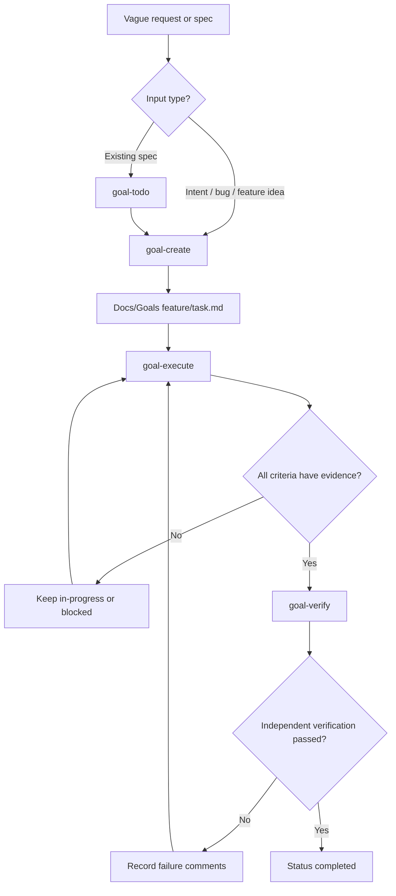

<p align="center">
  <br />
  
  <br />
</p>

<h1 align="center">Oh My Skills</h1>

<p align="center">
  <strong>Goal-first AI workflows for planning, executing, and verifying real work.</strong>
  <br />
  Turn vague requests into testable goals, implementation TODOs, evidence-backed execution, and independent verification.
</p>

<p align="center">
  <a href="#why-goals">Why Goals</a>&nbsp;&nbsp;&bull;&nbsp;&nbsp;<a href="#goal-skills">Goal Skills</a>&nbsp;&nbsp;&bull;&nbsp;&nbsp;<a href="#workflow">Workflow</a>&nbsp;&nbsp;&bull;&nbsp;&nbsp;<a href="#goal-files">Goal Files</a>&nbsp;&nbsp;&bull;&nbsp;&nbsp;<a href="#installation">Installation</a>
</p>

---

<a id="why-goals"></a>

## Why Goals

AI agents fail when work is vague. A prompt like "fix combat" or "build onboarding" leaves too much room for assumptions, hidden scope, and unverifiable output.

The `goal-*` skills solve that by forcing work through a simple lifecycle:

1. Define the target clearly.
2. Split large work into small goal files.
3. Convert specs into actionable TODOs when needed.
4. Execute one goal at a time.
5. Verify every acceptance criterion with direct evidence.

> [!CAUTION]
> A goal is not complete because the agent says it is complete. A goal is complete only when every acceptance criterion has direct evidence: code reference, test result, scene check, log, screenshot, or deterministic observed behavior.

> [!TIP]
> Good goals are small. Best case: one goal can be completed by one agent in one session. If a goal needs more than three days or more than seven acceptance criteria, split it.

---

<a id="goal-skills"></a>

## Goal Skills

This repo centers the workflow around four goal skills.

| Skill | Purpose | Output |
|:---|:---|:---|
| `goal-create` | Turn user intent into a structured goal file. | `Docs/Goals/{feature-name}/{kebab-case-task}.md` |
| `goal-todo` | Turn a spec into implementation and test checklists. | `<spec-stem>-todo.md` beside the source spec |
| `goal-execute` | Implement exactly one goal and collect evidence. | Updated goal file, code changes, tests/checks |
| `goal-verify` | Independently audit one goal after execution. | Updated pass/fail criteria and verification evidence |

> [!CAUTION]
> `goal-execute` handles one goal only. Do not bundle multiple goals into one execution run. Bundling hides failures and makes verification weak.

> [!TIP]
> Use `goal-todo` when you already have a product spec or design doc. Use `goal-create` when the request is still an intent, bug, task, or feature idea.

---

<a id="workflow"></a>

## Workflow

### 1. Create The Goal

Use `goal-create` when work is not yet written as an actionable goal.

The skill will:

- Ask focused clarifying questions when user intent is ambiguous.
- Search `Docs/Goals/` for duplicates before creating a new file.
- Explore the codebase instead of asking questions when the answer is discoverable.
- Extract the feature folder name, such as `authentication/` or `combat/`.
- Split oversized work into smaller atomic goals.
- Write one goal file with current behavior, desired behavior, interfaces, criteria, scope, and notes.

Example request:

```text
Use goal-create for a login rate-limit feature.
```

Generated path shape:

```text
Docs/Goals/login/rate-limit-login-attempts.md
```

> [!CAUTION]
> `goal-create` should describe what the system must do, not how to implement it. Implementation choices belong to `goal-execute` after fresh codebase investigation.

### 2. Convert Specs To TODOs

Use `goal-todo` when a spec already exists and you need a practical implementation checklist.

The skill will:

- Resolve the source spec from a provided path or likely docs folder.
- Read all requirement-bearing sections.
- Extract user flows, screens, data, persistence, assets, integrations, constraints, and acceptance criteria.
- Review UI/UX implications without inventing product scope.
- Investigate the codebase for existing components, services, tests, assets, scenes, or interfaces.
- Write a TODO document beside the spec.

Default output shape:

```text
Docs/Specs/onboarding/onboarding-todo.md
```

TODO items use three tags:

| Tag | Meaning |
|:---|:---|
| `[Logic]` | Business rules, gameplay rules, validation, state machines, services, events |
| `[UI]` | Screens, components, visual states, navigation, accessibility, localization |
| `[Data]` | Schemas, saved state, migrations, assets, analytics, config, API contracts |

> [!TIP]
> `goal-todo` is planning only. It does not implement code and does not create `Docs/Goals` files unless explicitly asked.

### 3. Execute One Goal

Use `goal-execute` when a goal file is ready to implement.

The skill will:

- Read the full goal file.
- Check `depends_on` before doing work.
- Stop and mark `blocked` if dependencies are incomplete.
- Build a concise plan mapped to acceptance criteria.
- Set goal status to `in-progress`.
- Add an `## Implementation plan` section to the goal file.
- Make focused code changes only for the requested goal.
- Add or update direct tests/checks when the repo supports them.
- Self-verify every acceptance criterion.
- Spawn an independent verification subagent before marking criteria complete.
- Add `## Verification evidence` with concrete proof.

Example request:

```text
Use goal-execute on Docs/Goals/login/rate-limit-login-attempts.md
```

> [!CAUTION]
> `UNCLEAR`, stale logs, skipped tests, assumptions, or partial evidence are failures. They must not be used to check off acceptance criteria.

> [!TIP]
> If verification fails, keep the goal `in-progress` or `blocked`, leave failed criteria unchecked, and record missing evidence directly in the goal file.

### 4. Verify Independently

Use `goal-verify` as the final gate.

The skill will:

- Re-read one complete goal file.
- Set or keep status `verifying` during audit.
- Build a private matrix of criteria, expected proof, self-test evidence, independent checks, and result.
- Audit `goal-execute` evidence instead of trusting it.
- Run or inspect the narrowest proof for each criterion.
- Mark each criterion pass/fail directly in the goal file.
- Add severity callouts under failed criteria.
- Set status `completed` only if all criteria pass.

Example request:

```text
Use goal-verify on Docs/Goals/login/rate-limit-login-attempts.md
```

> [!CAUTION]
> `goal-verify` is a gate, not an implementation step. It should not fix failures unless explicitly asked.

---

## End-To-End Flow



> [!TIP]
> The loop is intentional: create, execute, verify, fix, verify again. The file records the truth so future agents do not need to reconstruct history from chat.

---

<a id="goal-files"></a>

## Goal Files

A goal file is the contract between planning, implementation, and verification.

### Frontmatter

```yaml
---
status: pending
priority: medium
created: YYYY-MM-DD
updated: YYYY-MM-DD
depends_on: []
---
```

Supported status values:

| Status | Meaning |
|:---|:---|
| `pending` | Goal is written but not started. |
| `in-progress` | Goal is currently being executed or still needs work. |
| `verifying` | Goal is under independent verification. |
| `completed` | Every criterion passed with direct evidence. |
| `blocked` | External dependency or ambiguity prevents progress. |

### Required Sections

```markdown
# [bug / update / task] Summary

## Current behavior

## Desired behavior

## Key interfaces

## Acceptance criteria

## Out of scope

## Notes
```

`goal-execute` may add:

```markdown
## Implementation plan

## Verification evidence
```

### Acceptance Criteria

Acceptance criteria must be testable by an autonomous agent.

Every criterion should name:

- What must exist or happen.
- Where it must exist or happen.
- How it can be observed with tools.

Bad:

```markdown
- [ ] Player moves smoothly.
```

Good:

```markdown
- [ ] `PlayerController` velocity is greater than `0` when movement input is pressed, verified by Play Mode test.
```

> [!CAUTION]
> Subjective criteria like "looks good", "feels smooth", or "works correctly" are not valid unless they include observable proof.

> [!TIP]
> Prefer criteria that can be verified through code appearance, tests, scene checks, deterministic logs, or screenshots for visual requirements.

---

## Common Commands

Natural language is enough; skills auto-trigger from intent.

```text
Use goal-create for inventory item stacking.
Use goal-todo for Docs/Specs/inventory.md.
Use goal-execute on Docs/Goals/inventory/item-stacking.md.
Use goal-verify on Docs/Goals/inventory/item-stacking.md.
```

If your agent environment exposes slash commands, use the core goal wrappers:

```text
/goal/create
/goal/execute
/goal/verify
```

`goal-todo` is still available by natural-language trigger, but this repo does not currently ship a `/goal/todo` slash wrapper.

> [!CAUTION]
> Do not skip from spec directly to implementation when the scope is unclear. Create or derive a goal first so acceptance criteria become the source of truth.

---

<a id="installation"></a>

## Installation

Clone this repository into your agent skills directory.

For OpenCode:

```bash
git clone https://github.com/cuozg/oh-my-skills.git ~/.config/opencode/skills
```

For Claude Code or Codex-style local skills:

```bash
git clone https://github.com/cuozg/oh-my-skills.git ./.claude/skills
```

Skills activate based on your request. No manual import is needed in normal agent setups.

---

## Best Practices

- Keep one goal per file.
- Keep acceptance criteria short, concrete, and observable.
- Use `depends_on` for real blockers, not vague sequencing preferences.
- Put implementation details in `## Implementation plan`, not in the original goal definition.
- Preserve failed criteria and failure comments until verified fixed.
- Treat the goal file as the audit log for the work.

> [!TIP]
> Strong goal files make agents faster because they reduce context guessing. The agent can inspect the repo, implement narrowly, and prove pass/fail without asking the same questions again.

> [!CAUTION]
> Never mark `completed` without independent passing evidence for every acceptance criterion.

---

<p align="center">
  <sub>Built with obsessive iteration by <a href="https://github.com/cuozg">@cuozg</a></sub>
</p>
