# Oh My Skills

A comprehensive skill pack for AI agents working with **Unity** and **Flutter** projects. Clone it into your OpenCode config directory and get **37 specialized skills** and **50 slash commands** — all tuned for Unity C# and Flutter/Dart development.

## Installation

### 1. Clone

```bash
git clone https://github.com/cuozg/oh-my-skills.git ./.opencode
```

### 2. Install GitHub CLI (`gh`)

Several skills (PR reviews, PR descriptions, git workflows) use the [GitHub CLI](https://cli.github.com/) to interact with GitHub. Install it and authenticate:

**macOS**
```bash
brew install gh
```

Then authenticate:
```bash
gh auth login
```

> For other platforms, see the [official install docs](https://github.com/cli/cli#installation).

## Skills Design System

Skills follow a **3-tier progressive disclosure** architecture to minimize token usage while maximizing guidance quality:

```
Level 1 — Metadata (always in context)      name + description (~100 words)
Level 2 — SKILL.md (loaded on trigger)       workflow + tool list (<100 lines)
Level 3 — References (loaded on demand)      detailed standards, checklists, templates
```

### `unity-standards` — Shared Reference Hub

`unity-standards` is the **single source of truth** for all Unity-related conventions. It holds **84 reference files** across 8 categories:

| Category | Count | Covers |
| --- | --- | --- |
| Code Standards | 32 | Naming, formatting, lifecycle, events, DI, serialization, null-safety, async, LINQ, collections, error-handling, comments, access-modifiers, code-patterns, architecture-patterns, multi-file-workflow, refactoring-patterns, unity-attributes, object-pooling |
| Review | 15 | Logic, lifecycle risks, serialization risks, performance, security, concurrency, architecture, assets, prefabs, comment format, PR submission, parallel review |
| Plan | 11 | Sizing, risk, task structure, investigation workflow, dependency mapping, quick output, deep workflow |
| Quality | 6 | A–F grading, architecture/performance/best-practices/tech-debt audits, HTML report format |
| UI Toolkit | 6 | Setup, performance, UXML patterns, USS styling, C# bindings, custom controls |
| Test | 6 | Edit/Play mode patterns, test case format, coverage strategy, naming |
| Debug | 5 | Diagnosis workflow, common Unity errors, log format, fix mode, deep mode |
| Other | 3 | Mermaid syntax, FlatBuffers guide, skill authoring |

Other skills pull specific references on demand:

```python
read_skill_file("unity-standards", "references/code-standards/naming.md")
read_skill_file("unity-standards", "references/review/logic-checklist.md")
```

### `flutter-standards` — Shared Reference Hub

`flutter-standards` is the **shared reference hub** for all Flutter & Dart conventions. It holds **12 reference files** across 6 categories:

| Category | Count | Covers |
| --- | --- | --- |
| Code & Style | 2 | Dart naming, formatting, linting, null-safety, feature-first layout, pubspec |
| Architecture & State | 3 | Feature-first patterns, Riverpod 2.x, DI with provider scoping |
| UI & Assets | 2 | Widget composition, theming, responsive layout, asset management, flutter_gen |
| Async & Errors | 2 | Future/Stream patterns, exception hierarchies, Result pattern |
| Testing | 1 | Unit, widget, integration tests, AAA pattern, Mocktail |
| Performance & Debug | 2 | Rebuild profiling, DevTools, structured logging, crash reporting |

Other skills pull specific references on demand:

```python
read_skill_file("flutter-standards", "references/dart-style-guide.md")
read_skill_file("flutter-standards", "references/state-management-guide.md")
```

### Mandatory Skill Loading Rule

> **When delegating any Unity or Flutter task, always include the corresponding standards skill.**

```python
task(category="quick", load_skills=["unity-standards"], prompt="...")
task(category="deep", load_skills=["unity-code", "unity-standards"], prompt="...")
task(category="quick", load_skills=["flutter-standards"], prompt="...")
```

### Architecture

```mermaid
graph TD
    US[unity-standards<br/>84 reference files] --> UC[unity-code]
    US --> UR[unity-review]
    US --> UI[unity-investigate]
    US --> UD[unity-debug]
    US --> UP[unity-plan]
    US --> UDoc[unity-document]
    US --> UProf[unity-profiler]
    US --> UTU[unity-test-unit]
    US --> UTC[unity-test-case]
    US --> UUI[unity-uitoolkit]
    US --> UPI[unity-project-init]
    US --> USpec[unity-spec]

    FS[flutter-standards<br/>12 reference files] --> FC[flutter-code]
    FS --> FU[flutter-ui]
    FS --> FD[flutter-debug]
    FS --> FR[flutter-review]
    FS --> FT[flutter-test]
    FS --> FP[flutter-profiler]

    style US fill:#E04E39,color:#fff,stroke:#C03E2B
    style UC fill:#1a1a2e,color:#fff,stroke:#E04E39
    style UR fill:#1a1a2e,color:#fff,stroke:#E04E39
    style UI fill:#1a1a2e,color:#fff,stroke:#E04E39
    style UD fill:#1a1a2e,color:#fff,stroke:#E04E39
    style UP fill:#1a1a2e,color:#fff,stroke:#E04E39
    style UDoc fill:#1a1a2e,color:#fff,stroke:#E04E39
    style UProf fill:#1a1a2e,color:#fff,stroke:#E04E39
    style UTU fill:#1a1a2e,color:#fff,stroke:#E04E39
    style UTC fill:#1a1a2e,color:#fff,stroke:#E04E39
    style UUI fill:#1a1a2e,color:#fff,stroke:#E04E39
    style UPI fill:#1a1a2e,color:#fff,stroke:#E04E39
    style USpec fill:#1a1a2e,color:#fff,stroke:#E04E39

    style FS fill:#0175C2,color:#fff,stroke:#02569B
    style FC fill:#1a1a2e,color:#fff,stroke:#0175C2
    style FU fill:#1a1a2e,color:#fff,stroke:#0175C2
    style FD fill:#1a1a2e,color:#fff,stroke:#0175C2
    style FR fill:#1a1a2e,color:#fff,stroke:#0175C2
    style FT fill:#1a1a2e,color:#fff,stroke:#0175C2
    style FP fill:#1a1a2e,color:#fff,stroke:#0175C2
```



---

## Skills (37)

> **37 skills** across 13 domains. Each skill auto-triages complexity, loads shared references on demand, and produces defined outputs.

---

### unity-code

Write, extend, or optimize Unity C# code. Auto-triages into the right mode.

```
└── unity-code                  Unified C# coding skill
    ├─ Quick     ⚡  Single-file MonoBehaviour, SO, interface, enum, struct, helper
    ├─ Deep      🏗️  Multi-file features, services, state machines, refactors (2+ classes)
    ├─ Editor    🛠️  EditorWindow, CustomEditor, PropertyDrawer, Gizmos, Handles, MenuItem
    └─ Optimize  ⚡  Simplify & clean up without behavior change
```

---

### unity-review

Review code, architecture, assets, prefabs, and project quality.

```
└── unity-review                Unified review skill
    ├─ Local     📝  Inline // REVIEW comments on local changes (no GitHub)
    ├─ PR        🔗  GitHub PR review — parallel specialists → APPROVE / REQUEST_CHANGES
    └─ Project   📊  Full A–F audit — architecture, performance, best practices, tech debt
```

---

### unity-investigate

Analyze codebases, understand systems, trace data flows.

```
└── unity-investigate           Unified investigation skill
    ├─ Quick     💬  How does X work? What calls Y? → inline answer
    └─ Deep      📋  Full report with Mermaid diagrams, cited evidence, risk tables
```

---

### unity-debug

Diagnose, trace, and fix Unity issues.

```
└── unity-debug                 Unified debugging skill
    ├─ Fix       🔧  Compile errors → auto-fix loop → zero errors
    ├─ Quick     🩺  Runtime bugs → 2-3 proposals → user picks → fix
    ├─ Deep      🔎  Intermittent/multi-system → read-only investigation report
    └─ Log       📋  Color-coded Debug.Log snippets (text output only)
```

---

### unity-plan

Plan Unity features with codebase-aware task breakdowns.

```
└── unity-plan                  Unified planning skill
    ├─ Quick     ⚡  XS/S (0-8h) → inline report + task_create
    └─ Deep      🏗️  M/L (1-10 days) → markdown plan + task hierarchy
```

---

### unity-document

Generate technical documentation from real code state.

```
└── unity-document              Unified documentation skill
    ├─ System    📘  Existing system → architecture diagrams, API ref, extension guides
    └─ TDD       📐  Pre-implementation → architecture decisions, alternatives, risk assessment
```

---

### unity-profiler

```
└── unity-profiler              📊 Profiler analysis
    ├─ What: CPU spikes, GC pressure, rendering bottlenecks
    ├─ Rule: Read-only. Max 10 findings. Cite profiler markers and file:line.
    └─ Out:  Documents/Profiler/PERF_*.md
```

---

### unity-test

Testing automation for Unity projects.

```
├── unity-test-unit             🔬 Unit tests
│   ├─ What: Edit/Play Mode tests, mocking, coverage maximization
│   ├─ Target: 10+ test cases per class, Arrange-Act-Assert
│   └─ Out:   Test scripts with [Test] / [UnityTest] attributes
│
└── unity-test-case             📋 QA test cases
    ├─ What: Happy paths, edge cases, boundary values, negative tests
    └─ Out:  Documents/TestCases/{Name}_TestCases.html
```

---

### unity-ui

Build runtime UI with UI Toolkit.

```
└── unity-uitoolkit             🎨 UI Toolkit builder
    ├─ What: UXML templates, USS styling, C# bindings, custom controls
    ├─ Flow: Parse input → Clarify → Discover → Structure → Implement → Wire → Verify
    └─ Out:  .uxml + .uss + .cs controller files
```

---

### unity-project-init

```
└── unity-project-init          🏗️ Project scaffolding
    ├─ What: Feature-based folder structure, .asmdef, .gitignore, namespaces
    └─ Out:  Assets/_Project/ directory tree
```

---

### unity-spec

```
└── unity-spec                  📄 Game Design Specification
    ├─ What: GDD covering mechanics, systems, progression, UX/UI, art, audio, tech
    └─ Out:  Structured GDD document
```

---

### flutter-code

Write, extend, or optimize Flutter/Dart code.

```
└── flutter-code                Unified Dart coding skill
    ├─ Quick     ⚡  Single-file widget, provider, model, utility, service
    ├─ Deep      🏗️  Multi-file features, state machines, refactors (3+ files)
    └─ Optimize  ⚡  Simplify & clean up without behavior change
```

---

### flutter-ui

Compose screens, widgets, themes, and responsive layouts.

```
└── flutter-ui                  Unified UI composition skill
    ├─ Quick     ⚡  Single widget, one screen, layout fix, simple styling
    └─ Deep      🏗️  Multi-screen systems, custom themes, responsive breakpoints, animations
```

---

### flutter-debug

Diagnose and fix Flutter/Dart bugs.

```
└── flutter-debug               Unified Dart debugging skill
    ├─ Fix       🔧  Dart analysis errors → auto-fix loop
    ├─ Quick     🩺  Runtime crashes → 2-3 proposals → fix
    ├─ Deep      🔎  Intermittent/multi-system → investigation report
    └─ Log       📋  Structured logging snippets
```

---

### flutter-review

Review Flutter code, PRs, and projects.

```
└── flutter-review              Unified Flutter review skill
    ├─ Local     📝  Inline // REVIEW comments on .dart files
    ├─ PR        🔗  GitHub PR review → APPROVE / REQUEST_CHANGES
    └─ Project   📊  Full A–F audit — architecture, code style, performance
```

---

### flutter-test

```
└── flutter-test                🧪 Flutter tests (Unit, Widget, Integration)
    ├─ Pattern: AAA (Arrange-Act-Assert), mocktail, ProviderContainer
    ├─ Target:  10+ test cases per class
    └─ Out:     Test files with group/test structure
```

---

### flutter-profiler

```
└── flutter-profiler            📊 DevTools profiler analysis
    ├─ What: CPU frames, memory/GC, frame rendering, jank detection
    ├─ Rule: Read-only — suggests fixes, does not modify code
    └─ Out:  Severity-ranked performance report
```

---

### git

Git workflow automation.

```
├── git-commit                  💾 Commit with clean message (never pushes)
├── git-comment                 ✏️ Rewrite last commit message (never touches pushed)
├── git-squash                  📦 Squash commits for PR (plan → approve → execute)
├── git-description             📝 Generate & apply PR description via gh
└── git-clear                   🧹 Delete all comments from a GitHub PR
```

---

### bash

Shell script tooling.

```
├── bash-check                  ✅ Validate scripts (syntax + ShellCheck)
├── bash-optimize               ⚡ Refactor scripts (no behavior change)
└── bash-install                📥 Install software (auto-retry + verify)
```

---

### Other

```
├── flatbuffers-coder           🗂️  .fbs schemas → C# generation → binary data
├── mermaid                     📊  Flowcharts, sequence diagrams, state machines
├── skill-creator               🛠️  Create, modify, benchmark, and optimize skills
├── visual-explainer            🎨  Self-contained HTML pages for visual explanations
├── spreadsheet                 📊  Create, edit, analyze .xlsx/.csv/.tsv files
├── screenshot                  📸  Desktop/system screenshots (macOS, Linux, Windows)
├── pdf                         📄  Read, create, review PDFs with layout fidelity
├── imagegen                    🖼️  Generate & edit images via OpenAI API
└── mcp-builder                 🔧  Build MCP servers (Python FastMCP / Node SDK)
```

---

## Commands (50)

Slash commands for quick access to skills and workflows.

```
bash/              check · install · optimize
flatbuffers/       coder
git/               clear · comment · commit · description · squash
mermaid/           create
omo/               atlas · prometheus · sisyphus · sisyphus-junior
skill/             deep · quick
visual-explainer/  diff-review · fact-check · generate-slides · generate-visual-plan
                   generate-web-diagram · plan-review · project-recap · share
unity/code/        deep · editor · optimize · quick
unity/debug/       deep · fix · log · profiler · quick
unity/document/    system · tdd
unity/investigate/ deep · quick
unity/plan/        costing · deep · quick
unity/review/      architecture · asset · code-pr · general · local · prefab · quality
unity/test/        case · unit
unity/ui/          create
```
