<p align="center">
  <br />
  
  <br />
</p>

<h1 align="center">Oh My Skills</h1>

<p align="center">
  <strong>50 battle-tested AI agent skills. 252 reference docs. 322 commits of relentless refinement.</strong>
  <br />
  Built for Unity, Flutter, and full-stack development &mdash; evaluated, iterated, and hardened until they actually work.
</p>

<p align="center">
  <a href="#installation">Installation</a>&nbsp;&nbsp;&bull;&nbsp;&nbsp;<a href="#skills-50">Skills</a>&nbsp;&nbsp;&bull;&nbsp;&nbsp;<a href="#commands-57">Commands</a>&nbsp;&nbsp;&bull;&nbsp;&nbsp;<a href="#architecture">Architecture</a>&nbsp;&nbsp;&bull;&nbsp;&nbsp;<a href="#philosophy">Philosophy</a>
</p>

---

## Why This Exists

Most AI agent skills are written once and abandoned. They hallucinate patterns, miss edge cases, and produce output that looks right but isn't.

**Oh My Skills** is different. Every skill in this pack has been:

- **Written** from real-world project experience, not hypotheticals
- **Evaluated** against concrete test scenarios with pass/fail criteria
- **Refined** across 50+ iteration cycles &mdash; rewrite, eval, fix, re-eval
- **Hardened** with 252 reference documents that ground the agent in real conventions

The result: skills that produce **senior-engineer-quality output** &mdash; code that follows your project's actual patterns, reviews that catch real bugs, plans that map to your real codebase.

---

## Installation

### 1. Clone into your config directory

```bash
# For OpenCode
git clone https://github.com/cuozg/oh-my-skills.git ~/.config/opencode/skills

# For Claude Code / Codex
git clone https://github.com/cuozg/oh-my-skills.git ./.claude/skills
```

### 2. Install GitHub CLI (optional, for git skills)

Several skills (PR reviews, PR descriptions, git workflows) use the [GitHub CLI](https://cli.github.com/):

```bash
brew install gh && gh auth login
```

> For other platforms, see the [official install docs](https://github.com/cli/cli#installation).

That's it. Skills auto-activate based on your requests.

---

## The Numbers

| Metric | Count |
|:---|---:|
| Specialized skills | **50** |
| Reference documents | **252** |
| Commits of refinement | **322+** |
| Eval & refinement iterations | **53+** |
| Unity standards reference files | **54** |
| Flutter standards reference files | **12** |
| Slash commands | **57** |
| Covered domains | **13** |

---

<a id="philosophy"></a>

## Philosophy: Eval-Driven Skill Development

Skills aren't written &mdash; they're **forged**.

```
 Write v1       Eval against       Identify        Rewrite &       Re-eval
 of skill  -->  real scenarios -->  failures   -->  harden     -->  until pass
     |                                                                  |
     '--- repeat 3-10x per skill until output is indistinguishable ----'
                         from a senior engineer's work
```

### The 3-Tier Progressive Disclosure System

Every skill uses a **token-efficient architecture** that loads only what's needed:

```
Tier 1 ── Metadata          Always in context       ~100 words    name + description
Tier 2 ── SKILL.md          Loaded on trigger        <100 lines   workflow + tool list + rules
Tier 3 ── References        Loaded on demand         Deep docs    standards, checklists, templates
```

**Why this matters:** A naive skill dumps everything into context and wastes tokens. Our 3-tier system means the agent gets surgical precision &mdash; Tier 1 for routing, Tier 2 for workflow, Tier 3 only when the specific reference is needed.

### The Standards Hub Pattern

Instead of duplicating conventions across skills, **shared standards hubs** act as the single source of truth:

```
unity-standards/references/          54 files across 9 categories
├── code-standards/                  Naming, formatting, patterns, architecture
├── review/                          Checklists, PR format, parallel review
├── plan/                            Sizing, risk, task structure, dependencies
├── quality/                         A-F grading, audit templates
├── ui-toolkit/                      UXML, USS, C# bindings, custom controls
├── test/                            Edit/Play mode, coverage, naming
├── debug/                           Diagnosis, common errors, log format
├── optimization/                    Build, rendering, memory, mobile, Jobs/Burst
└── other/                           Mermaid, FlatBuffers, skill authoring

flutter-standards/references/        12 files across 6 categories
├── Code & Style                     Dart naming, formatting, linting
├── Architecture & State             Feature-first, Riverpod 2.x, DI
├── UI & Assets                      Widget composition, theming, responsive
├── Async & Errors                   Future/Stream, exception hierarchies
├── Testing                          AAA pattern, Mocktail
└── Performance & Debug              Rebuild profiling, DevTools, logging
```

Any skill can pull a specific reference on demand:
```python
read_skill_file("unity-standards", "references/code-standards/naming.md")
read_skill_file("flutter-standards", "references/state-management-guide.md")
```

**Rule:** When delegating any Unity or Flutter task, always include the corresponding standards skill:
```python
task(category="quick", load_skills=["unity-standards", "unity-code"], prompt="...")
task(category="deep",  load_skills=["flutter-standards", "flutter-code"], prompt="...")
```

---

<a id="architecture"></a>

## Architecture

Every domain skill pulls from its standards hub. The hub holds the conventions; the skill holds the workflow.

```mermaid
graph TD
    US[unity-standards<br/>54 reference files] --> UC[unity-code]
    US --> UE[unity-editor]
    US --> UR[unity-review]
    US --> UI[unity-investigate]
    US --> UD[unity-debug]
    US --> UP[unity-plan]
    US --> UDoc[unity-document]
    US --> UProf[unity-profiler]
    US --> UTU[unity-test-unit]
    US --> UTC[unity-test-case]
    US --> UUI[unity-uitoolkit]
    US --> UPI[unity-init]
    US --> USpec[unity-spec]
    US --> UOpt[unity-optimize]
    US --> UWgl[unity-webgl]
    US --> UPro[unity-prototype]
    US --> UCost[unity-costing]

    FS[flutter-standards<br/>12 reference files] --> FC[flutter-code]
    FS --> FU[flutter-ui]
    FS --> FD[flutter-debug]
    FS --> FR[flutter-review]
    FS --> FT[flutter-test]
    FS --> FP[flutter-profiler]

    style US fill:#E04E39,color:#fff,stroke:#C03E2B
    style FS fill:#0175C2,color:#fff,stroke:#02569B

    style UC fill:#1a1a2e,color:#fff,stroke:#E04E39
    style UE fill:#1a1a2e,color:#fff,stroke:#E04E39
    style UR fill:#1a1a2e,color:#fff,stroke:#E04E39
    style UI fill:#1a1a2e,color:#fff,stroke:#E04E39
    style UD fill:#1a1a2e,color:#fff,stroke:#E04E39
    style UP fill:#1a1a2e,color:#fff,stroke:#E04E39
    style UDoc fill:#1a1a2e,color:#fff,stroke:#E04E39
    style UProf fill:#1a1a2e,color:#fff,stroke:#E04E39
    style UTU fill:#1a1a2e,color:#fff,stroke:#E04E39
    style UTC fill:#1a1a2e,color:#fff,stroke:#E04E39
    style UUI fill:#1a1a2e,color:#fff,stroke:#E04E39
    style UPI fill:#1a1a2e,color:#fff,stroke:#E04E39
    style USpec fill:#1a1a2e,color:#fff,stroke:#E04E39
    style UOpt fill:#1a1a2e,color:#fff,stroke:#E04E39
    style UWgl fill:#1a1a2e,color:#fff,stroke:#E04E39
    style UPro fill:#1a1a2e,color:#fff,stroke:#E04E39
    style UCost fill:#1a1a2e,color:#fff,stroke:#E04E39

    style FC fill:#1a1a2e,color:#fff,stroke:#0175C2
    style FU fill:#1a1a2e,color:#fff,stroke:#0175C2
    style FD fill:#1a1a2e,color:#fff,stroke:#0175C2
    style FR fill:#1a1a2e,color:#fff,stroke:#0175C2
    style FT fill:#1a1a2e,color:#fff,stroke:#0175C2
    style FP fill:#1a1a2e,color:#fff,stroke:#0175C2
```



---

<a id="skills-50"></a>

## Skills (50)

50 skills across 13 domains. Each skill auto-triages complexity, loads shared references on demand, and produces defined outputs.

### Unity &mdash; Runtime Code

| Skill | What it does | Modes |
|:---|:---|:---|
| **unity-code** | Write, extend, or refactor runtime C# | Quick / Deep / Optimize |
| **unity-optimize** | Performance &mdash; code hot paths, build settings, audits | Code / Settings / Audit |
| **unity-editor** | Custom inspectors, windows, drawers, gizmos, handles | Quick / Deep |
| **unity-uitoolkit** | Runtime UI &mdash; UXML, USS, C# bindings, custom controls | &mdash; |
| **unity-webgl** | JSLib plugins, WebGL builds, templates, deployment | JSLib / Build / Template |
| **unity-prototype** | Playable prototypes from game ideas | &mdash; |

### Unity &mdash; Quality & Review

| Skill | What it does | Modes |
|:---|:---|:---|
| **unity-review** | Code review, PR review, full project audit | Local / PR / Project |
| **unity-debug** | Diagnose and fix bugs, from compile errors to intermittent issues | Fix / Quick / Deep / Log |
| **unity-investigate** | Codebase analysis, system tracing, architecture reports | Quick / Deep |
| **unity-profiler** | CPU spikes, GC pressure, rendering bottlenecks | &mdash; |
| **unity-test-unit** | Edit/Play mode unit tests (10+ per class, AAA pattern) | &mdash; |
| **unity-test-case** | QA test case documentation (HTML output) | &mdash; |

### Unity &mdash; Planning & Docs

| Skill | What it does | Modes |
|:---|:---|:---|
| **unity-plan** | Feature planning with scope detection (XS &rarr; XL) | Quick / Deep |
| **unity-costing** | XL feature breakdown (10+ days), epic/task trees | &mdash; |
| **unity-document** | System docs or technical design documents | System / TDD |
| **unity-spec** | Game Design Specification (GDD) | &mdash; |
| **unity-init** | Project scaffolding &mdash; folders, .asmdef, namespaces | &mdash; |
| **unity-standards** | **54 reference files** &mdash; the single source of truth | Hub |

### Flutter

| Skill | What it does | Modes |
|:---|:---|:---|
| **flutter-code** | Write, extend, or optimize Dart code | Quick / Deep / Optimize |
| **flutter-ui** | Screens, widgets, themes, responsive layouts | Quick / Deep |
| **flutter-debug** | Dart analysis errors to intermittent bugs | Fix / Quick / Deep / Log |
| **flutter-review** | Code review, PR review, project audit | Local / PR / Project |
| **flutter-test** | Unit, widget, and integration tests (AAA, mocktail) | Auto-triage |
| **flutter-profiler** | DevTools analysis, CPU/memory/jank reports | &mdash; |
| **flutter-standards** | **12 reference files** &mdash; Dart/Flutter conventions | Hub |

### Full-Stack & Infrastructure

| Skill | What it does |
|:---|:---|
| **nextjs-backend** | API routes, server actions, auth, multi-tenant (App Router) |
| **database-design** | PostgreSQL schemas, migrations, indexing, Prisma/Drizzle |
| **cloud-infra** | Cloudflare R2, Vercel deployment, CDN, signed URLs |

### Git Workflow

| Skill | What it does |
|:---|:---|
| **git-commit** | Stage + commit with clean imperative messages |
| **git-comment** | Rewrite last commit message |
| **git-squash** | Squash commits into clean logical units |
| **git-description** | Generate + apply PR descriptions |
| **git-clear** | Delete all comments from a GitHub PR |

### Autonomous Execution

| Skill | What it does |
|:---|:---|
| **sisyphus-work** | Scan goal files, execute all autonomously |
| **sisyphus-goal** | Interactive goal creation with acceptance criteria |
| **sisyphus-improve** | Quality refinement &mdash; assess work against goals |
| **session-retrospective** | Post-session learning &mdash; improve skills from experience |

### Shell & CLI

| Skill | What it does |
|:---|:---|
| **bash-check** | Validate scripts (syntax + ShellCheck) |
| **bash-optimize** | Refactor scripts without behavior change |
| **bash-install** | Install software with auto-retry + verification |

### Specialized

| Skill | What it does |
|:---|:---|
| **pixijs-coder** | PixiJS v8 &mdash; apps, shaders, filters, animations |
| **flatbuffers-coder** | .fbs schemas, C# generation, binary serialization |
| **mcp-builder** | Build MCP servers (Python FastMCP / Node SDK) |
| **skill-creator** | Create, modify, benchmark, and optimize skills |

### Productivity & Output

| Skill | What it does |
|:---|:---|
| **visual-explainer** | Self-contained HTML pages for visual explanations |
| **mermaid** | Flowcharts, sequence diagrams, state machines |
| **spreadsheet** | Create, edit, analyze .xlsx/.csv/.tsv files |
| **pdf** | Read, create, review PDFs with layout fidelity |
| **imagegen** | Generate + edit images via OpenAI API |
| **screenshot** | Desktop/system screenshots (macOS, Linux, Windows) |

---

<a id="commands-57"></a>

## Commands (57)

Slash commands for direct access to specific skill modes.

```
bash/              check   install   optimize
flatbuffers/       coder
git/               clear   comment   commit   description   squash
mermaid/           create
omo/               atlas   prometheus   sisyphus   sisyphus-goal
                   sisyphus-improve   sisyphus-junior   sisyphus-work
skill/             deep   quick
visual-explainer/  diff-review   fact-check   generate-slides
                   generate-visual-plan   generate-web-diagram
                   plan-review   project-recap   share

unity/code/        deep   optimize   quick
unity/debug/       deep   fix   log   profiler   quick
unity/document/    system   tdd
unity/editor/      deep   quick
unity/investigate/ deep   quick
unity/optimize/    audit   code   settings
unity/plan/        costing   deep   quick
unity/review/      architecture   asset   code-pr   general
                   local   prefab   quality
unity/test/        case   unit
unity/ui/          create
```

---

## How Skills Are Built

Each skill goes through a rigorous development cycle:

```
1. AUTHOR       Write SKILL.md with workflow, tool whitelist, rules
                Write reference docs grounding the agent in real patterns

2. EVALUATE     Run against real-world test scenarios
                Grade output: correctness, pattern adherence, completeness

3. IDENTIFY     Find failure modes — hallucinated patterns, missed edge cases,
                vague instructions that let the agent drift

4. HARDEN       Rewrite weak sections, add guardrails, tighten constraints
                Add "MUST DO" / "MUST NOT DO" rules for observed failure modes

5. RE-EVALUATE  Run the same scenarios again — verify failures are fixed
                Run NEW scenarios — verify no regressions

6. REPEAT       Until the skill produces output indistinguishable
                from a senior engineer working on the same codebase
```

The `skill-creator` skill automates parts of this process &mdash; it can benchmark skills with variance analysis, run eval suites, and optimize trigger descriptions for routing accuracy.

---

## Contributing

Found a bug in a skill? Have an idea for a new one? PRs welcome.

The bar: every skill must produce output you'd accept in a code review from a senior engineer. If it doesn't, it needs more eval cycles.

---

<p align="center">
  <sub>Built with obsessive iteration by <a href="https://github.com/cuozg">@cuozg</a></sub>
</p>
