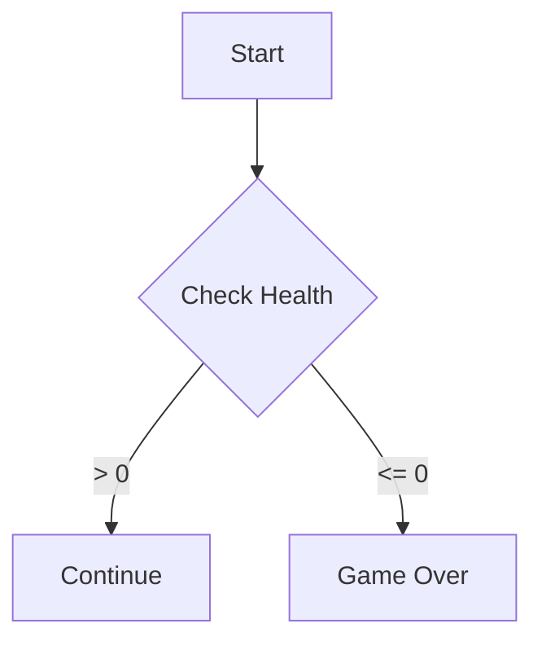
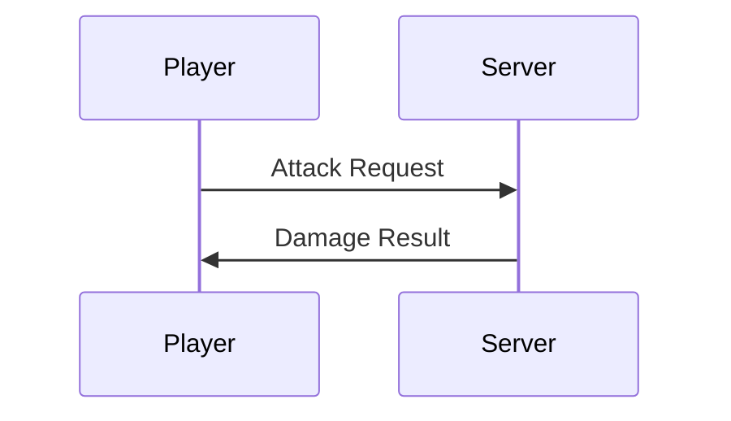

Use skill mermaid to create diagram for $ARGUMENTS

# Mermaid Workflow

## Diagram Types

| Type | Use Case |
|------|----------|
| Flowchart | Logic flows, decision trees |
| Sequence | Component communication, API calls |
| Class | Data relationships, inheritance |
| State | UI states, game states |

## Workflow Steps

1. Analyze entities and relationships
2. Choose diagram type
3. Author using [MERMAID_PATTERNS.md](MERMAID_PATTERNS.md)
4. Validate syntax, ensure accuracy
5. Embed in ` ```mermaid ` blocks

## Quick Examples





## Best Practices

- Multiple small diagrams > one giant chart
- Prefer `TD` or `LR` direction
- Use `style`/`classDef` for critical paths
- Consistent participant names across docs
