# flutter-standards Architecture

## Skill Dependency Map

Shows which reference files each downstream skill loads via `read_skill_file`.

```mermaid
graph TD
    FS["flutter-standards<br/>Shared Reference Hub"]

    FC["flutter-code"]
    FU["flutter-ui"]
    FD["flutter-debug"]
    FR["flutter-review"]
    FT["flutter-test"]
    FP["flutter-profiler"]

    FS --> FC
    FS --> FU
    FS --> FD
    FS --> FR
    FS --> FT
    FS --> FP

    subgraph "Code & Style"
        R1["dart-style-guide.md"]
        R2["code-organization.md"]
    end

    subgraph "Architecture & State"
        R3["architecture-patterns.md"]
        R4["state-management-guide.md"]
        R5["dependency-injection.md"]
    end

    subgraph "UI & Assets"
        R6["ui-best-practices.md"]
        R7["asset-management.md"]
    end

    subgraph "Async & Errors"
        R8["async-streams.md"]
        R9["error-handling.md"]
    end

    subgraph "Testing"
        R10["testing-patterns.md"]
    end

    subgraph "Performance & Debug"
        R11["performance-optimization.md"]
        R12["debug-logging.md"]
    end

    FC -.-> R1 & R2 & R3 & R4 & R5 & R8 & R9
    FU -.-> R1 & R6 & R7 & R11
    FD -.-> R9 & R12 & R8 & R11
    FR -.-> R1 & R2 & R3 & R4 & R9 & R11
    FT -.-> R10 & R9 & R8
    FP -.-> R11 & R12

    style FS fill:#0175C2,color:#fff,stroke:#02569B
    style FC fill:#1a1a2e,color:#fff,stroke:#0175C2
    style FU fill:#1a1a2e,color:#fff,stroke:#0175C2
    style FD fill:#1a1a2e,color:#fff,stroke:#0175C2
    style FR fill:#1a1a2e,color:#fff,stroke:#0175C2
    style FT fill:#1a1a2e,color:#fff,stroke:#0175C2
    style FP fill:#1a1a2e,color:#fff,stroke:#0175C2
```



## Reference Loading Pattern

```python
# Downstream skills load specific references on demand:
read_skill_file("flutter-standards", "references/dart-style-guide.md")
read_skill_file("flutter-standards", "references/state-management-guide.md")
read_skill_file("flutter-standards", "references/testing-patterns.md")
```

## Reference Categories

| Category | Files | Primary Consumers |
|----------|-------|--------------------|
| Code & Style | dart-style-guide, code-organization | flutter-code, flutter-review |
| Architecture & State | architecture-patterns, state-management-guide, dependency-injection | flutter-code, flutter-review |
| UI & Assets | ui-best-practices, asset-management | flutter-ui |
| Async & Errors | async-streams, error-handling | flutter-code, flutter-debug, flutter-test |
| Testing | testing-patterns | flutter-test |
| Performance & Debug | performance-optimization, debug-logging | flutter-profiler, flutter-debug |
