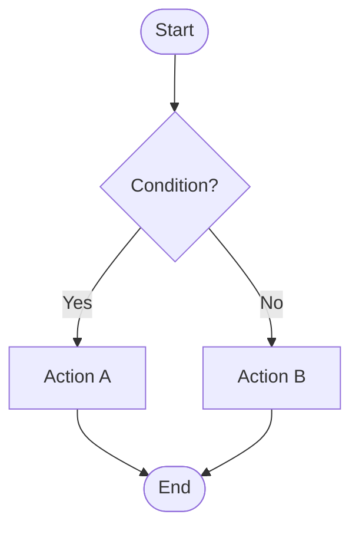
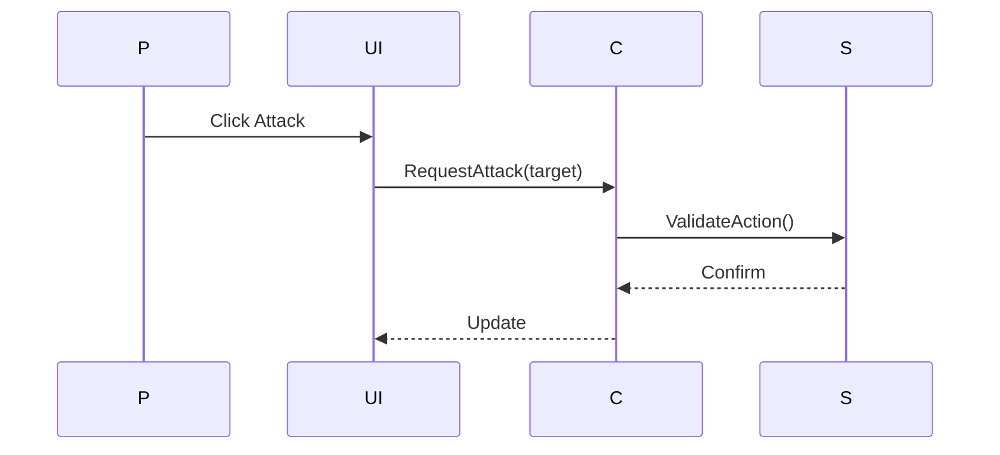
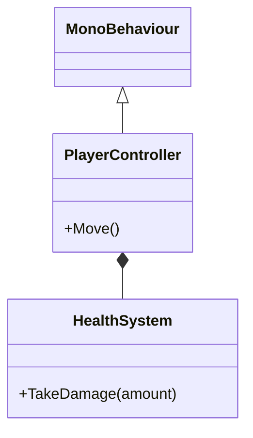
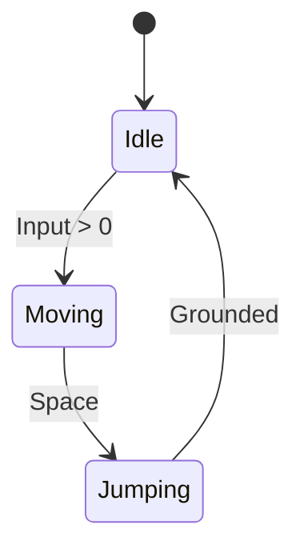

# Mermaid Chart Patterns

## 1. Flowcharts

```mermaid
flowchart TD
    Start([Start]) --> Check{Condition?}
    Check -- Yes --> A[Action A]
    Check -- No --> B[Action B]
    A & B --> Done([End])
```

## 2. Sequence Diagrams

```mermaid
sequenceDiagram
    P->>UI: Click Attack
    UI->>C: RequestAttack(target)
    C->>S: ValidateAction()
    S-->>C: Confirm
    C-->>UI: Update
```

## 3. Class Diagrams

```mermaid
classDiagram
    MonoBehaviour <|-- PlayerController
    PlayerController *-- HealthSystem
    PlayerController : +Move()
    class HealthSystem{ +TakeDamage(amount) }
```

## 4. State Diagrams

```mermaid
stateDiagram-v2
    [*] --> Idle
    Idle --> Moving : Input > 0
    Moving --> Jumping : Space
    Jumping --> Idle : Grounded
```
