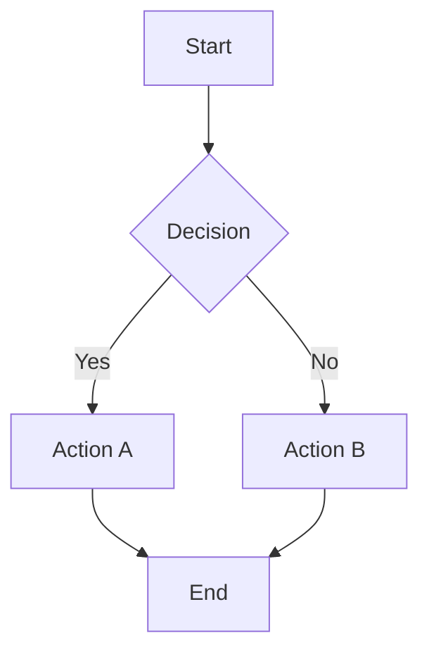
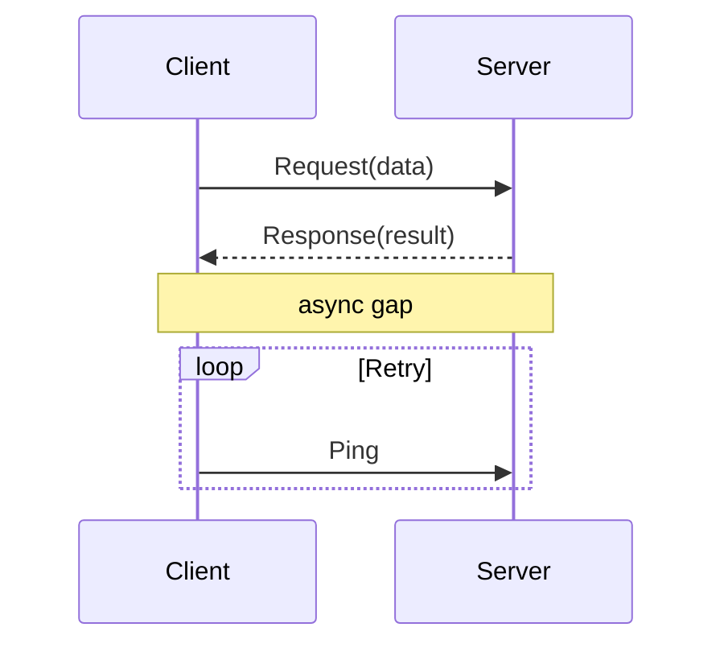
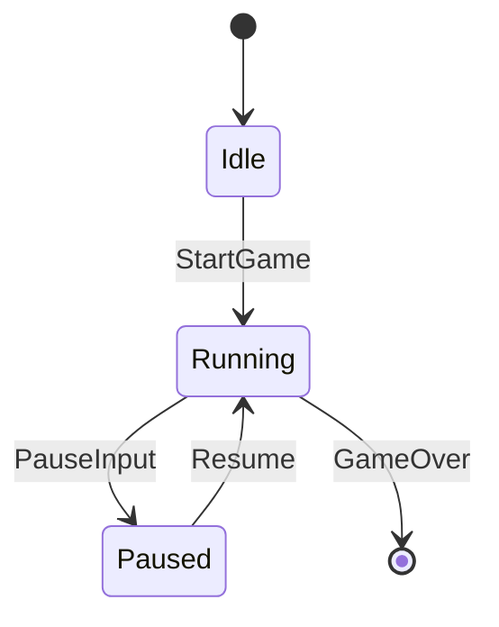
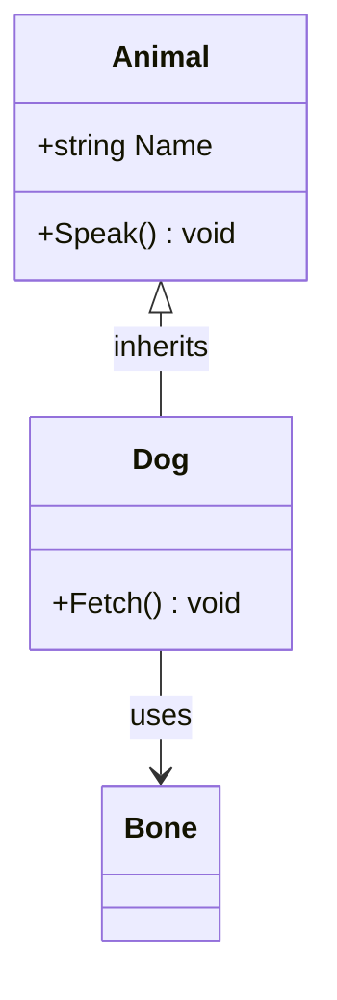
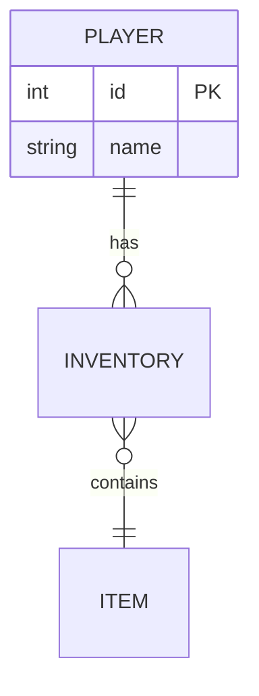

# Mermaid Diagram Types

> **Shared syntax reference**: `unity-standards/references/other/mermaid-syntax.md`
> Load via: `read_skill_file("unity-standards", "references/other/mermaid-syntax.md")`
> Covers: flowchart, sequence, state, class diagrams with detailed syntax and styling.

## Flowchart

Key syntax: `-->` (arrow), `--label-->` (labeled), `[rect]`, `{diamond}`, `(rounded)`, `((circle))`

## Sequence Diagram

Key syntax: `->>` (solid), `-->>` (dashed), `Note over`, `loop`, `alt`, `par`

## State Diagram

Key syntax: `[*]` (start/end), `-->` with `: EventLabel`

## Class Diagram

Key syntax: `<|--` (inherit), `-->` (association), `*--` (composition), `o--` (aggregation)

## ER Diagram

Key syntax: `||--o{` (one-to-many), `}o--||` (many-to-one), `||--||` (one-to-one)

## Common Pitfalls

- Quote node labels containing special chars: `A["label (with parens)"]`
- Avoid reserved words as node IDs: `end`, `start`, `state`
- Use `%%` for comments: `%% this is ignored`
- `classDiagram` uses `+` (public), `-` (private), `#` (protected)
