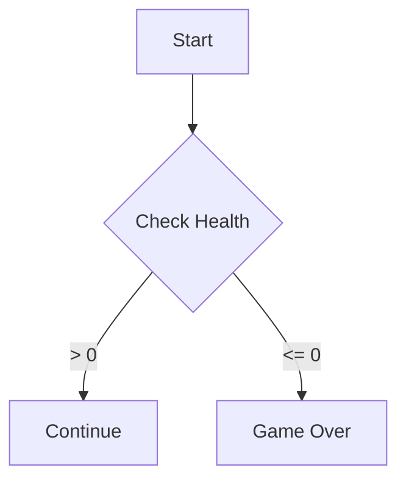
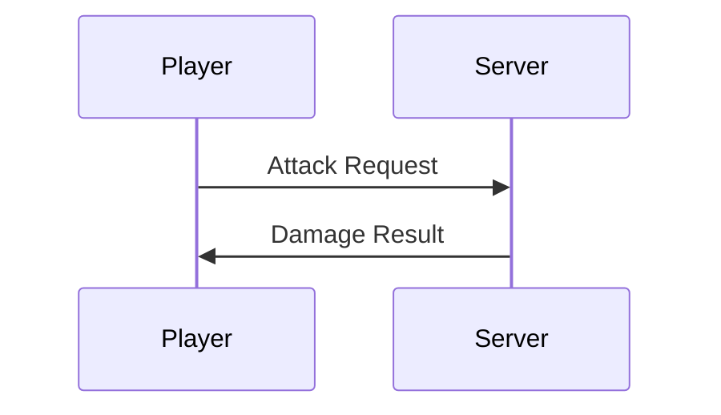

# Mermaid Diagram Specialist

Visualize complex systems using Mermaid.js syntax.

## Examples

| Trigger | What Happens |
|---------|-------------|
| "Run mermaid" | Executes the primary workflow end-to-end |
| "Apply mermaid to <target>" | Scopes execution to a specific file or module |
| "Check mermaid output" | Reviews and validates previous results |


## Purpose

Generate accurate Mermaid.js diagrams (flowcharts, sequence, class, state) from system descriptions, code analysis, or architecture documentation, following the `DIAGRAM_OUTPUT.md` template.

## Input

- **Required**: System or flow to visualize — description, code references, or architecture overview
- **Optional**: Preferred diagram type (flowchart, sequence, class, state), specific entities to include

## Output

Mermaid diagram(s) embedded in ` ```mermaid ` code blocks, following the `DIAGRAM_OUTPUT.md` template. Diagrams are embedded inline or saved to the relevant documentation file.

## Output Requirement (MANDATORY)

**Every diagram MUST follow the template**: [DIAGRAM_OUTPUT.md](.opencode/skills/other/mermaid/assets/templates/DIAGRAM_OUTPUT.md)

Embed diagrams in context or save to the relevant documentation file.

Read the template first, then populate all sections.

## Diagram Types

| Type | Use Case |
|------|----------|
| Flowchart | Logic flows, decision trees |
| Sequence | Component communication, API calls |
| Class | Data relationships, inheritance |
| State | UI states, game states |

## Workflow

1. **Analyze**: Identify entities and relationships
2. **Choose Type**: Match to diagram type above
3. **Author**: Use patterns from [.opencode/skills/other/mermaid/references/MERMAID_PATTERNS.md](.opencode/skills/other/mermaid/references/MERMAID_PATTERNS.md)
4. **Validate**: Check syntax, ensure accuracy
5. **Embed**: Wrap in ` ```mermaid ` code blocks

## Quick Examples





## Best Practices

- **Keep Simple**: Multiple small diagrams > one giant chart
- **Top-Down Flow**: Prefer `TD` or `LR` direction
- **Semantic Colors**: Highlight critical paths with `style`/`classDef`
- **Consistent Aliases**: Same participant names across project docs
