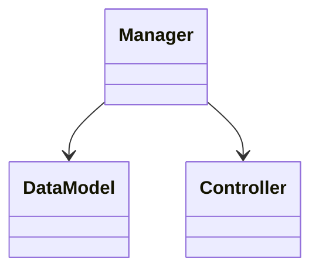
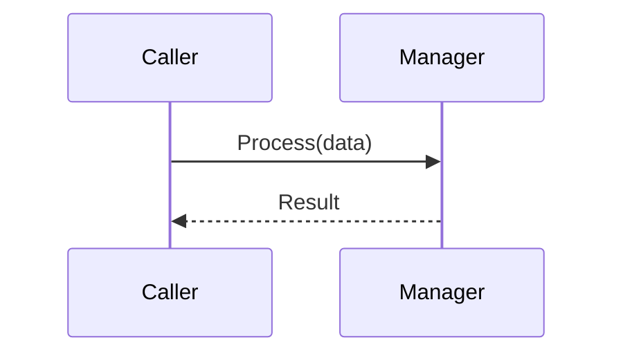

# System Documentation Template — MANDATORY

## Metadata (Required)
- Owner: Alice
- Last Updated: 2026-03-05
- Next Review Due: 2026-05-05
- Status: Active

## {SystemName}

### 1. Overview (Required)
- **Purpose**: {1-2 sentences explaining what this system does and when it runs}
- **Scope**: {What is included and excluded from this system}

### 2. Architecture (Required)
{Explain architecture choice in 1-2 sentences}

### 3. Public API (Required)
| Method/Property | Signature | Description | Location |
|---|---|---|---|
| `Initialize` | `void Initialize(Config c)` | Boots system | (Manager.cs:23) |

### 4. Decision Drivers (Required)
| Driver | Priority | Rationale | Evidence |
|---|---|---|---|
| Memory Perf | High | Avoiding GC via object pools | (Pool.cs:45) |

### 5. Data Flow (Required)

### 6. Extension Guide (Required)
- **How to add handlers**: Implement `IHandler` interface (Handler.cs:12).
- **How to override behavior**: Inherit from `BaseSystem` and override `Execute` (BaseSystem.cs:44).

### 7. Dependencies (Required)
| System | Role | Version | Evidence |
|---|---|---|---|
| EventBus | Routing | 1.2 | (EventBus.cs:10) |

### 8. Known Limitations (Required)
| Limitation | Impact | Workaround | Issue ID |
|---|---|---|---|
| Not thread safe | High | Call only from main thread | #1234 |

## Validation Checklist
- [ ] All sections present (1-8)
- [ ] All tables have at least 2 rows
- [ ] Every claim has `(file:line)` citation
- [ ] Mermaid diagrams valid syntax
- [ ] Owner assigned
- [ ] Review date set (max 90 days future)
- [ ] No TODO/TBD/FIXME