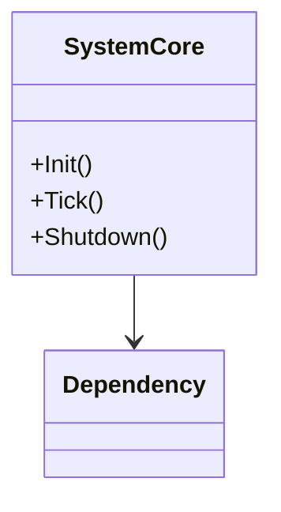
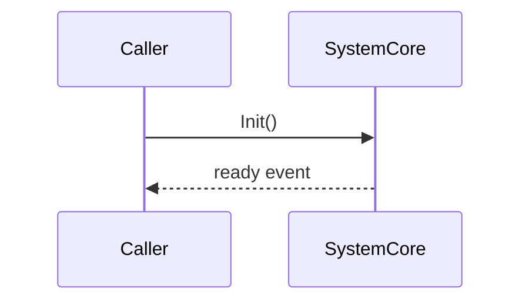

# System Documentation Template

## {SystemName}
**File**: `Documents/Systems/{SystemName}.md`  
**Last updated**: {YYYY-MM-DD}

---

## Overview

{1-2 sentences: what this system does and when it runs.}

---

## Architecture

---

## Public API

| Method / Property | Signature | Description | Location |
|-------------------|-----------|-------------|----------|
| `Init()` | `void Init()` | Bootstraps the system | `file:line` |

---

## Data Flow

---

## Extension Guide

- To add a new handler: implement `IHandler` (`file:line`) and register via `SystemCore.Register()`
- To override behavior: subclass `BaseProcessor` (`file:line`)

---

## Dependencies

| System / Package | Role | Evidence |
|-----------------|------|----------|
| {Name} | {role} | `file:line` |

---

## Known Limitations

- {limitation} (`file:line`)
