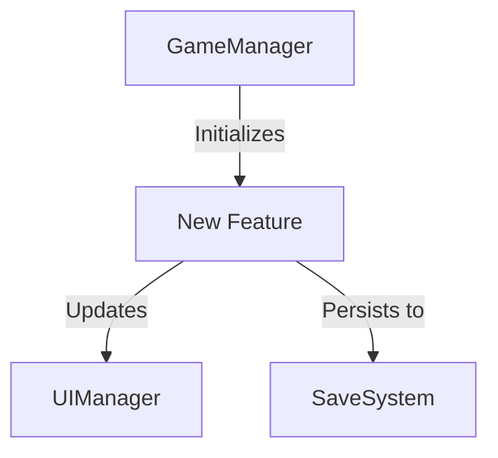
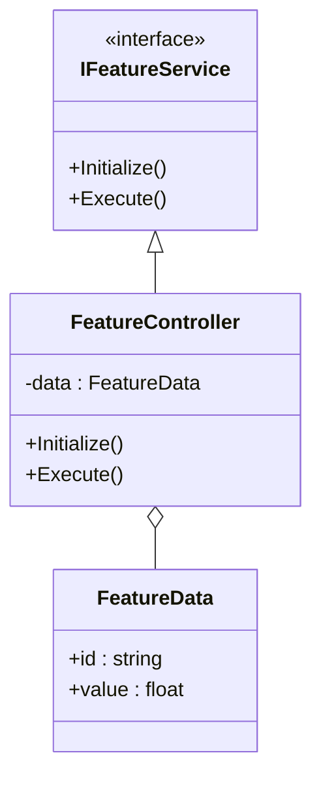
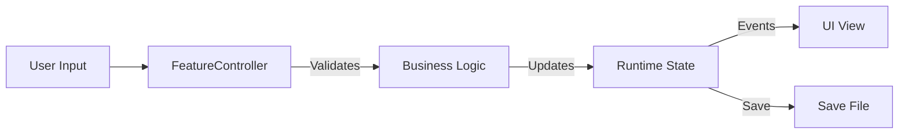

# {FeatureName} — Technical Design Document

> **Generated**: {Date}
> **Author**: AI Assistant
> **Status**: Draft | Review | Approved
> **Version**: 1.0
> **Target Release**: {Release}

---

## 1. Executive Summary
<!-- One paragraph: What is being built/changed, why, and the high-level approach. Focus on the "what" and "why". -->

## 2. Background & Motivation
<!-- Context setting. Why are we doing this? -->

### 2.1 Current State
<!-- How does the system work today? What are the limitations? Reference specific classes/files/assets. -->

### 2.2 Goals
<!-- What must this feature achieve? Be specific and measurable. -->
- [ ]
- [ ]

### 2.3 Non-Goals
<!-- What is explicitly out of scope? -->
-
-

## 3. Architecture Overview (MANDATORY)
<!-- This section defines the "Where" and "How" of the system integration. -->

### 3.1 System Context Diagram
<!-- Show where this feature sits in the overall system. High-level block diagram. -->


### 3.2 Architecture Decision Records (ADRs)
<!-- Key technical decisions made during design. Why did we choose X over Y? -->
| Decision | Options Considered | Chosen | Rationale |
|:---|:---|:---|:---|
| Data Storage | ScriptableObject vs JSON vs Database | JSON | Need runtime modification & easy serialization. |
| | | | |

### 3.3 Class/Component Diagram
<!-- Class diagram showing key classes, interfaces, and relationships. Mandatory for new systems. -->


## 4. Technical Approach (MANDATORY)
<!-- The "Meat" of the document. Detailed technical specifications. -->

### 4.1 Core Components
<!-- List all new or modified components. -->
| Component | Responsibility | Type | File Path |
|:---|:---|:---|:---|
| `FeatureController` | Manages core logic and state. | MonoBehaviour | `Assets/Scripts/Feature/FeatureController.cs` |
| `FeatureConfig` | Static configuration data. | ScriptableObject | `Assets/Scripts/Feature/FeatureConfig.cs` |

### 4.2 Data Architecture

#### 4.2.1 Data Models
<!-- Define the data structures. serialization attributes, field types. -->
```csharp
[Serializable]
public class FeatureData {
    public string id;      // Unique identifier
    public float value;    // Normalized value (0-1)
    public List<string> tags;
}
```

#### 4.2.2 Data Flow
<!-- How data moves through the system. Input -> Process -> Output. -->


### 4.3 Logic & State Management
<!-- Describe complex logic, state machines, or formulas. Pseudocode or flowcharts. -->
*   **Initialization**: ...
*   **Update Loop**: ...
*   **Cleanup**: ...

### 4.4 API Surface
<!-- Public methods and properties exposed to other systems. -->
| Method/Property | Signature | Description |
|:---|:---|:---|
| `Initialize` | `void Initialize(Config config)` | Sets up the service with config. |
| `OnStateChanged` | `event Action<State>` | Fired when internal state changes. |

### 4.5 Error Handling & Extension Points
*   **Exceptions**: What happens if initialization fails?
*   **Extension**: How can other systems extend this behavior (virtual methods, callbacks)?

## 5. Integration Points

### 5.1 Dependencies (Required Systems)
<!-- Existing systems this feature relies on. -->
| System | How Used | Already Exists? |
|:---|:---|:---|
| `AudioManager` | Play SFX on events. | Yes |
| `InventorySystem` | Check for item requirements. | Yes |

### 5.2 Events & Communication
<!-- How this system talks to others (Events, Signals, Messages). -->
| Event | Direction | Payload | Purpose |
|:---|:---|:---|:---|
| `OnItemUsed` | Subscribe | `ItemId` | Trigger feature logic. |
| `OnFeatureComplete` | Publish | `ResultData` | Notify UI to show summary. |

### 5.3 Third-Party Dependencies
<!-- Packages, plugins, or external services. -->
| Package | Version | Purpose |
|:---|:---|:---|
| `DoTween` | 1.2.0 | Animations |

## 6. Implementation Strategy (MANDATORY)

### 6.1 Step-by-Step Implementation Plan
<!-- Break down the work into deliverable chunks. -->
| Phase | Description | Deliverables | Definition of Done | Est. Time |
|:---|:---|:---|:---|:---|
| **1. Skeleton** | Core interfaces and empty classes. | Compilable codebase. | Interfaces defined, assembly compiles. | 1 day |
| **2. Logic** | Implementation of core algorithms. | Functional logic. | Unit tests pass. | 2 days |
| **3. Integration**| Hook up to UI and other systems. | End-to-end flow. | Feature works in Play Mode. | 2 days |
| **4. Polish** | VFX, SFX, edge case handling. | Production-ready. | QA Pass, no errors. | 1 day |

### 6.2 Migration Strategy
<!-- If replacing/modifying code, how do we migrate data/references? -->
*   [ ] Deprecate `OldClass`.
*   [ ] Create migration script for `PlayerData`.
*   [ ] Update prefabs with `NewComponent`.

### 6.3 Feature Flags
<!-- Switches to enable/disable parts of the feature. -->
*   `ENABLE_NEW_FEATURE_X`: Toggles the main entry point.

## 7. Risk Assessment (MANDATORY)

### 7.1 Technical Risks
| Risk | Probability | Impact | Mitigation |
|:---|:---|:---|:---|
| **Complexity** | Med | High | Break down into smaller classes; use Strategy pattern. |
| **Race Conditions**| Low | High | Ensure initialization order; use event-driven updates. |

### 7.2 Unity-Specific Risks
| Risk | Probability | Impact | Mitigation |
|:---|:---|:---|:---|
| **Serialization Cycles** | Low | High | Use `[NonSerialized]` on back-references. |
| **Play Mode Reload** | Med | Med | Ensure static state is cleared `OnDisable`/`OnDestroy`. |
| **Prefab Nesting** | High | Low | Use Prefab Variants properly. |

### 7.3 Performance Risks
| Risk | Probability | Impact | Mitigation |
|:---|:---|:---|:---|
| **GC Allocations** | High | Med | Use object pooling; avoid LINQ in Update. |
| **Frame Spikes** | Med | Low | Time-slice heavy logic over multiple frames. |

## 8. Testing Strategy

### 8.1 Unit Tests
<!-- Code-level tests for logic classes. -->
| Test Area | What's Tested | Type |
|:---|:---|:---|
| `FeatureLogic` | Input validation, state transitions. | Edit Mode |
| `DataModel` | Serialization/Deserialization. | Edit Mode |

### 8.2 Integration Tests
<!-- System-level tests ensuring components work together. -->
*   [ ] Verify `FeatureController` initializes `UIManager`.
*   [ ] Verify Save/Load cycle preserves state.

### 8.3 Manual Testing Checklist
<!-- QA steps. -->
- [ ] Step 1: ...
- [ ] Step 2: ...

## 9. Performance Considerations

### 9.1 Memory Budget
*   **Texture Memory**: ~5MB (Atlas)
*   **Heap Allocation**: Zero alloc in Update loop.

### 9.2 CPU Budget
*   **Target**: < 0.5ms per frame on target device.

### 9.3 Optimization Strategies
*   Cache Component references (no `GetComponent` in Update).
*   Use `StringBuilder` for text updates.

## 10. Platform Considerations
| Platform | Concern | Approach |
|:---|:---|:---|
| **Mobile** | Battery drain | Throttle updates when idle. |
| **All** | Screen safe area | Use UI Toolkit SafeArea container. |

## 11. Security & Data Privacy
*   No PII stored.
*   Save data obfuscation (optional).

## 12. Open Questions
<!-- Things we don't know yet. -->
- [ ] ?

## 13. References
<!-- Links to tickets, docs, designs. -->
- [JIRA-123](...)
- [Figma Design](...)

## 14. Change Log
| Date | Author | Change Description |
|:---|:---|:---|
| {Date} | AI Assistant | Initial Draft |
