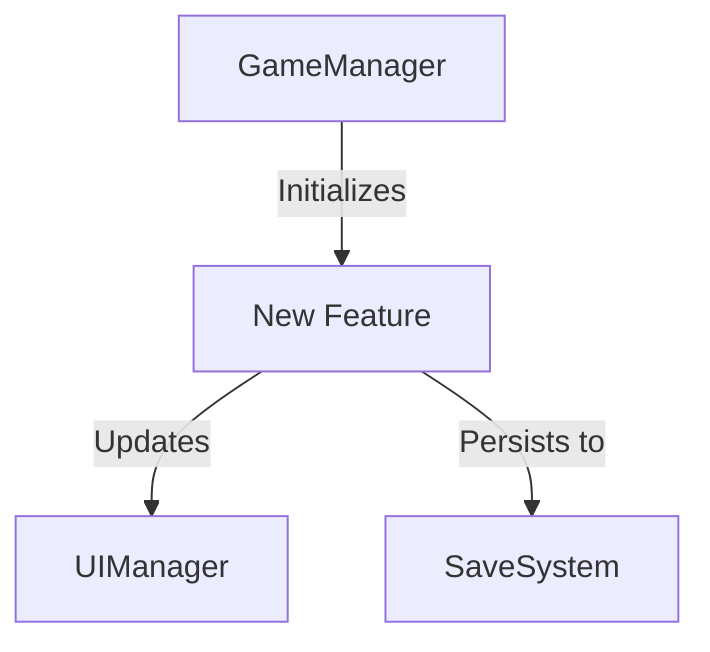
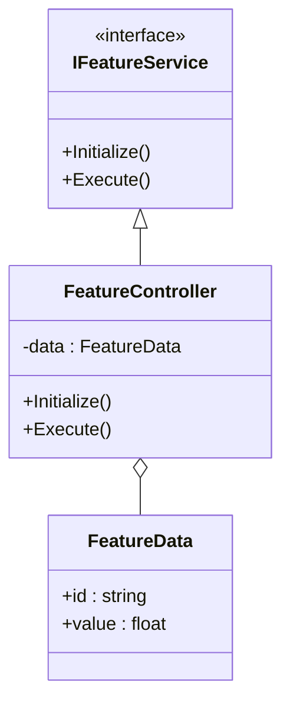

<!-- PART 1/4 of TDD_DOCUMENT_TEMPLATE.md -->
<!-- Split template chunk: keep order and concatenate parts to reconstruct full template. -->

# {FeatureName} — Technical Design Document

> **Generated**: {Date}
> **Author**: AI Assistant
> **Status**: Draft | Review | Approved
> **Version**: 1.0
> **Target Release**: {Release}

---

## 1. Executive Summary
<!-- One paragraph: What is being built/changed, why, and the high-level approach. Focus on the "what" and "why". -->

## 2. Background & Motivation
<!-- Context setting. Why are we doing this? -->

### 2.1 Current State
<!-- How does the system work today? What are the limitations? Reference specific classes/files/assets. -->

### 2.2 Goals
<!-- What must this feature achieve? Be specific and measurable. -->
- [ ]
- [ ]

### 2.3 Non-Goals
<!-- What is explicitly out of scope? -->
-
-

## 3. Architecture Overview (MANDATORY)
<!-- This section defines the "Where" and "How" of the system integration. -->

### 3.1 System Context Diagram
<!-- Show where this feature sits in the overall system. High-level block diagram. -->

### 3.2 Architecture Decision Records (ADRs)
<!-- Key technical decisions made during design. Why did we choose X over Y? -->
| Decision | Options Considered | Chosen | Rationale |
|:---|:---|:---|:---|
| Data Storage | ScriptableObject vs JSON vs Database | JSON | Need runtime modification & easy serialization. |
| | | | |

### 3.3 Class/Component Diagram
<!-- Class diagram showing key classes, interfaces, and relationships. Mandatory for new systems. -->

