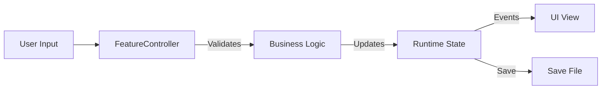

<!-- PART 2/4 of TDD_DOCUMENT_TEMPLATE.md -->
<!-- Split template chunk: keep order and concatenate parts to reconstruct full template. -->

## 4. Technical Approach (MANDATORY)
<!-- The "Meat" of the document. Detailed technical specifications. -->

### 4.1 Core Components
<!-- List all new or modified components. -->
| Component | Responsibility | Type | File Path |
|:---|:---|:---|:---|
| `FeatureController` | Manages core logic and state. | MonoBehaviour | `Assets/Scripts/Feature/FeatureController.cs` |
| `FeatureConfig` | Static configuration data. | ScriptableObject | `Assets/Scripts/Feature/FeatureConfig.cs` |

### 4.2 Data Architecture

#### 4.2.1 Data Models
<!-- Define the data structures. serialization attributes, field types. -->
```csharp
[Serializable]
public class FeatureData {
    public string id;      // Unique identifier
    public float value;    // Normalized value (0-1)
    public List<string> tags;
}
```

#### 4.2.2 Data Flow
<!-- How data moves through the system. Input -> Process -> Output. -->


### 4.3 Logic & State Management
<!-- Describe complex logic, state machines, or formulas. Pseudocode or flowcharts. -->
*   **Initialization**: ...
*   **Update Loop**: ...
*   **Cleanup**: ...

### 4.4 API Surface
<!-- Public methods and properties exposed to other systems. -->
| Method/Property | Signature | Description |
|:---|:---|:---|
| `Initialize` | `void Initialize(Config config)` | Sets up the service with config. |
| `OnStateChanged` | `event Action<State>` | Fired when internal state changes. |

### 4.5 Error Handling & Extension Points
*   **Exceptions**: What happens if initialization fails?
*   **Extension**: How can other systems extend this behavior (virtual methods, callbacks)?

## 5. Integration Points

### 5.1 Dependencies (Required Systems)
<!-- Existing systems this feature relies on. -->
| System | How Used | Already Exists? |
|:---|:---|:---|
| `AudioManager` | Play SFX on events. | Yes |
| `InventorySystem` | Check for item requirements. | Yes |

### 5.2 Events & Communication
<!-- How this system talks to others (Events, Signals, Messages). -->
| Event | Direction | Payload | Purpose |
|:---|:---|:---|:---|
| `OnItemUsed` | Subscribe | `ItemId` | Trigger feature logic. |
| `OnFeatureComplete` | Publish | `ResultData` | Notify UI to show summary. |

### 5.3 Third-Party Dependencies
<!-- Packages, plugins, or external services. -->
| Package | Version | Purpose |
|:---|:---|:---|
| `DoTween` | 1.2.0 | Animations |

