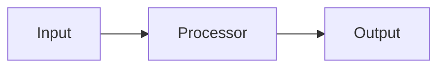

# TDD Template

## TDD: {Feature / System Name}
**Date**: {YYYY-MM-DD}  
**Status**: Draft | Review | Approved

---

## Problem

{1-2 sentences: what problem this design solves.}

---

## Goals

- {Measurable goal 1}
- {Measurable goal 2}

## Non-Goals

- {Explicitly out of scope}

---

## Design

### Components

| Component | Responsibility | File |
|-----------|----------------|------|
| {Name} | {role} | `{path}` |

### Interfaces

```csharp
public interface I{Name}
{
    void {Method}();
}
```

### Data Flow



---

## Alternatives Considered

| Option | Pros | Cons | Rejected Because |
|--------|------|------|-----------------|
| {Alt 1} | {pro} | {con} | {reason} |
| {Alt 2} | {pro} | {con} | {reason} |

---

## Dependencies

| System | Coupling | Evidence |
|--------|----------|----------|
| {Name} | {tight/loose} | `file:line` |

---

## Risks

| Risk | Likelihood | Impact | Mitigation |
|------|-----------|--------|------------|
| {risk} | H/M/L | H/M/L | {action} |

---

## Open Questions

- {Resolved or pending question}
