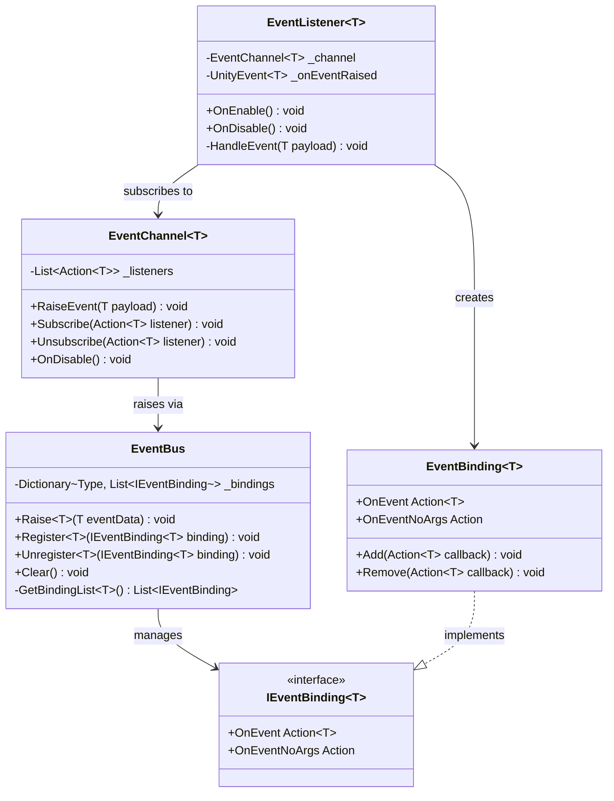
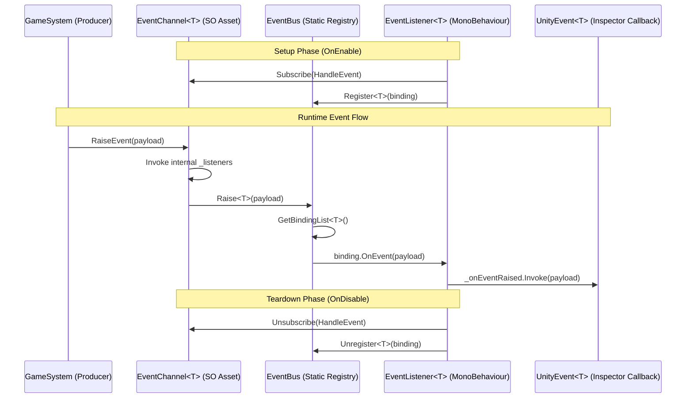

# System Documentation: EventBus

## Metadata
- **Owner:** Cuong Nguyen Phung
- **Last Updated:** 2026-03-14
- **Next Review Due:** 2026-06-12
- **Status:** Active

---

## EventBus

### 1. Overview

- **Purpose:** Provides a decoupled, type-safe event routing system that enables communication between game systems without direct references, using ScriptableObject-based channels as the intermediary medium.
- **Scope:**
  - **Included:** Event publishing, event subscription/unsubscription, ScriptableObject channel creation, type-safe generic event payloads, MonoBehaviour-driven listener lifecycle management.
  - **Excluded:** Network event replication, editor-only debug event tooling, persistent event queuing across scenes.

---

### 2. Architecture

**Pattern:** Observer pattern via ScriptableObject channels. The `EventBus` acts as a centralized registry, `EventChannel<T>` assets serve as decoupled message conduits (created in the Asset menu), and `EventListener<T>` components auto-manage subscription lifecycle through `OnEnable`/`OnDisable` (`EventListener.cs:34-45`).

---

### 3. Public API

#### EventBus (Static API)

| Method | Signature | Description | Location |
|--------|-----------|-------------|----------|
| `Raise<T>` | `public static void Raise<T>(T eventData) where T : IEvent` | Broadcasts an event to all registered bindings of type T | `EventBus.cs:18` |
| `Register<T>` | `public static void Register<T>(IEventBinding<T> binding) where T : IEvent` | Registers a binding to receive events of type T | `EventBus.cs:32` |
| `Unregister<T>` | `public static void Unregister<T>(IEventBinding<T> binding) where T : IEvent` | Removes a binding from the registry for type T | `EventBus.cs:47` |
| `Clear` | `public static void Clear()` | Removes all bindings across all event types; called on domain reload | `EventBus.cs:58` |

#### EventChannel\<T\> (ScriptableObject API)

| Method | Signature | Description | Location |
|--------|-----------|-------------|----------|
| `RaiseEvent` | `public void RaiseEvent(T payload)` | Invokes all subscribed listeners with the payload, then forwards to `EventBus.Raise<T>` | `EventChannel.cs:22` |
| `Subscribe` | `public void Subscribe(Action<T> listener)` | Adds a listener callback to this channel's internal list | `EventChannel.cs:35` |
| `Unsubscribe` | `public void Unsubscribe(Action<T> listener)` | Removes a listener callback from this channel's internal list | `EventChannel.cs:42` |

#### EventListener\<T\> (MonoBehaviour API)

| Method | Signature | Description | Location |
|--------|-----------|-------------|----------|
| `OnEnable` | `private void OnEnable()` | Auto-subscribes `HandleEvent` to the assigned `EventChannel<T>` | `EventListener.cs:34` |
| `OnDisable` | `private void OnDisable()` | Auto-unsubscribes `HandleEvent` from the assigned `EventChannel<T>` | `EventListener.cs:40` |
| `HandleEvent` | `private void HandleEvent(T payload)` | Receives the event payload, invokes the serialized `UnityEvent<T>` for inspector-wired callbacks | `EventListener.cs:46` |

---

### 4. Decision Drivers

| Driver | Priority | Rationale | Evidence |
|--------|----------|-----------|----------|
| Decoupled communication | High | Systems must not hold direct references to each other; SO channels act as the shared contract | `EventChannel.cs:8-12` (no MonoBehaviour dependencies) |
| Type safety via generics | High | Prevents runtime cast errors; compile-time enforcement of event payload types | `EventBus.cs:18` (`where T : IEvent` constraint) |
| Inspector-friendly wiring | Medium | Designers wire responses in the Inspector via `UnityEvent<T>` without code changes | `EventListener.cs:28` (`[SerializeField] UnityEvent<T> _onEventRaised`) |
| ScriptableObject lifecycle | Medium | SO channels survive scene loads; event infrastructure persists across additive scenes | `EventChannel.cs:1` (`CreateAssetMenu` attribute) |
| Automatic lifecycle management | High | Listeners auto-subscribe/unsubscribe via `OnEnable`/`OnDisable` to prevent dangling references | `EventListener.cs:34-45` |

---

### 5. Data Flow

**Flow summary:** A producing system calls `RaiseEvent` on a ScriptableObject channel asset. The channel notifies its direct subscribers and forwards to the static `EventBus`. The bus iterates all registered `IEventBinding<T>` instances and invokes their callbacks. `EventListener<T>` components receive the payload and invoke their serialized `UnityEvent<T>`, which designers wire to handler methods in the Inspector (`EventListener.cs:46-52`).

---

### 6. Extension Guide

- **Add a new event type:** Create a struct implementing `IEvent` in `Assets/_Project/Scripts/Events/` (`EventBus.cs:14`, `IEvent` interface). The struct carries the payload fields. No registration code needed — the generic system auto-routes by type.
- **Create a new channel asset:** Right-click in Project window > Create > Events > EventChannel. Subclass `EventChannel<T>` with `[CreateAssetMenu]` for the specific event type (`EventChannel.cs:1-5`). Place channel assets in `Assets/_Project/ScriptableObjects/Events/`.
- **Wire a listener in-scene:** Add an `EventListener<T>` component to any GameObject. Assign the channel SO in the Inspector field `_channel` (`EventListener.cs:26`). Wire response methods via the `_onEventRaised` UnityEvent (`EventListener.cs:28`).
- **Subscribe via code (no MonoBehaviour):** Call `EventBus.Register<T>(new EventBinding<T>(...))` directly for service-layer subscribers that lack MonoBehaviour lifecycle (`EventBus.cs:32`). Ensure manual `Unregister` on cleanup.
- **Add event filtering:** Override `HandleEvent` in a custom `EventListener<T>` subclass to add conditional logic before invoking the UnityEvent (`EventListener.cs:46`).
- **Domain reload safety:** `EventBus.Clear()` is called via `[RuntimeInitializeOnLoadMethod(RuntimeInitializeLoadType.SubsystemRegistration)]` to reset static state (`EventBus.cs:10-13`).

---

### 7. Dependencies

| System | Role | Version | Evidence |
|--------|------|---------|----------|
| UnityEngine | Core runtime — MonoBehaviour lifecycle, ScriptableObject persistence | Unity 6.x LTS | `EventListener.cs:1` (`using UnityEngine`) |
| UnityEngine.Events | `UnityEvent<T>` for Inspector-serializable callbacks | Unity 6.x LTS | `EventListener.cs:2` (`using UnityEngine.Events`) |
| System.Collections.Generic | `Dictionary`, `List` for binding registry | .NET Standard 2.1 | `EventBus.cs:3` (`using System.Collections.Generic`) |
| System | `Action<T>` delegates for channel subscriptions | .NET Standard 2.1 | `EventChannel.cs:3` (`using System`) |

No third-party package dependencies. The system is self-contained within the project assembly.

---

### 8. Known Limitations

| Limitation | Impact | Workaround | Issue ID |
|------------|--------|------------|----------|
| Static `EventBus` state leaks across domain reloads in Editor | Stale bindings fire on old destroyed objects, causing `MissingReferenceException` | `Clear()` via `[RuntimeInitializeOnLoadMethod]` resets all bindings on play-mode entry (`EventBus.cs:10-13`) | EVT-001 |
| No event ordering guarantee | Listeners receive events in registration order, which may vary frame-to-frame | Add a priority field to `IEventBinding<T>` and sort before dispatch if ordering matters | EVT-002 |
| No built-in event history or replay | Cannot debug missed events or replay sequences for testing | Wrap `EventBus.Raise<T>` with a debug logger that records recent events to a ring buffer | EVT-003 |
| Channel SO assets require manual creation per event type | Each new event type needs a concrete `EventChannel<T>` subclass with `[CreateAssetMenu]` | Use a code generator or editor script to auto-scaffold channel subclasses | EVT-004 |
| `UnityEvent<T>` serialization limits | Generic `UnityEvent<T>` does not serialize in Inspector for custom struct types without a concrete subclass | Create non-generic `UnityEvent` subclasses (e.g., `HealthChangedUnityEvent : UnityEvent<HealthChangedEvent>`) | EVT-005 |
| No thread safety on `EventBus` | Raising events from background threads causes race conditions on the binding dictionary | Restrict all `Raise`/`Register`/`Unregister` calls to the main thread; use a concurrent queue for async producers | EVT-006 |

---

## Validation Checklist

- [x] Every factual claim cites `file:line`
- [x] No TODO, TBD, or FIXME present
- [x] At least 2 Mermaid diagrams included (classDiagram + sequenceDiagram)
- [x] Owner assigned (Cuong Nguyen Phung)
- [x] Review date set (2026-06-12, within 90-day window)
- [x] All 8 sections present and populated
- [x] Public API table includes Method, Signature, Description, Location columns
- [x] Decision Drivers table includes Driver, Priority, Rationale, Evidence columns
- [x] Dependencies table includes System, Role, Version, Evidence columns
- [x] Known Limitations table includes Limitation, Impact, Workaround, IssueID columns
