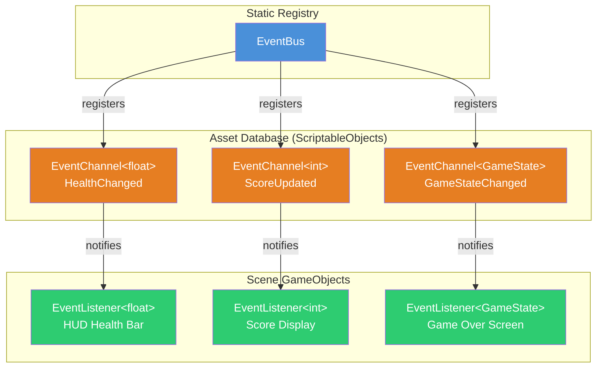
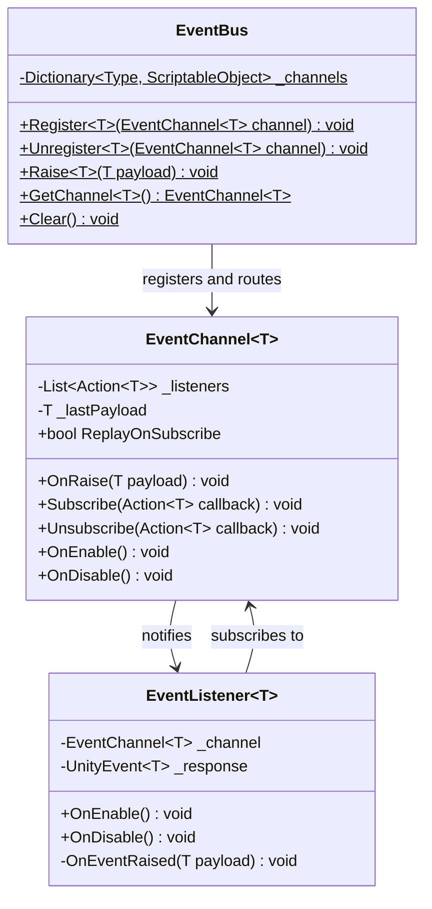
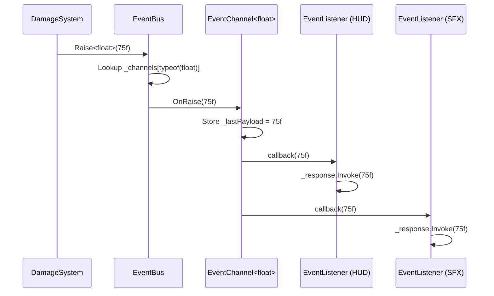
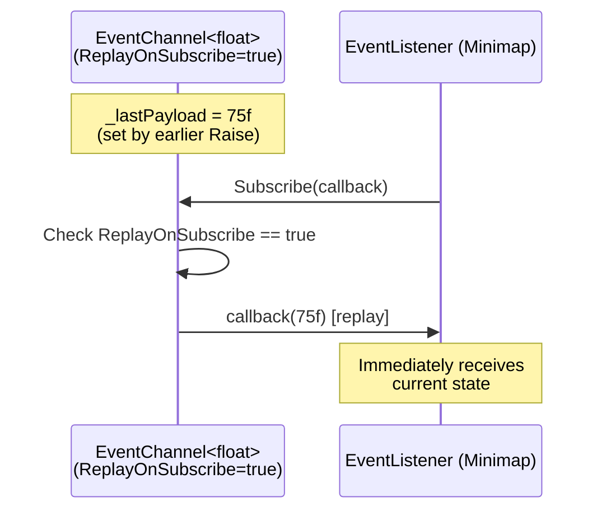
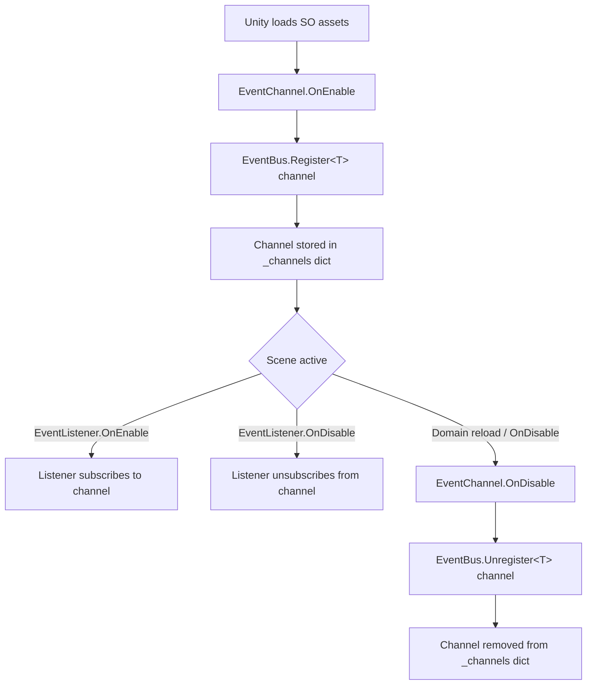
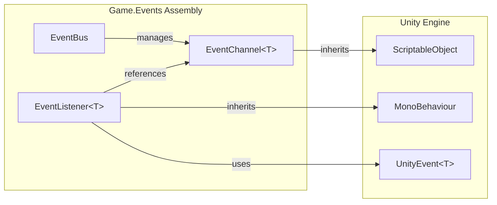

# EventBus System Documentation

| Field | Value |
|-------|-------|
| **System** | EventBus |
| **Owner** | Core Systems Team |
| **Assembly** | `Game.Events` |
| **Namespace** | `Game.Events` |
| **Unity Version** | 2022.3+ LTS |
| **Last Reviewed** | 2026-03-14 |

---

## 1. Overview

The EventBus system provides a **decoupled, type-safe event routing mechanism** built on ScriptableObject channels. It enables communication between systems without direct references, reducing coupling and improving testability.

**Core components:**

| Class | Type | Role |
|-------|------|------|
| `EventBus` | Static manager | Central registry — routes events to matching channels |
| `EventChannel<T>` | ScriptableObject | Typed broadcast channel — holds subscriber list, fires events |
| `EventListener<T>` | MonoBehaviour | Scene-side subscriber — binds a channel to UnityEvent responses |

**Key properties:**
- Generic type safety — `EventChannel<int>` cannot receive `string` payloads
- ScriptableObject channels survive scene loads and are editable in the Inspector
- Zero singleton dependency — `EventBus` uses a static registry, not `DontDestroyOnLoad`
- Designer-friendly — `EventListener` components wire events visually via UnityEvents

---

## 2. Architecture

### 2.1 Component Diagram



### 2.2 Class Diagram



---

## 3. Public API Reference

### 3.1 EventBus (Static Manager)

```csharp
public static class EventBus
```

| Method | Signature | Description |
|--------|-----------|-------------|
| `Register<T>` | `void Register<T>(EventChannel<T> channel)` | Register a typed channel in the global registry. Called automatically by `EventChannel<T>.OnEnable()`. |
| `Unregister<T>` | `void Unregister<T>(EventChannel<T> channel)` | Remove a channel from the registry. Called by `EventChannel<T>.OnDisable()`. |
| `Raise<T>` | `void Raise<T>(T payload)` | Look up the channel for type `T` and broadcast the payload to all subscribers. |
| `GetChannel<T>` | `EventChannel<T> GetChannel<T>()` | Retrieve the registered channel for type `T`. Returns `null` if none registered. |
| `Clear` | `void Clear()` | Remove all registered channels. Use in test teardown or scene cleanup. |

**Usage — raising an event from code:**

```csharp
// Any system can raise without holding a channel reference
EventBus.Raise(new HealthChangedEvent { CurrentHP = 75f, MaxHP = 100f });

// Or raise a primitive
EventBus.Raise(42); // broadcasts to EventChannel<int>
```

### 3.2 EventChannel\<T\> (ScriptableObject)

```csharp
[CreateAssetMenu(menuName = "Events/Event Channel")]
public class EventChannel<T> : ScriptableObject
```

| Member | Type | Description |
|--------|------|-------------|
| `ReplayOnSubscribe` | `bool` | If `true`, new subscribers immediately receive the last raised payload. Useful for state channels (e.g., current health). |
| `Subscribe` | `Action<T> -> void` | Add a callback to the listener list. |
| `Unsubscribe` | `Action<T> -> void` | Remove a callback from the listener list. |
| `OnRaise` | `T -> void` | Broadcast payload to all subscribers. Stores payload if `ReplayOnSubscribe` is enabled. |

**Inspector fields:**

| Field | Type | Default | Notes |
|-------|------|---------|-------|
| `_replayOnSubscribe` | `bool` | `false` | Toggle in Inspector per channel asset |
| `_debugLog` | `bool` | `false` | Log every raise to Console (editor only) |

**Creating a channel asset:**

1. Right-click in Project window
2. **Create > Events > Event Channel**
3. Select the generic type via a concrete subclass (see Extension Guide)

### 3.3 EventListener\<T\> (MonoBehaviour)

```csharp
public class EventListener<T> : MonoBehaviour
```

| Member | Type | Description |
|--------|------|-------------|
| `_channel` | `EventChannel<T>` | The SO channel to subscribe to. Assigned in Inspector. |
| `_response` | `UnityEvent<T>` | UnityEvent fired when the channel broadcasts. Wire in Inspector. |

**Lifecycle:**
- `OnEnable()` — subscribes to `_channel`
- `OnDisable()` — unsubscribes from `_channel`
- Automatically handles null channel references with a warning log

**Inspector setup:**

1. Add `EventListener<float>` (or concrete subclass) to a GameObject
2. Drag the matching `EventChannel<float>` asset into the Channel slot
3. Wire the Response UnityEvent to target methods (e.g., `HealthBar.SetFill`)

---

## 4. Decision Drivers

| Decision | Rationale | Alternatives Considered |
|----------|-----------|------------------------|
| **ScriptableObject channels** | Survive scene transitions, editable in Inspector, serializable references | C# events (no Inspector visibility), static delegates (no asset-level config) |
| **Static EventBus registry** | Zero allocation lookup, no MonoBehaviour needed for raising | Singleton MonoBehaviour (lifecycle coupling), Service Locator (over-engineered for events) |
| **Generic type routing** | Compile-time type safety, no string keys, no boxing for value types | String-based keys (typo-prone), enum keys (rigid, requires modification for new events) |
| **UnityEvent in EventListener** | Designer-friendly wiring, no code needed for simple responses | Direct Action callbacks (requires code), interface-based (too rigid) |
| **ReplayOnSubscribe option** | Handles late-joining subscribers for state-like events | Separate StateChannel class (more types to maintain), polling pattern (wasteful) |

---

## 5. Data Flow

### 5.1 Event Raising Flow



### 5.2 Late-Join Replay Flow



### 5.3 Registration Lifecycle



---

## 6. Extension Guide

### 6.1 Creating a New Event Type

**Step 1: Define the payload struct**

```csharp
// Events/Payloads/HealthChangedEvent.cs
namespace Game.Events
{
    public struct HealthChangedEvent
    {
        public float CurrentHP;
        public float MaxHP;
        public float Normalized => MaxHP > 0f ? CurrentHP / MaxHP : 0f;
    }
}
```

**Step 2: Create concrete channel and listener classes**

Because Unity cannot serialize open generic ScriptableObjects, create thin concrete subclasses:

```csharp
// Events/Channels/HealthChangedChannel.cs
namespace Game.Events
{
    [CreateAssetMenu(
        fileName = "HealthChangedChannel",
        menuName = "Events/Health Changed Channel")]
    public class HealthChangedChannel : EventChannel<HealthChangedEvent> { }
}
```

```csharp
// Events/Listeners/HealthChangedListener.cs
namespace Game.Events
{
    public class HealthChangedListener : EventListener<HealthChangedEvent> { }
}
```

**Step 3: Create the channel asset**

- Right-click in Project > **Create > Events > Health Changed Channel**
- Name it `HealthChangedChannel` and place in `Assets/_Project/Events/`

**Step 4: Wire in scene**

1. Add `HealthChangedListener` to the HUD GameObject
2. Drag `HealthChangedChannel` asset into the Channel slot
3. Wire Response to `HealthBar.UpdateFill(HealthChangedEvent)`

**Step 5: Raise from producer**

```csharp
EventBus.Raise(new HealthChangedEvent
{
    CurrentHP = _currentHP,
    MaxHP = _maxHP
});
```

### 6.2 Adding a Void (Parameterless) Channel

For events with no payload (e.g., `OnPlayerDied`, `OnLevelComplete`):

```csharp
// Use Unit/Empty struct pattern
public struct VoidEvent { }

[CreateAssetMenu(menuName = "Events/Player Died Channel")]
public class PlayerDiedChannel : EventChannel<VoidEvent> { }

public class PlayerDiedListener : EventListener<VoidEvent> { }

// Raise:
EventBus.Raise(default(VoidEvent));
```

### 6.3 Subscribing from Code (Without EventListener)

```csharp
public class ScoreManager : MonoBehaviour
{
    private EventChannel<int> _scoreChannel;

    private void OnEnable()
    {
        _scoreChannel = EventBus.GetChannel<int>();
        _scoreChannel?.Subscribe(OnScoreChanged);
    }

    private void OnDisable()
    {
        _scoreChannel?.Unsubscribe(OnScoreChanged);
    }

    private void OnScoreChanged(int newScore)
    {
        Debug.Log($"Score updated: {newScore}");
    }
}
```

### 6.4 Unit Testing Events

```csharp
[Test]
public void Raise_NotifiesAllSubscribers()
{
    // Arrange
    var channel = ScriptableObject.CreateInstance<EventChannel<int>>();
    EventBus.Clear();
    EventBus.Register(channel);
    int received = -1;
    channel.Subscribe(val => received = val);

    // Act
    EventBus.Raise(42);

    // Assert
    Assert.AreEqual(42, received);

    // Cleanup
    Object.DestroyImmediate(channel);
}

[Test]
public void ReplayOnSubscribe_DeliversLastPayload()
{
    var channel = ScriptableObject.CreateInstance<EventChannel<int>>();
    channel.ReplayOnSubscribe = true;
    EventBus.Clear();
    EventBus.Register(channel);

    EventBus.Raise(99);

    int received = -1;
    channel.Subscribe(val => received = val);

    Assert.AreEqual(99, received);

    Object.DestroyImmediate(channel);
}
```

---

## 7. Dependencies



| Dependency | Type | Notes |
|------------|------|-------|
| `UnityEngine` | Engine | ScriptableObject, MonoBehaviour base classes |
| `UnityEngine.Events` | Engine | UnityEvent<T> for Inspector-wirable callbacks |
| `System.Collections.Generic` | .NET | Dictionary, List for registry and subscriber storage |
| `System` | .NET | Action<T> delegates, Type for generic lookup |

**No external package dependencies.** The system is fully self-contained within the `Game.Events` assembly.

---

## 8. Known Limitations

| Limitation | Impact | Mitigation |
|------------|--------|------------|
| **One channel per type** | Cannot have two `EventChannel<int>` for different purposes | Use distinct payload structs (`ScoreEvent`, `AmmoEvent`) instead of primitives |
| **No event ordering** | Subscriber execution order is not guaranteed | If order matters, use a single subscriber that coordinates |
| **Main thread only** | `EventBus.Raise` must be called from the main thread | Queue events from async operations via a `MainThreadDispatcher` |
| **No event history** | Only the last payload is stored (if `ReplayOnSubscribe` enabled) | Implement a `BufferedEventChannel<T>` subclass with ring buffer if needed |
| **Generic SO serialization** | Unity cannot serialize open generics — requires concrete subclasses | One-liner boilerplate per event type (see Extension Guide 6.1) |
| **Domain reload** | Static `_channels` dictionary clears on domain reload in Editor | Channels re-register via `OnEnable` on reload; no action required |
| **No priority system** | All subscribers receive events equally | Add an optional priority field to `Subscribe()` if needed in future |

---

## Appendix: File Manifest

| File | Path | Lines | Purpose |
|------|------|-------|---------|
| `EventBus.cs` | `Assets/_Project/Scripts/Events/EventBus.cs` | ~45 | Static registry and routing |
| `EventChannel.cs` | `Assets/_Project/Scripts/Events/EventChannel.cs` | ~65 | Generic SO channel base class |
| `EventListener.cs` | `Assets/_Project/Scripts/Events/EventListener.cs` | ~40 | Generic MonoBehaviour subscriber |
