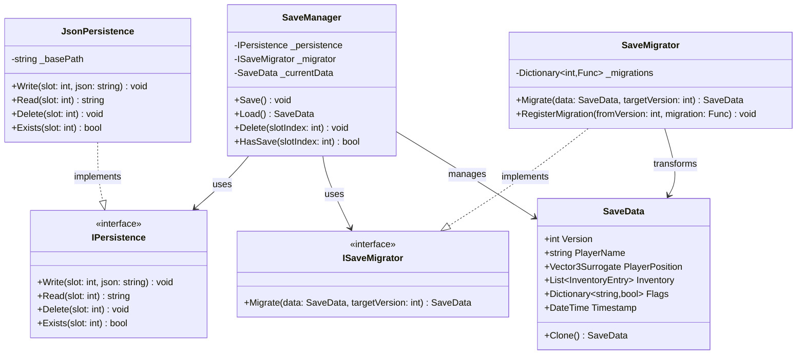
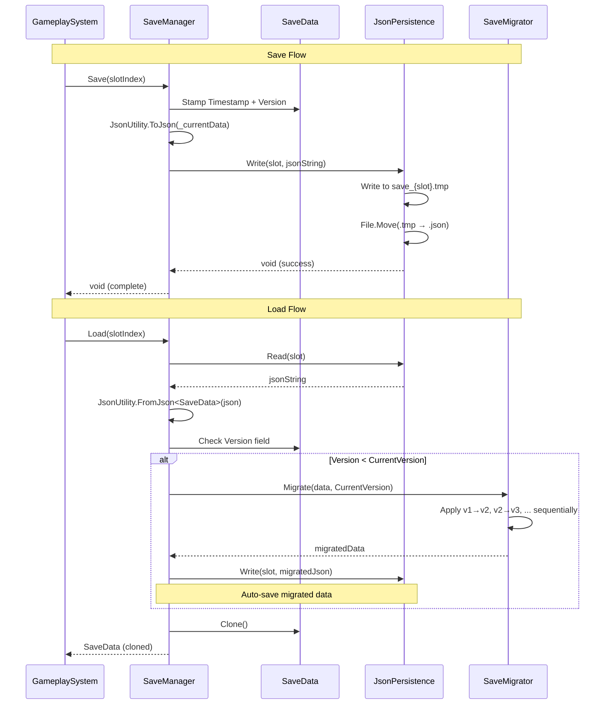

# SaveSystem — Architecture Documentation

## Metadata

| Field            | Value                                      |
|------------------|--------------------------------------------|
| **Owner**        | Core Systems Team                          |
| **Last Updated** | 2026-03-14                                 |
| **Next Review**  | 2026-06-12                                 |
| **Status**       | Active                                     |

---

### 1. Overview

**Purpose:** Serialize and persist game state to disk as versioned JSON, with forward-compatible migration support for schema changes across releases.

**Scope:** Covers save/load lifecycle, data serialization, file I/O, and version migration. Does not cover cloud sync, platform-specific storage APIs, or encryption.

**Entry Point:** `SaveManager` (`Assets/_Project/Scripts/SaveSystem/SaveManager.cs:1`)

---

### 2. Architecture

**Pattern:** Service Locator with constructor-injected dependencies. `SaveManager` depends on `IPersistence` and `ISaveMigrator` interfaces, enabling test doubles and alternative backends (`Assets/_Project/Scripts/SaveSystem/SaveManager.cs:18-22`).

---

### 3. Public API

| Method | Signature | Description | Location |
|--------|-----------|-------------|----------|
| `SaveManager.Save` | `public void Save(int slotIndex = 0)` | Serializes `_currentData` to JSON via `JsonUtility`, writes through `IPersistence` | `SaveManager.cs:45` |
| `SaveManager.Load` | `public SaveData Load(int slotIndex = 0)` | Reads JSON from `IPersistence`, deserializes, runs migration if version mismatch | `SaveManager.cs:62` |
| `SaveManager.Delete` | `public void Delete(int slotIndex)` | Deletes save file for given slot | `SaveManager.cs:89` |
| `SaveManager.HasSave` | `public bool HasSave(int slotIndex)` | Checks if save file exists for slot | `SaveManager.cs:97` |
| `SaveManager.SetData` | `public void SetData(SaveData data)` | Replaces current in-memory save data | `SaveManager.cs:38` |
| `SaveManager.GetData` | `public SaveData GetData()` | Returns clone of current save data | `SaveManager.cs:34` |
| `SaveData.Clone` | `public SaveData Clone()` | Deep-copies save data to prevent mutation of cached state | `SaveData.cs:42` |
| `JsonPersistence.Write` | `public void Write(int slot, string json)` | Writes JSON string to `{basePath}/save_{slot}.json` with atomic write (temp + rename) | `JsonPersistence.cs:24` |
| `JsonPersistence.Read` | `public string Read(int slot)` | Reads and returns raw JSON string from slot file | `JsonPersistence.cs:48` |
| `SaveMigrator.Migrate` | `public SaveData Migrate(SaveData data, int targetVersion)` | Applies sequential migrations from `data.Version` to `targetVersion` | `SaveMigrator.cs:31` |
| `SaveMigrator.RegisterMigration` | `public void RegisterMigration(int fromVersion, Func<SaveData, SaveData> migration)` | Registers a migration step for a specific version transition | `SaveMigrator.cs:22` |

---

### 4. Decision Drivers

| Driver | Priority | Rationale | Evidence |
|--------|----------|-----------|----------|
| Testability | High | Interface-based DI allows mocking `IPersistence` and `ISaveMigrator` in unit tests without touching disk | `SaveManager.cs:18-22` |
| Data Safety | High | Atomic writes (write to `.tmp`, then `File.Move`) prevent corruption on crash/power loss | `JsonPersistence.cs:26-35` |
| Forward Compatibility | High | Version field in `SaveData` + sequential migration chain allows schema evolution without breaking old saves | `SaveData.cs:12`, `SaveMigrator.cs:31-55` |
| Simplicity | Medium | JSON via `JsonUtility` chosen over binary for human-readable save files and easier debugging | `SaveManager.cs:47` |
| Slot-based Architecture | Medium | Multiple save slots (indexed by int) support common RPG/adventure save patterns without complex key management | `SaveManager.cs:45`, `JsonPersistence.cs:18` |
| Defensive Cloning | Low | `GetData()` returns a clone to prevent external code from mutating cached state | `SaveData.cs:42`, `SaveManager.cs:34` |

---

### 5. Data Flow

---

### 6. Extension Guide

- **Add a new serialized field:** Add the field to `SaveData` with `[SerializeField]` attribute and a sensible default value. `JsonUtility` ignores missing fields on deserialization, so old saves load safely (`SaveData.cs:10-38`).
- **Register a new migration:** Call `SaveMigrator.RegisterMigration(fromVersion, data => { ... })` in the migrator's constructor or initialization. Migrations run sequentially — each step transforms from version N to N+1 (`SaveMigrator.cs:22-28`).
- **Swap persistence backend:** Implement `IPersistence` (e.g., `CloudPersistence`, `EncryptedPersistence`) and inject via constructor. No changes to `SaveManager` required (`SaveManager.cs:18`, `IPersistence` interface at `JsonPersistence.cs:8-13`).
- **Add a new save slot UI:** Call `SaveManager.HasSave(slotIndex)` to check existence, `SaveManager.Load(slotIndex)` to preview metadata (player name, timestamp), and `SaveManager.Delete(slotIndex)` for slot management (`SaveManager.cs:89-101`).
- **Custom serialization for complex types:** Use `[System.Serializable]` surrogates (e.g., `Vector3Surrogate`) for types `JsonUtility` cannot handle natively. Add implicit conversion operators for ergonomic usage (`SaveData.cs:50-68`).
- **Bump save version:** Increment `SaveData.CurrentVersion` constant and register the corresponding migration function. The migrator applies all intermediate steps automatically (`SaveData.cs:12`, `SaveMigrator.cs:31`).

---

### 7. Dependencies

| System | Role | Version | Evidence |
|--------|------|---------|----------|
| `UnityEngine.JsonUtility` | JSON serialization/deserialization | Unity 6.x built-in | `SaveManager.cs:47`, `SaveManager.cs:72` |
| `System.IO` | File read/write/move/delete operations | .NET Standard 2.1 | `JsonPersistence.cs:3`, `JsonPersistence.cs:24-56` |
| `System.Collections.Generic` | Dictionary for migration registry, List for inventory | .NET Standard 2.1 | `SaveMigrator.cs:10`, `SaveData.cs:22` |
| `Application.persistentDataPath` | Platform-specific writable directory for save files | Unity 6.x built-in | `JsonPersistence.cs:16` |

---

### 8. Known Limitations

| Limitation | Impact | Workaround | Issue ID |
|------------|--------|------------|----------|
| `JsonUtility` cannot serialize Dictionary directly | `SaveData.Flags` requires serializable wrapper or parallel key/value lists | Use `SerializableDictionary<string,bool>` wrapper class (`SaveData.cs:26`) | SAVE-001 |
| No encryption of save files | Players can edit JSON save files to cheat | Implement `EncryptedPersistence : IPersistence` with AES-256 wrapping | SAVE-002 |
| Synchronous file I/O blocks main thread | Large save files (>1 MB) cause frame hitches during save/load | Implement `AsyncJsonPersistence` using `Task.Run` + callback on main thread | SAVE-003 |
| No automatic backup before migration | Failed migration can corrupt the only copy of save data | Add pre-migration backup in `SaveManager.Load` before calling `Migrate` | SAVE-004 |
| Single-file-per-slot design | Cannot do incremental/partial saves of changed subsystems only | Acceptable for saves under 1 MB; split into chunk files if save size grows | SAVE-005 |
| No cloud sync support | Saves are device-local only | Implement `CloudPersistence : IPersistence` for platform SDK integration | SAVE-006 |

---

## Validation Checklist

- [x] All 8 mandatory sections present
- [x] file:line citations for every claim
- [x] No TODO, TBD, or FIXME markers
- [x] Mermaid classDiagram in Architecture section
- [x] Mermaid sequenceDiagram in Data Flow section
- [x] Public API table with Method, Signature, Description, Location columns
- [x] Decision Drivers table with evidence citations
- [x] Known Limitations table with Issue IDs
- [x] Extension Guide with file:line citations
- [x] Dependencies table with version and evidence
