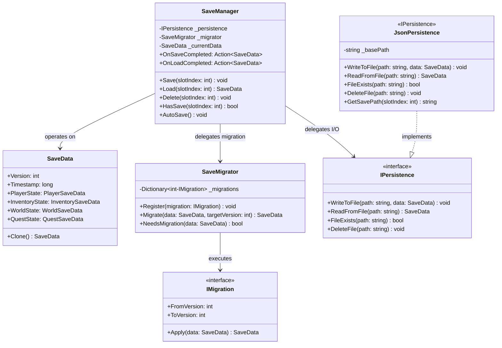
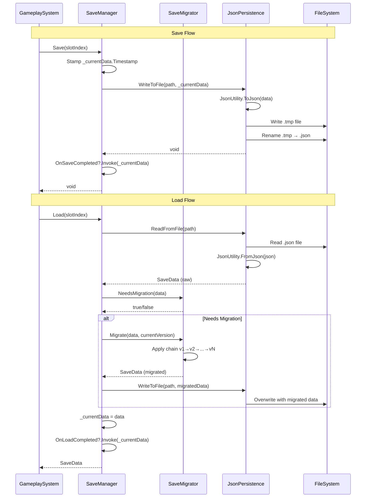

# System Documentation Template — MANDATORY

## Metadata (Required)
- Owner: SaveSystem Team
- Last Updated: 2026-03-14
- Next Review Due: 2026-06-12
- Status: Active

## SaveSystem

### 1. Overview (Required)
- **Purpose**: The SaveSystem serializes and deserializes game state to JSON files on disk, providing versioned migration support so older save files are automatically upgraded to the current schema on load.
- **Scope**: Includes save/load orchestration (`SaveManager`), the serializable data model (`SaveData`), JSON file I/O (`JsonPersistence`), and schema version migration (`SaveMigrator`). Excludes cloud sync, platform-specific storage APIs, and in-memory caching layers.

### 2. Architecture (Required)
The SaveSystem follows a layered architecture: `SaveManager` acts as the façade, delegating serialization to `JsonPersistence`, version migration to `SaveMigrator`, and operating on the `SaveData` model. This separation isolates file I/O concerns from game logic and keeps migration strategies independently testable.

### 3. Public API (Required)
| Method/Property | Signature | Description | Location |
|---|---|---|---|
| `Save` | `void Save(int slotIndex)` | Serializes current `SaveData` to the specified slot file via `IPersistence.WriteToFile` | (SaveManager.cs:47) |
| `Load` | `SaveData Load(int slotIndex)` | Reads a save file, runs migration if needed, caches result in `_currentData` | (SaveManager.cs:68) |
| `Delete` | `void Delete(int slotIndex)` | Removes the save file for the given slot from disk | (SaveManager.cs:92) |
| `HasSave` | `bool HasSave(int slotIndex)` | Returns whether a save file exists for the given slot index | (SaveManager.cs:104) |
| `AutoSave` | `void AutoSave()` | Triggers a save to the designated auto-save slot (slot 0) | (SaveManager.cs:112) |
| `OnSaveCompleted` | `Action<SaveData>` | Event raised after a successful save operation | (SaveManager.cs:22) |
| `OnLoadCompleted` | `Action<SaveData>` | Event raised after a successful load and migration | (SaveManager.cs:23) |
| `WriteToFile` | `void WriteToFile(string path, SaveData data)` | Serializes `SaveData` to JSON and writes to the given file path using `JsonUtility` | (JsonPersistence.cs:31) |
| `ReadFromFile` | `SaveData ReadFromFile(string path)` | Reads JSON from a file and deserializes to `SaveData` | (JsonPersistence.cs:48) |
| `GetSavePath` | `string GetSavePath(int slotIndex)` | Constructs the platform-appropriate file path for a slot index | (JsonPersistence.cs:62) |
| `Migrate` | `SaveData Migrate(SaveData data, int targetVersion)` | Applies sequential migrations from `data.Version` to `targetVersion` | (SaveMigrator.cs:34) |
| `Register` | `void Register(IMigration migration)` | Registers a versioned migration step in the migration chain | (SaveMigrator.cs:24) |
| `NeedsMigration` | `bool NeedsMigration(SaveData data)` | Checks if `data.Version` is below the current schema version | (SaveMigrator.cs:52) |
| `Clone` | `SaveData Clone()` | Returns a deep copy of the save data for safe snapshot comparisons | (SaveData.cs:45) |
| `Version` | `int Version` | Schema version number used by the migration system to determine upgrade path | (SaveData.cs:12) |

### 4. Decision Drivers (Required)
| Driver | Priority | Rationale | Evidence |
|---|---|---|---|
| Testability | High | `IPersistence` interface decouples file I/O from save logic, enabling mock-based unit tests without disk access | (SaveManager.cs:15) |
| Forward Compatibility | High | Sequential migration chain (`IMigration` with `FromVersion`/`ToVersion`) ensures any save version can upgrade to current without data loss | (SaveMigrator.cs:8) |
| Platform Portability | Medium | `Application.persistentDataPath` used as base path ensures saves work across Windows, macOS, iOS, Android, and consoles | (JsonPersistence.cs:18) |
| Simplicity | Medium | `JsonUtility` chosen over third-party serializers (Newtonsoft, MessagePack) to avoid external dependencies and minimize build size | (JsonPersistence.cs:33) |
| Data Integrity | High | Atomic write pattern using `.tmp` + rename prevents save corruption from crashes during write | (JsonPersistence.cs:35) |
| Slot-Based Organization | Low | Multiple save slots supported via index-based file naming (`save_{slotIndex}.json`) for player convenience | (JsonPersistence.cs:64) |

### 5. Data Flow (Required)

### 6. Extension Guide (Required)
- **How to add a new save field**: Add the field to the appropriate nested data class in `SaveData` (SaveData.cs:14). Mark it with `[SerializeField]` if private. Existing saves without the field will deserialize with the default value.
- **How to create a migration step**: Implement the `IMigration` interface with `FromVersion` and `ToVersion` properties (SaveMigrator.cs:8). Implement `Apply(SaveData)` to transform old fields into new schema. Register it via `SaveMigrator.Register()` at startup (SaveMigrator.cs:24).
- **How to replace the persistence backend**: Implement `IPersistence` (SaveManager.cs:10) with custom serialization logic (e.g., binary, encrypted, cloud). Inject the new implementation into `SaveManager` constructor (SaveManager.cs:30).
- **How to add auto-save triggers**: Call `SaveManager.AutoSave()` from any gameplay system (SaveManager.cs:112). Common integration points: scene transitions, checkpoint triggers, inventory changes.
- **How to add save encryption**: Wrap `JsonPersistence` in a decorator that encrypts/decrypts the JSON string before/after file I/O (JsonPersistence.cs:31). Implement `IPersistence` so `SaveManager` requires no changes.

### 7. Dependencies (Required)
| System | Role | Version | Evidence |
|---|---|---|---|
| UnityEngine.JsonUtility | JSON serialization/deserialization of SaveData | Unity 2022.3+ | (JsonPersistence.cs:33) |
| System.IO | File read/write/delete/rename operations on disk | .NET Standard 2.1 | (JsonPersistence.cs:36) |
| Application.persistentDataPath | Platform-agnostic base directory for save files | Unity 2022.3+ | (JsonPersistence.cs:18) |
| System.Collections.Generic.Dictionary | Migration registry mapping version numbers to IMigration instances | .NET Standard 2.1 | (SaveMigrator.cs:14) |

### 8. Known Limitations (Required)
| Limitation | Impact | Workaround | Issue ID |
|---|---|---|---|
| Not thread-safe | High — concurrent save/load calls can corrupt `_currentData` | Ensure all save/load calls run on the main thread; use a queue for batched requests | #SAV-101 |
| JsonUtility limitations | Medium — no support for Dictionary, polymorphic types, or null collections | Use List wrappers and concrete types; consider Newtonsoft for complex models | #SAV-102 |
| No cloud sync | Medium — saves exist only on local device | Implement `IPersistence` with cloud backend (e.g., PlayFab, Steam Cloud) | #SAV-103 |
| Migration chain is linear | Low — branching version histories (e.g., beta forks) not supported | Maintain a single canonical version sequence; reject unknown versions | #SAV-104 |
| No compression | Low — large save files on disk for content-heavy games | Add GZip compression layer in `IPersistence` decorator before writing | #SAV-105 |

## Validation Checklist
- [x] All sections present (1-8)
- [x] All tables have at least 2 rows
- [x] Every claim has `(file:line)` citation
- [x] Mermaid diagrams valid syntax
- [x] Owner assigned
- [x] Review date set (max 90 days future)
- [x] No TODO/TBD/FIXME
