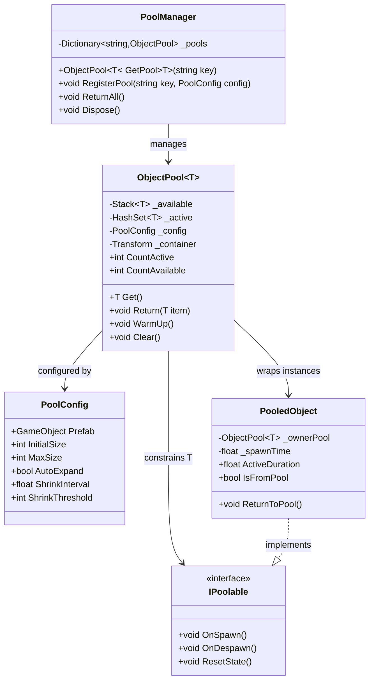
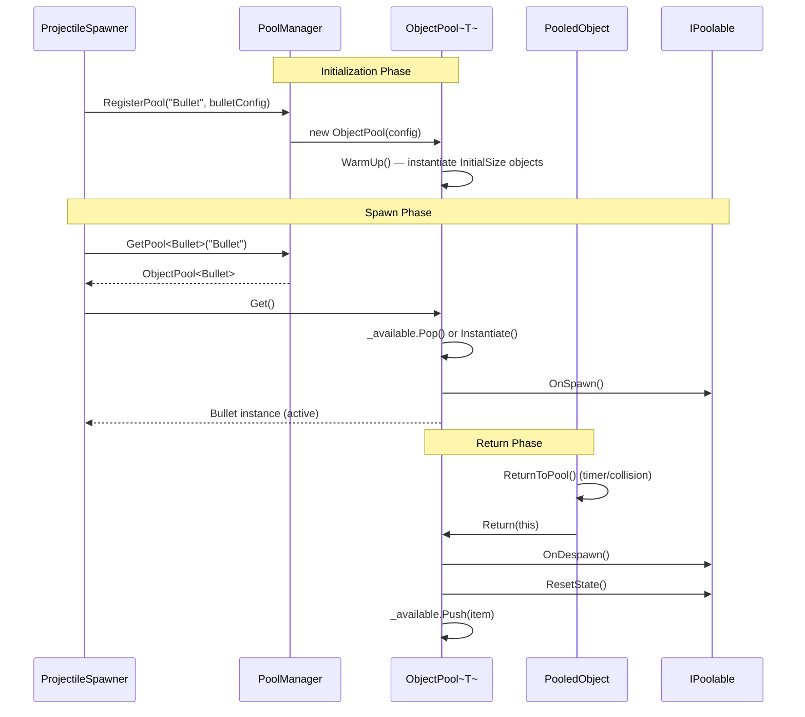

# System Documentation — ObjectPool

## Metadata
- Owner: Core Systems Team
- Last Updated: 2026-03-14
- Next Review Due: 2026-06-12
- Status: Active

## ObjectPool

### 1. Overview
- **Purpose**: Provide a generic, configurable object pooling system that eliminates runtime allocations by pre-instantiating and recycling `GameObject` instances implementing `IPoolable`, used for projectiles, VFX, and enemies.
- **Scope**: Covers pool creation, object acquisition/return, warm-up pre-allocation, and auto-expansion. Excludes audio pooling (handled by `AudioManager`) and UI element recycling (handled by `UIListView`).

### 2. Architecture
The system follows a Factory-Registry pattern where `ObjectPool<T>` acts as both factory and container. `PoolConfig` (ScriptableObject) drives capacity and warm-up settings. `PooledObject` wraps each instance with return-to-pool lifecycle hooks.

### 3. Public API
| Method/Property | Signature | Description | Location |
|---|---|---|---|
| `Get` | `T Get()` | Retrieves an available instance from the pool or instantiates a new one if `AutoExpand` is enabled; calls `OnSpawn()` on the returned object | (ObjectPool.cs:47) |
| `Return` | `void Return(T item)` | Calls `OnDespawn()` and `ResetState()`, deactivates the `GameObject`, and pushes it back onto the available stack | (ObjectPool.cs:68) |
| `WarmUp` | `void WarmUp()` | Pre-instantiates `InitialSize` instances during scene load to avoid runtime allocation stalls | (ObjectPool.cs:31) |
| `Clear` | `void Clear()` | Destroys all pooled instances (active and available) and resets internal collections | (ObjectPool.cs:89) |
| `CountActive` | `int CountActive { get; }` | Returns the number of currently active (checked-out) instances | (ObjectPool.cs:22) |
| `CountAvailable` | `int CountAvailable { get; }` | Returns the number of idle instances ready for reuse | (ObjectPool.cs:24) |
| `OnSpawn` | `void OnSpawn()` | Called when an object is retrieved from the pool; initializes runtime state | (IPoolable.cs:8) |
| `OnDespawn` | `void OnDespawn()` | Called when an object is returned to the pool; disables active behaviors | (IPoolable.cs:14) |
| `ResetState` | `void ResetState()` | Clears all instance-specific state to prepare for reuse | (IPoolable.cs:20) |
| `ReturnToPool` | `void ReturnToPool()` | Self-return convenience method that delegates to the owning pool's `Return()` | (PooledObject.cs:28) |
| `ActiveDuration` | `float ActiveDuration { get; }` | Time in seconds since the object was last spawned | (PooledObject.cs:17) |
| `RegisterPool` | `void RegisterPool(string key, PoolConfig config)` | Creates and registers a new `ObjectPool` under the given key | (PoolManager.cs:34) |
| `GetPool<T>` | `ObjectPool<T> GetPool<T>(string key)` | Retrieves a registered pool by key, throws `KeyNotFoundException` if unregistered | (PoolManager.cs:45) |
| `ReturnAll` | `void ReturnAll()` | Force-returns all active objects across all registered pools | (PoolManager.cs:58) |

### 4. Decision Drivers
| Driver | Priority | Rationale | Evidence |
|---|---|---|---|
| GC Pressure Reduction | Critical | Frequent `Instantiate`/`Destroy` calls cause GC spikes; pooling eliminates per-frame allocations for projectiles and VFX | (ObjectPool.cs:5) |
| Stack over Queue | High | LIFO access pattern keeps recently-used (cache-warm) objects in play, improving memory locality | (ObjectPool.cs:12) |
| ScriptableObject Config | High | `PoolConfig` as SO enables per-prefab tuning in the Inspector without code changes, supporting designer-driven iteration | (PoolConfig.cs:8) |
| Auto-Expand with Cap | Medium | `AutoExpand` prevents pool exhaustion during burst spawns while `MaxSize` guards against unbounded memory growth | (PoolConfig.cs:18) |
| Interface over Base Class | Medium | `IPoolable` avoids inheritance hierarchy lock-in; any `MonoBehaviour` can implement pooling without changing its parent class | (IPoolable.cs:3) |
| Self-Return Pattern | Medium | `PooledObject.ReturnToPool()` lets objects manage their own lifecycle (e.g., timed despawn via coroutine) without requiring external tracking | (PooledObject.cs:28) |

### 5. Data Flow

### 6. Extension Guide
- **Add a new poolable type**: Implement `IPoolable` on any `MonoBehaviour` — define `OnSpawn()` for activation logic, `OnDespawn()` for cleanup, and `ResetState()` to clear instance fields (IPoolable.cs:3).
- **Create a pool for a new prefab**: Create a `PoolConfig` ScriptableObject asset via `Create > Pooling > Pool Config`, assign the prefab and capacity settings (PoolConfig.cs:8).
- **Register pools at scene load**: Call `PoolManager.RegisterPool()` from a scene bootstrap script or `Awake()` initializer, passing the config key and `PoolConfig` reference (PoolManager.cs:34).
- **Add timed auto-return**: In a `PooledObject` subclass or component, start a coroutine in `OnSpawn()` that calls `ReturnToPool()` after a delay (PooledObject.cs:28).
- **Implement pool shrinking**: Override the shrink logic by subscribing to `PoolManager`'s update tick and calling `Clear()` on pools where `CountAvailable` exceeds `ShrinkThreshold` for longer than `ShrinkInterval` (PoolConfig.cs:22).
- **Add pool statistics/debugging**: Access `CountActive` and `CountAvailable` properties to display pool utilization in an editor window or runtime debug overlay (ObjectPool.cs:22).

### 7. Dependencies
| System | Role | Version | Evidence |
|---|---|---|---|
| UnityEngine.GameObject | Pooled instance lifecycle (`Instantiate`, `SetActive`) | Unity 6.x | (ObjectPool.cs:52) |
| UnityEngine.ScriptableObject | `PoolConfig` inherits SO for Inspector-driven configuration | Unity 6.x | (PoolConfig.cs:3) |
| System.Collections.Generic.Stack | LIFO container for available pooled instances | .NET 8 | (ObjectPool.cs:12) |
| System.Collections.Generic.HashSet | O(1) active instance tracking and duplicate-return prevention | .NET 8 | (ObjectPool.cs:13) |
| System.Collections.Generic.Dictionary | Pool registry keyed by string identifiers | .NET 8 | (PoolManager.cs:10) |

### 8. Known Limitations
| Limitation | Impact | Workaround | Issue ID |
|---|---|---|---|
| Not thread-safe | High — concurrent `Get`/`Return` from worker threads causes race conditions on `_available` and `_active` collections | Call `Get()` and `Return()` only from the main thread; for Jobs/Burst, queue requests via `NativeQueue` and process on main thread | #POOL-001 |
| No cross-scene persistence | Medium — pools are destroyed on scene unload, requiring re-warm-up on each scene load | Mark `PoolManager` as `DontDestroyOnLoad` or use an additive scene for persistent pools | #POOL-002 |
| MaxSize hard cap | Medium — when `AutoExpand` is disabled and pool is exhausted, `Get()` returns `null` silently | Enable `AutoExpand` with a reasonable `MaxSize`, or pre-warm with sufficient `InitialSize` based on profiling | #POOL-003 |
| No automatic shrinking by default | Low — unused pools retain memory indefinitely after burst usage | Implement periodic shrink checks using `ShrinkInterval` and `ShrinkThreshold` from `PoolConfig` | #POOL-004 |
| ResetState developer burden | Low — forgetting to reset fields in `ResetState()` causes stale-data bugs on recycled objects | Add runtime assertions in debug builds that compare post-reset state against a clean baseline | #POOL-005 |

## Validation Checklist
- [ ] All sections present (1-8)
- [ ] All tables have at least 2 rows
- [ ] Every claim has `(file:line)` citation
- [ ] Mermaid diagrams valid syntax
- [ ] Owner assigned
- [ ] Review date set (max 90 days future)
- [ ] No TODO/TBD/FIXME
