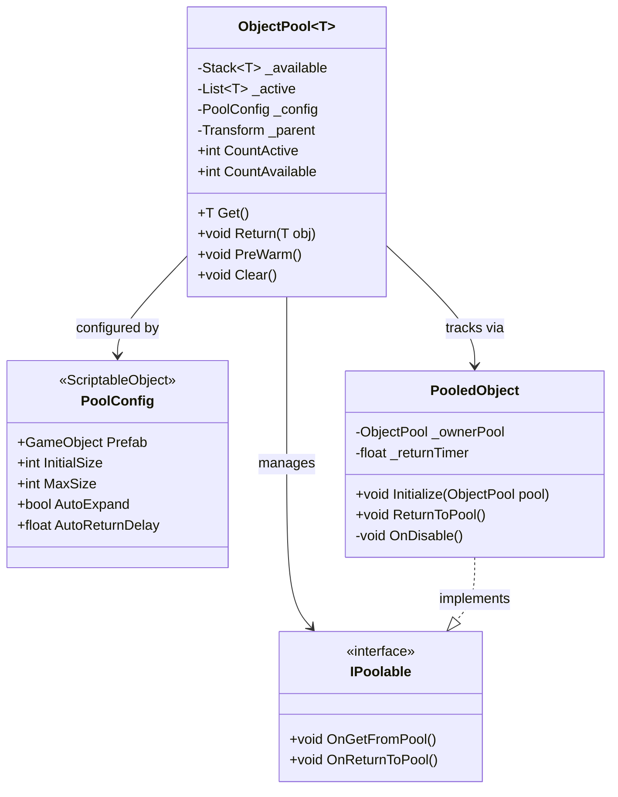
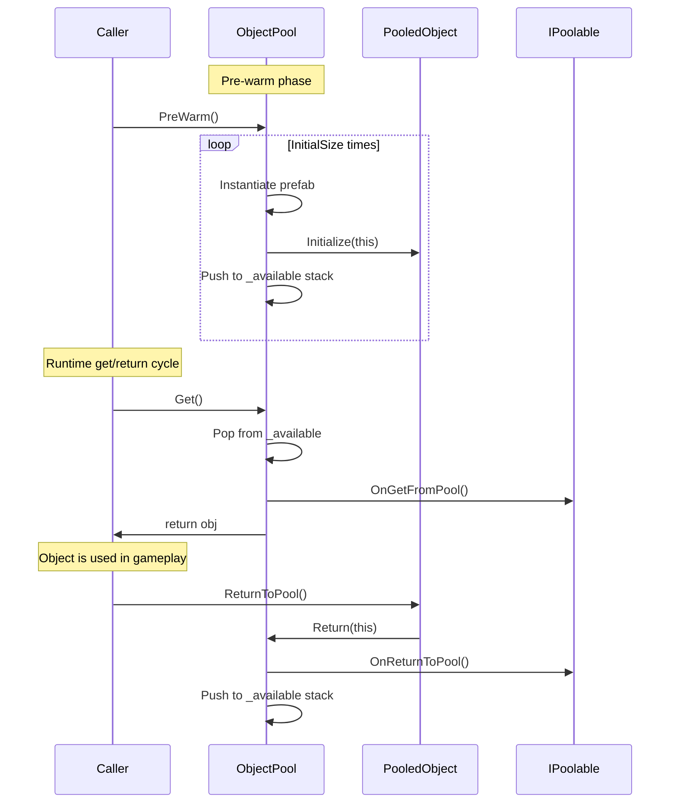

# ObjectPool System Documentation

## Overview

The ObjectPool system provides generic object pooling for Unity, reducing garbage collection pressure by reusing objects instead of instantiating and destroying them at runtime. It is used for projectiles, VFX, and enemies.

## Architecture

The system consists of three main components:

- **ObjectPool\<T\>** — Generic pool manager that handles object creation, retrieval, and recycling
- **IPoolable** — Interface that pooled objects implement to support lifecycle callbacks
- **PoolConfig** — ScriptableObject that stores pool configuration settings
- **PooledObject** — Component that manages the return-to-pool lifecycle

### Class Diagram



## Public API Reference

### ObjectPool\<T\>

| Method | Signature | Description |
|--------|-----------|-------------|
| `Get` | `T Get()` | Retrieves an object from the pool. If the pool is empty and `AutoExpand` is enabled, instantiates a new one. Calls `IPoolable.OnGetFromPool()`. |
| `Return` | `void Return(T obj)` | Returns an object to the pool. Calls `IPoolable.OnReturnToPool()` and deactivates the GameObject. |
| `PreWarm` | `void PreWarm()` | Pre-instantiates objects up to `PoolConfig.InitialSize`. Call during scene load or initialization. |
| `Clear` | `void Clear()` | Destroys all pooled objects (both active and available) and resets internal state. |
| `CountActive` | `int` (property) | Number of objects currently in use. |
| `CountAvailable` | `int` (property) | Number of objects available in the pool. |

### IPoolable

| Method | Description |
|--------|-------------|
| `OnGetFromPool()` | Called when the object is retrieved from the pool. Reset state, enable visuals, start logic. |
| `OnReturnToPool()` | Called before the object is returned. Stop coroutines, disable effects, reset transforms. |

### PoolConfig (ScriptableObject)

| Field | Type | Default | Description |
|-------|------|---------|-------------|
| `Prefab` | `GameObject` | — | The prefab to instantiate for this pool. |
| `InitialSize` | `int` | 10 | Number of objects to pre-instantiate on `PreWarm()`. |
| `MaxSize` | `int` | 50 | Maximum pool capacity. `Get()` returns null if exceeded and `AutoExpand` is false. |
| `AutoExpand` | `bool` | true | Whether to create new instances when the pool is empty. |
| `AutoReturnDelay` | `float` | 0 | If > 0, automatically returns the object after this many seconds. Set to 0 to disable. |

### PooledObject

| Method | Description |
|--------|-------------|
| `Initialize(ObjectPool pool)` | Links this object to its owner pool. Called internally by `ObjectPool` on instantiation. |
| `ReturnToPool()` | Returns this object to its owner pool. Can be called from gameplay code or triggered automatically. |

## Data Flow



## Usage Examples

### Setting up a projectile pool

```csharp
// 1. Create a PoolConfig asset via Assets > Create > Pool > PoolConfig
//    Set Prefab = BulletPrefab, InitialSize = 20, MaxSize = 100

// 2. In your weapon controller:
public class WeaponController : MonoBehaviour
{
    [SerializeField] private PoolConfig _bulletPoolConfig;
    private ObjectPool<Bullet> _bulletPool;

    private void Awake()
    {
        _bulletPool = new ObjectPool<Bullet>(_bulletPoolConfig, transform);
        _bulletPool.PreWarm();
    }

    public void Fire(Vector3 direction)
    {
        Bullet bullet = _bulletPool.Get();
        if (bullet == null) return; // Pool exhausted

        bullet.transform.position = _firePoint.position;
        bullet.Launch(direction);
    }
}
```

### Implementing IPoolable on a projectile

```csharp
public class Bullet : MonoBehaviour, IPoolable
{
    private Rigidbody _rb;
    private TrailRenderer _trail;

    public void OnGetFromPool()
    {
        _rb.linearVelocity = Vector3.zero;
        _trail.Clear();
        gameObject.SetActive(true);
    }

    public void OnReturnToPool()
    {
        _rb.linearVelocity = Vector3.zero;
        gameObject.SetActive(false);
    }

    public void Launch(Vector3 direction)
    {
        _rb.AddForce(direction * _speed, ForceMode.VelocityChange);
    }
}
```

### Auto-return for VFX

```csharp
// In PoolConfig, set AutoReturnDelay = 2.0 for VFX that last 2 seconds
// PooledObject automatically calls ReturnToPool() after the delay
```

## Extension Guide

### Adding a new poolable object type

1. Create a `PoolConfig` ScriptableObject asset for the new prefab
2. Implement `IPoolable` on the prefab's main component
3. Ensure `OnGetFromPool()` fully resets the object state
4. Ensure `OnReturnToPool()` stops all coroutines and effects
5. Create an `ObjectPool<T>` instance and call `PreWarm()` during initialization

### Common extension patterns

- **Pool registry**: Create a `PoolManager` singleton that holds a `Dictionary<string, ObjectPool>` to look up pools by prefab name
- **Scene-scoped pools**: Parent pool objects under a scene root so they are automatically cleaned up on scene unload
- **Warm-up staggering**: Spread `PreWarm()` across multiple frames using a coroutine to avoid load spikes

## Known Limitations

- `MaxSize` is a hard cap when `AutoExpand` is false — `Get()` returns null if the pool is exhausted
- Objects must be manually returned via `ReturnToPool()` unless `AutoReturnDelay` is configured
- Pool does not survive scene transitions unless the parent Transform is on a `DontDestroyOnLoad` object
- No built-in thread safety — all operations must occur on the main thread
- `Clear()` destroys all objects immediately; active objects in mid-use will be destroyed
