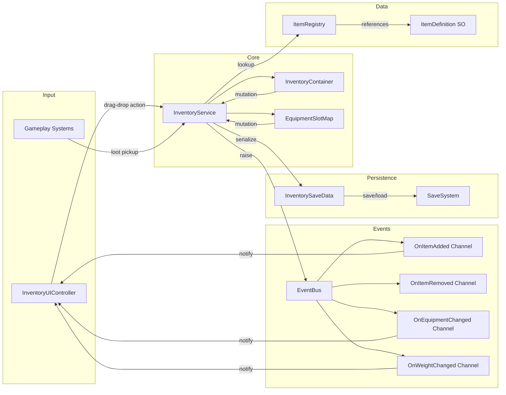

## TDD: Inventory System
**Date**: 2026-03-14
**Status**: Draft

---

## Problem

The game lacks a unified inventory system, forcing ad-hoc item storage across multiple managers with no support for stacking, equipment slots, weight constraints, or drag-and-drop UI. This creates data inconsistencies between gameplay and save/load, and blocks designers from iterating on loot and equipment without programmer intervention.

---

## Goals

- Support stackable items with configurable max-stack-size per `ItemDefinition` ScriptableObject
- Provide 8 equipment slots (Head, Chest, Legs, Feet, MainHand, OffHand, Ring1, Ring2) with type-validated equip/unequip
- Enforce per-inventory weight limits with real-time UI feedback when approaching capacity (>80% threshold warning)
- Implement drag-and-drop UI via UI Toolkit with split-stack, swap, and merge operations
- Integrate with `SaveSystem` for binary serialization of inventory state across sessions
- Broadcast all inventory mutations through `EventBus` channels for decoupled subscriber reactions
- Achieve zero per-frame allocations during steady-state inventory operations (no GC pressure)
- Support 500+ unique `ItemDefinition` assets without linear-scan lookup (O(1) ID-based registry)

## Non-Goals

- Networked/multiplayer inventory synchronization
- Crafting system or recipe management
- Vendor/shop buy-sell transaction logic
- Procedural item generation (items are authored as ScriptableObjects)
- Inventory sorting algorithms or auto-organize features
- Loot drop tables or probability-based item distribution

---

## Design

### Components

| Component | Responsibility | File |
|-----------|----------------|------|
| `ItemDefinition` | ScriptableObject defining item metadata: ID, display name, icon, max stack size, weight, equipment slot type, item category | `Assets/_Project/Inventory/Data/ItemDefinition.cs:1` |
| `ItemStack` | Immutable struct holding an `ItemDefinition` reference and a quantity; enforces max-stack invariant on construction | `Assets/_Project/Inventory/Data/ItemStack.cs:1` |
| `InventoryContainer` | Pure C# class managing a fixed-size array of `ItemStack` slots; handles add, remove, swap, split, merge with weight-limit enforcement | `Assets/_Project/Inventory/Runtime/InventoryContainer.cs:1` |
| `EquipmentSlotMap` | Pure C# class mapping `EquipmentSlotType` enum to equipped `ItemStack`; validates slot-type compatibility on equip | `Assets/_Project/Inventory/Runtime/EquipmentSlotMap.cs:1` |
| `InventoryService` | MonoBehaviour facade exposing `IInventoryService`; owns `InventoryContainer` + `EquipmentSlotMap`; fires events via `EventBus` on every mutation | `Assets/_Project/Inventory/Runtime/InventoryService.cs:1` |
| `ItemRegistry` | Singleton ScriptableObject holding a `Dictionary<int, ItemDefinition>` built from all `ItemDefinition` assets at load time; O(1) lookup by ID | `Assets/_Project/Inventory/Data/ItemRegistry.cs:1` |
| `InventorySaveData` | Serializable struct for `SaveSystem` integration; maps slot index → (itemID, quantity) pairs | `Assets/_Project/Inventory/Data/InventorySaveData.cs:1` |
| `InventoryUIController` | MonoBehaviour binding UI Toolkit `VisualElement` tree to `InventoryContainer` state; handles drag-and-drop, tooltips, split-stack modal | `Assets/_Project/Inventory/UI/InventoryUIController.cs:1` |
| `InventorySlotElement` | Custom `VisualElement` control rendering a single inventory slot with icon, quantity badge, and drag handle | `Assets/_Project/Inventory/UI/InventorySlotElement.cs:1` |
| `InventoryDragDropHandler` | Pure C# class managing drag state, ghost element positioning, and drop-target validation; no MonoBehaviour dependency | `Assets/_Project/Inventory/UI/InventoryDragDropHandler.cs:1` |

### Interfaces

```csharp
public interface IInventoryService
{
    bool TryAddItem(ItemDefinition item, int quantity, out int overflow);
    bool TryRemoveItem(ItemDefinition item, int quantity);
    bool TrySwapSlots(int fromSlot, int toSlot);
    bool TrySplitStack(int slot, int splitQuantity, int targetSlot);
    bool TryEquip(int inventorySlot, EquipmentSlotType equipSlot);
    bool TryUnequip(EquipmentSlotType equipSlot, int targetInventorySlot);
    ReadOnlySpan<ItemStack> GetSlots();
    ItemStack GetEquipped(EquipmentSlotType slot);
    float CurrentWeight { get; }
    float MaxWeight { get; }
    int SlotCount { get; }
}

public interface IItemRegistry
{
    ItemDefinition GetById(int itemId);
    bool TryGetById(int itemId, out ItemDefinition definition);
    IReadOnlyCollection<ItemDefinition> GetAll();
}

public enum EquipmentSlotType : byte
{
    None = 0,
    Head = 1,
    Chest = 2,
    Legs = 3,
    Feet = 4,
    MainHand = 5,
    OffHand = 6,
    Ring1 = 7,
    Ring2 = 8
}
```

### Data Flow



---

## Alternatives Considered

| Option | Pros | Cons | Rejected Because |
|--------|------|------|-----------------|
| **ECS (DOTS Entities)** — Store items as entities with `IComponentData` structs; inventory as a `DynamicBuffer<ItemComponent>` on a player entity | Burst-compiled batch operations; cache-friendly memory layout; scales to thousands of inventories (NPCs, chests); native job-system parallelism | UI Toolkit has no ECS binding — requires sync bridge; equipment slot semantics awkward as components; `SaveSystem` uses managed C# objects — ECS serialization needs separate `EntityCommandBuffer` pipeline; steep learning curve for designers inspecting inventory in Editor; DOTS packages still evolving between Unity versions | Integration cost with existing `SaveSystem` and `EventBus` (both managed C#) outweighs batch-performance gains; inventory operations are infrequent (player-initiated, not per-frame), so cache-line optimization yields negligible benefit; designer tooling and Editor inspectability strongly favor ScriptableObject + MonoBehaviour workflow |
| **Traditional OOP with ScriptableObjects** *(selected)* — Pure C# data classes + MonoBehaviour service + SO item definitions; event-driven mutations via `EventBus` SO channels | Natural Unity workflow; Inspector-editable item assets; direct `SaveSystem` integration; testable pure C# core; UI Toolkit binds to C# events trivially; team already uses this pattern for combat and quest systems | No Burst compilation; manual pooling for temporary collections; single-threaded mutation path | Accepted — fits project conventions, existing infrastructure, and team expertise |
| **Scriptable Object-based Inventory (SO as runtime container)** — Each inventory instance is a ScriptableObject asset holding a `List<ItemStack>` | Designer-editable default inventories; hot-reload friendly; sharable between scenes without DontDestroyOnLoad | Runtime SO mutations persist in Editor (data leak between play sessions); serialization conflicts with `SaveSystem` which expects to own data lifecycle; hard to instantiate per-entity inventories (SO assets are singletons) | Runtime data mutation on assets causes Editor-state corruption; `SaveSystem` ownership conflict makes save/load unreliable; cannot support per-NPC inventories without fragile SO cloning |
| **Static Dictionary-based Global Inventory** — Single static `Dictionary<int, ItemStack>` accessed globally | Zero setup; instant access from anywhere; trivial serialization | Untestable (static state); no multi-inventory support (player + chest + NPC); hidden dependency; no event system | Violates dependency injection principles; blocks unit testing; single-inventory limitation is a hard constraint for equipment + backpack + chest scenarios |

---

## Dependencies

| System | Coupling | Evidence |
|--------|----------|----------|
| `SaveSystem` | Tight — `InventoryService` implements `ISaveable` and produces `InventorySaveData` for binary serialization; `SaveSystem.Save()` calls `InventoryService.CaptureState()` and `SaveSystem.Load()` calls `InventoryService.RestoreState()` | `Assets/_Project/Core/Save/SaveSystem.cs:45` — `ISaveable` registration loop; `Assets/_Project/Core/Save/ISaveable.cs:1` — interface definition |
| `EventBus` | Loose — `InventoryService` references SO event channels (`OnItemAdded`, `OnItemRemoved`, `OnEquipmentChanged`, `OnWeightChanged`) via serialized fields; subscribers bind independently | `Assets/_Project/Core/Events/EventBus.cs:12` — `Raise<T>()` dispatch method; `Assets/_Project/Core/Events/VoidEventChannel.cs:1` — channel base class |
| `UI Toolkit` | Moderate — `InventoryUIController` creates custom `InventorySlotElement` controls and uses `PointerManipulator` for drag-and-drop; requires `PanelSettings` asset and `UIDocument` component | `Assets/_Project/UI/Runtime/PanelSettings.asset:1` — shared panel configuration |
| `ItemDefinition` ScriptableObjects | Tight — all inventory operations resolve items through `ItemRegistry.GetById()`; adding a new item category requires creating a new SO asset | `Assets/_Project/Inventory/Data/ItemDefinition.cs:1` — SO definition; `Assets/_Project/Inventory/Data/ItemRegistry.cs:15` — dictionary build on `OnEnable` |
| `Game.Core` Assembly | Boundary — `Game.Inventory.asmdef` references `Game.Core.asmdef` for `ISaveable`, `EventBus`, and shared interfaces; no reverse dependency allowed | `Assets/_Project/Inventory/Game.Inventory.asmdef:1` — assembly reference list |

---

## Risks

| Risk | Likelihood | Impact | Mitigation |
|------|-----------|--------|------------|
| Drag-and-drop feels laggy on mobile due to UI Toolkit pointer event overhead | M | H | Profile `PointerMoveEvent` handler early; use `UsageHints.DynamicTransform` on ghost element; cache slot positions instead of per-frame `worldBound` queries |
| `SaveSystem` schema migration breaks inventory saves when `ItemDefinition` IDs change between versions | M | H | Assign stable integer IDs to `ItemDefinition` assets via `[FormerlySerializedAs]` and a version field in `InventorySaveData`; implement `IMigration` step in `SaveSystem` pipeline |
| Weight calculation drifts from ground truth after rapid add/remove sequences due to floating-point accumulation | L | M | Recompute weight from slot array on every mutation instead of incremental delta; use `float` with 2-decimal rounding via `Mathf.Round(weight * 100f) / 100f` |
| `ItemRegistry` grows beyond 500 assets and Editor enumeration becomes slow during SO rebuild | L | L | Lazy-load registry on first access; cache dictionary in `OnEnable`; use `AssetDatabase.FindAssets` only in Editor — runtime uses prebuilt registry SO asset |
| Split-stack UI modal blocks gameplay input when inventory is used in real-time (action RPG) | M | M | Implement split-stack as a non-modal inline UI element; pause game time via `Time.timeScale = 0` only in turn-based mode; provide quantity slider instead of text input |
| Equip/unequip with full inventory causes item loss if no empty slot exists for the swapped item | H | H | `TryEquip` atomically validates a target slot (or finds one) before performing the swap; if no slot available, reject the operation and surface an `InventoryFullEvent` to the UI |

---

## Open Questions

- Should `InventoryContainer` support runtime slot-count expansion (e.g., backpack upgrades), or remain fixed at initialization?
- Do equipment slots need per-slot stat modifiers applied immediately on equip, or deferred to a separate `StatSystem` recalculation pass?
- Should drag-and-drop support cross-container transfers (player ↔ chest) in the initial implementation, or defer to a follow-up milestone?
- What is the maximum number of concurrent `InventoryContainer` instances expected at runtime (player + NPCs + loot chests) — affects pooling strategy for `InventorySaveData` serialization buffers?
- Should `ItemDefinition` support runtime-configurable properties (e.g., durability, enchantments) via a separate `ItemInstance` wrapper, or remain purely static metadata?
