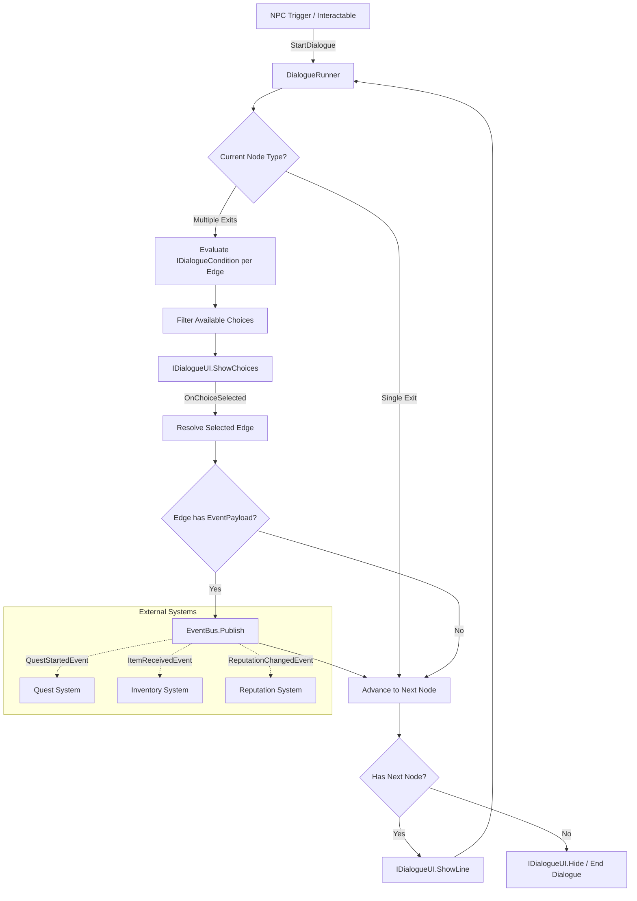

# TDD: Dialogue System

**Date**: 2026-03-14 | **Status**: Draft

## Problem

The project has no dialogue system. We need branching conversations with conditional logic, localization support, and EventBus integration so dialogue choices can trigger game events (quests, combat, inventory changes) without coupling the dialogue system to downstream consumers.

## Goals

- Support branching dialogue trees with unlimited depth and merging branches
- Evaluate runtime conditions (quest state, inventory, stats) to gate dialogue options
- Localize all player-visible text via string keys (compatible with Unity Localization package)
- Fire events through the existing EventBus pattern when players select dialogue choices
- Author dialogue assets in the Unity Inspector without requiring external tools
- Achieve zero per-frame allocations during active dialogue playback

## Non-Goals

- Voice acting / audio lip-sync integration (future phase)
- Visual novel-style character portraits and emotion systems
- Multiplayer dialogue synchronization
- External dialogue editor tools (Yarn Spinner, Ink) — this is a native SO-based system
- Cinematic camera control during dialogue sequences

## Design

### Components

| Component | Responsibility | File |
|-----------|---------------|------|
| `DialogueAsset` | ScriptableObject container holding the full conversation graph (nodes, edges, conditions) | `Runtime/Dialogue/DialogueAsset.cs` |
| `DialogueNode` | Serializable struct — one speaker line with text key, speaker ID, and outgoing edges | `Runtime/Dialogue/DialogueNode.cs` |
| `DialogueEdge` | Serializable struct — links two nodes, carries optional condition and event payload | `Runtime/Dialogue/DialogueEdge.cs` |
| `IDialogueCondition` | Interface for evaluating branching conditions at runtime | `Runtime/Dialogue/Conditions/IDialogueCondition.cs` |
| `DialogueConditionSO` | Abstract ScriptableObject base for designer-authored conditions | `Runtime/Dialogue/Conditions/DialogueConditionSO.cs` |
| `QuestStateCondition` | Concrete condition — checks quest completion state | `Runtime/Dialogue/Conditions/QuestStateCondition.cs` |
| `InventoryCondition` | Concrete condition — checks item ownership | `Runtime/Dialogue/Conditions/InventoryCondition.cs` |
| `DialogueEventPayload` | Serializable struct wrapping an EventBus event type + data for choice-triggered events | `Runtime/Dialogue/Events/DialogueEventPayload.cs` |
| `DialogueRunner` | MonoBehaviour — traverses the graph, evaluates conditions, advances state, publishes events | `Runtime/Dialogue/DialogueRunner.cs` |
| `IDialogueUI` | Interface for UI display (text, choices) — decouples runner from presentation | `Runtime/Dialogue/UI/IDialogueUI.cs` |
| `DialogueUIController` | MonoBehaviour — implements `IDialogueUI` using UI Toolkit | `Runtime/Dialogue/UI/DialogueUIController.cs` |
| `DialogueAssetEditor` | Custom editor for authoring nodes in the Inspector | `Editor/Dialogue/DialogueAssetEditor.cs` |

### Interfaces

```csharp
/// Evaluates a runtime condition for dialogue branching.
public interface IDialogueCondition
{
    bool Evaluate();
}

/// Abstracts dialogue presentation from traversal logic.
public interface IDialogueUI
{
    void ShowLine(string speakerName, string localizedText);
    void ShowChoices(IReadOnlyList<DialogueChoice> choices);
    void Hide();
    event Action<int> OnChoiceSelected;
}

/// Read-only view of a player-facing dialogue choice.
public readonly struct DialogueChoice
{
    public readonly int EdgeIndex;
    public readonly string LocalizedText;
    public readonly bool IsAvailable;

    public DialogueChoice(int edgeIndex, string localizedText, bool isAvailable)
    {
        EdgeIndex = edgeIndex;
        LocalizedText = localizedText;
        IsAvailable = isAvailable;
    }
}
```

### Data Flow



### EventBus Integration Detail

The existing EventBus pattern (file: `unity-standards/references/code-standards/architecture-patterns-advanced.md:36-57`) uses `Dictionary<Type, List<Delegate>>` with `Subscribe<T>`, `Unsubscribe<T>`, and `Publish<T>`. The dialogue system publishes strongly-typed event structs:

```csharp
// Dialogue-specific events published through EventBus
public readonly struct DialogueStartedEvent
{
    public readonly string DialogueAssetId;
    public DialogueStartedEvent(string id) => DialogueAssetId = id;
}

public readonly struct DialogueChoiceMadeEvent
{
    public readonly string DialogueAssetId;
    public readonly int NodeIndex;
    public readonly int ChoiceIndex;
    public DialogueChoiceMadeEvent(string id, int node, int choice)
    {
        DialogueAssetId = id;
        NodeIndex = node;
        ChoiceIndex = choice;
    }
}

public readonly struct DialogueEndedEvent
{
    public readonly string DialogueAssetId;
    public DialogueEndedEvent(string id) => DialogueAssetId = id;
}
```

### Localization Strategy

All player-visible strings stored as `string` keys (e.g., `"dlg_merchant_greeting_01"`). The `DialogueRunner` resolves keys through an `ILocalizationProvider` interface:

```csharp
public interface ILocalizationProvider
{
    string Resolve(string key);
}
```

Default implementation wraps Unity Localization package's `LocalizedString`. Fallback implementation returns raw keys for projects without localization setup. This avoids a hard dependency on `com.unity.localization`.

### Condition System Detail

Conditions are ScriptableObject assets following the Strategy pattern (file: `unity-standards/references/code-standards/architecture-patterns-advanced.md:6-29`). Designers create condition assets in the Project window and assign them to dialogue edges:

```csharp
public abstract class DialogueConditionSO : ScriptableObject, IDialogueCondition
{
    public abstract bool Evaluate();
}

[CreateAssetMenu(menuName = "Dialogue/Conditions/Quest State")]
public sealed class QuestStateCondition : DialogueConditionSO
{
    [SerializeField] private string _questId;
    [SerializeField] private QuestState _requiredState;

    public override bool Evaluate()
    {
        // Resolved via ServiceLocator or DI at runtime
        var questSystem = ServiceLocator.Get<IQuestSystem>();
        return questSystem.GetState(_questId) == _requiredState;
    }
}
```

## Alternatives Considered

| Option | Pros | Cons | Rejected Because |
|--------|------|------|------------------|
| **Yarn Spinner integration** | Mature, battle-tested, rich branching syntax, built-in localization | External dependency, custom markup language (not pure C#), limited Inspector authoring, harder to integrate with existing EventBus | Adds a 3rd-party dependency we cannot modify; condition evaluation requires bridging Yarn variables to our game state; EventBus integration needs custom command handlers — significant glue code |
| **JSON-file dialogue trees** | Human-readable, version-control friendly, easy to parse | No Inspector workflow, no SO references, manual serialization, no Unity Editor tooling, conditions require string-based evaluation | Loses Unity's serialization advantages and Inspector authoring; designers cannot visually wire conditions or preview dialogue flow; requires building a separate editor tool |
| **MonoBehaviour-per-node graph** | Each node is a GameObject — visual in Hierarchy, easy to debug | Massive scene bloat for large dialogues, poor performance with hundreds of nodes, no reusability across scenes | Does not scale — a 50-node conversation creates 50 GameObjects; cannot share dialogue assets across scenes without prefab nesting; violates data-driven design principles |

## Dependencies

| System | Coupling | Evidence |
|--------|----------|----------|
| EventBus (Mediator pattern) | Loose — `DialogueRunner` calls `EventBus.Publish<T>()` with typed event structs; no reverse dependency | `unity-standards/references/code-standards/architecture-patterns-advanced.md:36-57` |
| ScriptableObject event channels | None — EventBus used instead of SO channels for dialogue events, but SO channels remain available for other systems | `unity-standards/references/code-standards/events.md:61-84` |
| Unity Localization package | Optional — behind `ILocalizationProvider` interface; system works without it using key-passthrough fallback | `com.unity.localization` (external package, not currently installed) |
| IState / StateMachine | None — dialogue states are graph nodes, not FSM states; no conflict with existing state machine pattern | `unity-standards/references/code-standards/architecture-patterns.md:8-26` |
| VContainer / DI | Optional — `DialogueRunner` accepts `IDialogueUI` and `ILocalizationProvider` via `[Inject]` or `[SerializeField]`; works with or without DI container | `unity-standards/references/code-standards/dependencies.md:19-39` |
| Unity Serialization | Direct — `DialogueNode`, `DialogueEdge` use `[Serializable]` structs with `[SerializeField]`; follows established patterns | `unity-standards/references/code-standards/serialization.md:29-41` |

## Risks

| Risk | Likelihood | Impact | Mitigation |
|------|-----------|--------|------------|
| Large dialogue graphs cause Inspector lag due to nested serialized arrays | M | M | Implement pagination in `DialogueAssetEditor`; cap visual display at 50 nodes; add search/filter for node lookup |
| Condition evaluation order matters when multiple edges share conditions | L | H | Document deterministic evaluation order (top-to-bottom as serialized); add `priority` field to `DialogueEdge` for explicit ordering |
| Circular node references create infinite dialogue loops | M | H | Add cycle detection in `DialogueAssetEditor.OnValidate()` using DFS; log warning and highlight offending edges in red |
| EventBus event types grow unbounded as dialogue content scales | L | M | Use a single `DialogueGameEvent` struct with a string-based event ID instead of one struct per event type; downstream listeners filter by ID |
| Localization key mismatches cause blank dialogue text in non-default locales | M | H | Add validation pass in `DialogueAssetEditor` that cross-references all keys against the localization table; flag missing keys as warnings |
| `[SerializeReference]` polymorphism for conditions may break on domain reload | L | M | Use `DialogueConditionSO` (ScriptableObject) references instead of `[SerializeReference]` — SO references survive domain reload reliably per `unity-standards/references/code-standards/serialization.md:97` |

## Open Questions

1. Should greyed-out (unavailable) choices be shown to the player, or hidden entirely? This affects UX and the `IsAvailable` field usage in `DialogueChoice`.
2. What is the maximum expected dialogue tree size (node count)? This drives serialization strategy and whether we need a node-streaming approach for very large assets.
3. Should the system support mid-dialogue save/restore (e.g., saving which node the player is on), or is dialogue always ephemeral within a session?
4. Do we need a "visited node" tracker so NPCs can reference previous conversation paths (e.g., "As I mentioned before...")?
5. Should condition evaluation happen once when presenting choices, or re-evaluate if the player delays selection (e.g., another system changes quest state while dialogue is open)?
