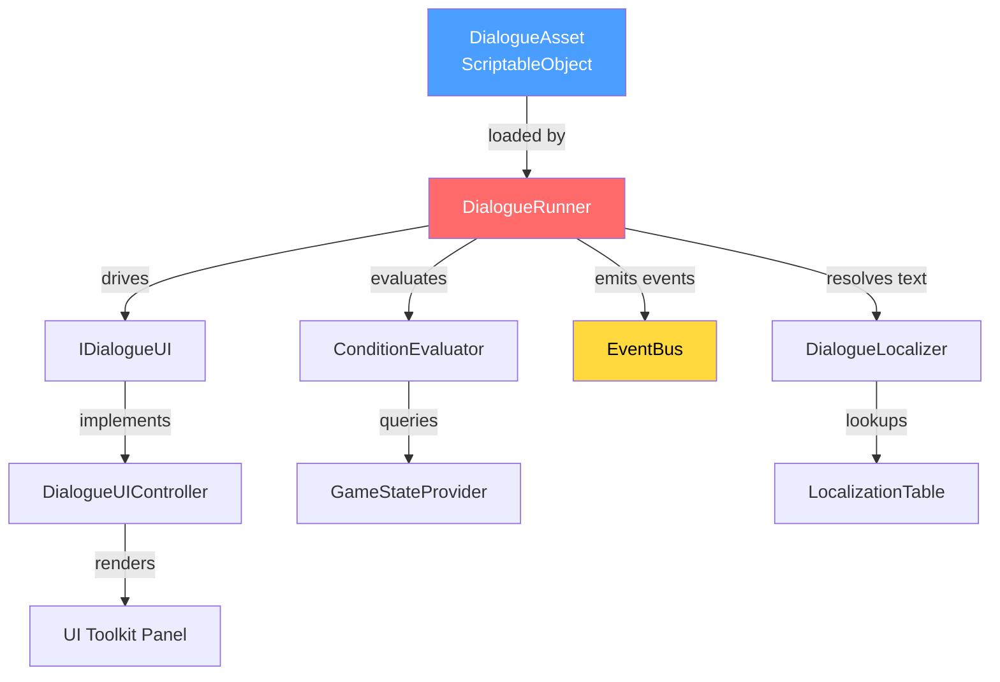
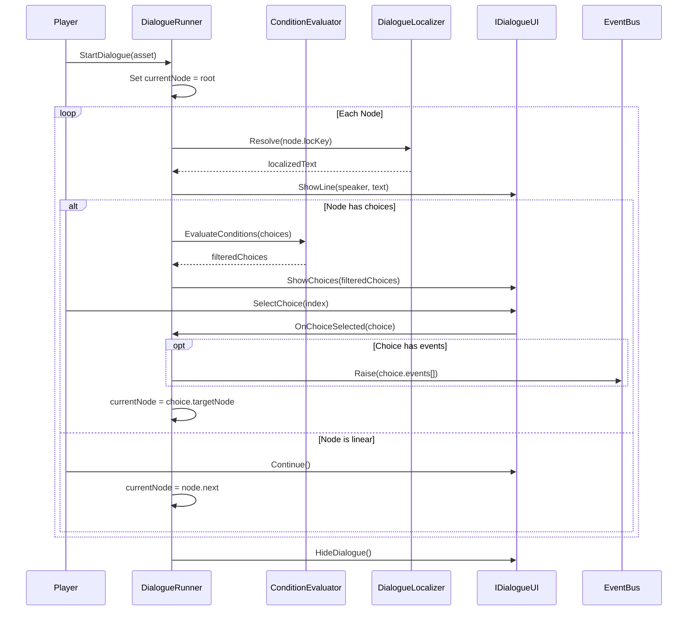
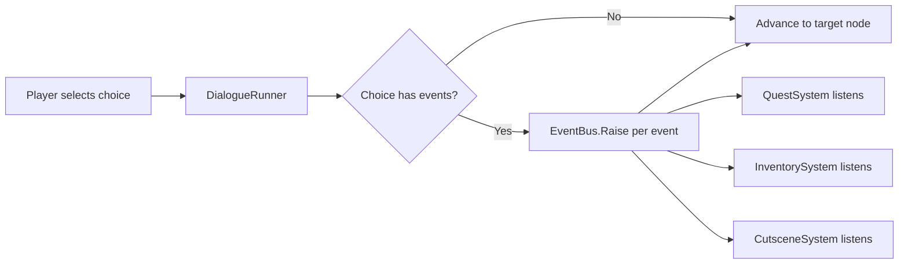
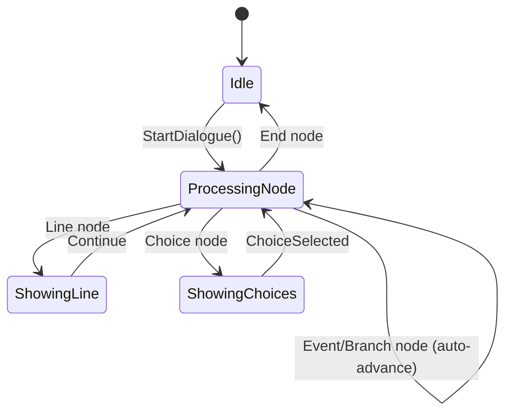

# Technical Design Document: Dialogue System

**Author:** AI Architect  
**Date:** 2026-03-14  
**Status:** Draft  
**Version:** 1.0

---

## 1. Overview

### 1.1 Problem Statement

The project currently has no dialogue system. Narrative content, NPC interactions, and player-driven conversations must be hardcoded or skipped entirely. This blocks quest design, narrative progression, and any story-driven gameplay.

### 1.2 Goals

- Branching conversation trees with conditional logic (game state, inventory, flags)
- Full localization support for all dialogue text
- Integration with the existing EventBus to trigger game events from dialogue choices
- Designer-friendly authoring workflow (ScriptableObject-based, no code required for content)
- Extensible architecture for future features (voice-over, portraits, animations)

### 1.3 Non-Goals

- Visual node-graph editor (Phase 2 consideration)
- Voice-over pipeline integration
- Cinematic camera control during dialogue
- Multiplayer dialogue synchronization

---

## 2. Architecture

### 2.1 High-Level Architecture



### 2.2 Component Responsibilities

| Component | Responsibility |
|-----------|---------------|
| `DialogueAsset` | ScriptableObject holding the conversation graph (nodes, edges, conditions) |
| `DialogueRunner` | State machine that traverses the graph, evaluates conditions, and orchestrates flow |
| `ConditionEvaluator` | Evaluates branching conditions against game state |
| `DialogueLocalizer` | Resolves localization keys to localized strings for the active locale |
| `IDialogueUI` | Interface decoupling the runner from any specific UI implementation |
| `DialogueUIController` | Concrete UI implementation using UI Toolkit |
| `EventBus` (existing) | Receives game events fired by dialogue choices |

### 2.3 Data Flow



---

## 3. Data Model

### 3.1 Dialogue Graph Structure

```csharp
[CreateAssetMenu(menuName = "Dialogue/Dialogue Asset")]
public class DialogueAsset : ScriptableObject
{
    [SerializeField] private string _dialogueId;
    [SerializeField] private List<DialogueNode> _nodes;
    [SerializeField] private int _rootNodeIndex;

    public string DialogueId => _dialogueId;
    public IReadOnlyList<DialogueNode> Nodes => _nodes;
    public int RootNodeIndex => _rootNodeIndex;
}
```

### 3.2 Node Types

```csharp
[Serializable]
public class DialogueNode
{
    public string NodeId;
    public DialogueNodeType NodeType; // Line, Choice, Event, Branch, End
    public string SpeakerId;
    public string LocalizationKey;    // Key into localization table
    public List<DialogueChoice> Choices;
    public List<DialogueEvent> Events; // Events fired when node is entered
    public int NextNodeIndex;          // For linear progression (-1 = end)
}

public enum DialogueNodeType
{
    Line,       // Single speaker line, auto-advance to next
    Choice,     // Player selects from filtered options
    Event,      // Fire events, no display, auto-advance
    Branch,     // Conditional jump (no display, evaluates conditions)
    End         // Terminal node
}
```

### 3.3 Choice with Conditions

```csharp
[Serializable]
public class DialogueChoice
{
    public string LocalizationKey;
    public int TargetNodeIndex;
    public List<DialogueCondition> Conditions; // All must pass to show
    public List<DialogueEvent> Events;         // Fired on selection
}

[Serializable]
public class DialogueCondition
{
    public ConditionType Type;       // HasFlag, IntCompare, HasItem
    public string Key;               // Flag name, variable name, item ID
    public ComparisonOp Operator;    // Equals, GreaterThan, LessThan, etc.
    public string Value;             // Compared against (string-parsed)
}

public enum ConditionType { HasFlag, IntCompare, FloatCompare, HasItem, QuestState }
public enum ComparisonOp { Equals, NotEquals, GreaterThan, LessThan, GreaterOrEqual, LessOrEqual }
```

### 3.4 Event Integration

```csharp
[Serializable]
public class DialogueEvent
{
    public string EventChannel;    // EventBus channel name
    public string EventPayload;    // JSON or simple string payload
}
```

At runtime, when a `DialogueEvent` is encountered:

```csharp
// Inside DialogueRunner
private void FireEvents(IReadOnlyList<DialogueEvent> events)
{
    foreach (var evt in events)
    {
        _eventBus.Raise(evt.EventChannel, evt.EventPayload);
    }
}
```

---

## 4. Condition System

### 4.1 Design

Conditions are evaluated by `ConditionEvaluator`, which queries `IGameStateProvider` for current values. This decouples dialogue from specific game systems.

```csharp
public interface IGameStateProvider
{
    bool HasFlag(string flagName);
    int GetInt(string key);
    float GetFloat(string key);
    bool HasItem(string itemId);
    string GetQuestState(string questId);
}

public class ConditionEvaluator
{
    private readonly IGameStateProvider _stateProvider;

    public bool Evaluate(DialogueCondition condition) { /* ... */ }

    public bool EvaluateAll(IReadOnlyList<DialogueCondition> conditions)
    {
        foreach (var c in conditions)
        {
            if (!Evaluate(c)) return false; // AND logic
        }
        return true;
    }
}
```

### 4.2 Condition Evaluation Rules

- All conditions on a choice use **AND** logic (all must pass)
- If no conditions are specified, the choice is always visible
- Conditions are evaluated **when the parent node is displayed**, not ahead of time
- If all choices on a Choice node are filtered out, the node falls through to `NextNodeIndex`

---

## 5. Localization

### 5.1 Strategy

Use Unity's Localization package (`com.unity.localization`) with String Tables.

| Concern | Solution |
|---------|----------|
| Key format | `dialogue/{dialogueId}/{nodeId}` for lines, `dialogue/{dialogueId}/{nodeId}/choice_{index}` for choices |
| Fallback | English (en) as source locale |
| Runtime resolution | `DialogueLocalizer` wraps `LocalizedString` lookups |
| Speaker names | Separate table: `characters/{speakerId}` |
| Rich text | Supported via TextMeshPro tags in localized strings |

### 5.2 DialogueLocalizer

```csharp
public class DialogueLocalizer
{
    private const string TableName = "DialogueStrings";
    private const string CharacterTableName = "CharacterNames";

    public string GetLine(string localizationKey)
    {
        var entry = LocalizationSettings.StringDatabase
            .GetLocalizedString(TableName, localizationKey);
        return entry;
    }

    public string GetSpeakerName(string speakerId)
    {
        return LocalizationSettings.StringDatabase
            .GetLocalizedString(CharacterTableName, speakerId);
    }
}
```

### 5.3 Authoring Workflow

1. Designer creates `DialogueAsset` with localization keys (not raw text)
2. English strings are authored in the Unity Localization String Table
3. Translators work in String Tables (CSV export/import supported)
4. Runtime: `DialogueLocalizer` resolves keys to the active locale

---

## 6. EventBus Integration

### 6.1 Integration Pattern

The dialogue system fires events through the existing `EventBus` at two points:

1. **Node entry** — when a node with `Events` is reached (e.g., `Event` node type)
2. **Choice selection** — when a player picks a choice that has `Events`

### 6.2 Event Flow



### 6.3 Example Usage

A dialogue choice that completes a quest and gives an item:

```json
{
  "localizationKey": "dialogue/blacksmith/node_5/choice_0",
  "targetNodeIndex": 6,
  "conditions": [
    { "type": "HasItem", "key": "iron_ore", "operator": "GreaterOrEqual", "value": "5" }
  ],
  "events": [
    { "eventChannel": "Quest.Complete", "eventPayload": "{ \"questId\": \"forge_the_sword\" }" },
    { "eventChannel": "Inventory.AddItem", "eventPayload": "{ \"itemId\": \"steel_sword\", \"count\": 1 }" }
  ]
}
```

---

## 7. UI Layer

### 7.1 Interface Contract

```csharp
public interface IDialogueUI
{
    void ShowLine(string speakerName, string text);
    void ShowChoices(IReadOnlyList<ChoiceDisplayData> choices);
    void HideDialogue();

    event Action OnContinueRequested;
    event Action<int> OnChoiceSelected;
}

public struct ChoiceDisplayData
{
    public string Text;
    public int OriginalIndex;
}
```

### 7.2 UI Toolkit Implementation

- UXML template: `DialoguePanel.uxml` with speaker label, text label, choice container
- USS stylesheet: `DialoguePanel.uss` with typewriter animation support
- `DialogueUIController : MonoBehaviour, IDialogueUI` binds to the panel

### 7.3 Typewriter Effect

Text is revealed character-by-character via a coroutine. Clicking/tapping during typewriter completes the line instantly.

---

## 8. DialogueRunner State Machine



### 8.1 Runner Implementation Sketch

```csharp
public class DialogueRunner : MonoBehaviour
{
    [SerializeField] private MonoBehaviour _dialogueUIComponent; // Must implement IDialogueUI

    private IDialogueUI _ui;
    private IGameStateProvider _gameState;
    private ConditionEvaluator _conditionEvaluator;
    private DialogueLocalizer _localizer;
    private IEventBus _eventBus;

    private DialogueAsset _currentAsset;
    private int _currentNodeIndex;
    private DialogueState _state = DialogueState.Idle;

    public void StartDialogue(DialogueAsset asset)
    {
        _currentAsset = asset;
        _currentNodeIndex = asset.RootNodeIndex;
        _state = DialogueState.ProcessingNode;
        ProcessCurrentNode();
    }

    private void ProcessCurrentNode()
    {
        if (_currentNodeIndex < 0 || _currentNodeIndex >= _currentAsset.Nodes.Count)
        {
            EndDialogue();
            return;
        }

        var node = _currentAsset.Nodes[_currentNodeIndex];
        FireEvents(node.Events);

        switch (node.NodeType)
        {
            case DialogueNodeType.Line:
                ShowLine(node);
                break;
            case DialogueNodeType.Choice:
                ShowChoices(node);
                break;
            case DialogueNodeType.Event:
            case DialogueNodeType.Branch:
                AdvanceToNext(node);
                break;
            case DialogueNodeType.End:
                EndDialogue();
                break;
        }
    }

    // ... remaining methods omitted for brevity
}
```

---

## 9. Alternatives Considered

| Approach | Pros | Cons | Decision |
|----------|------|------|----------|
| **ScriptableObject graph (chosen)** | Native Unity, serializable, version-control friendly, inspector editing | No visual node editor OOTB | **Selected** — simplest correct path; node editor is Phase 2 |
| **JSON/YAML external files** | Easy external tooling, diff-friendly | No Unity inspector integration, manual deserialization | Rejected — adds friction for designers |
| **Yarn Spinner (3rd party)** | Mature, well-tested, node editor included | External dependency, opinionated architecture, harder EventBus integration | Rejected — coupling to 3rd party for a core system |
| **Ink (3rd party)** | Excellent branching narrative, writer-friendly markup | Steep learning curve, different mental model, limited Unity-native integration | Rejected — better for pure narrative than game-integrated dialogue |

---

## 10. Dependencies

| Dependency | Type | Purpose | Risk |
|------------|------|---------|------|
| `EventBus` | Internal (existing) | Fire game events from dialogue | Low — stable API assumed |
| `com.unity.localization` | Unity Package | String table localization | Low — official Unity package |
| `IGameStateProvider` | Internal (new interface) | Query game state for conditions | Medium — must be implemented by game systems |
| UI Toolkit | Unity built-in | Dialogue panel rendering | Low — built into Unity |

---

## 11. Risks & Mitigations

| Risk | Severity | Likelihood | Mitigation |
|------|----------|------------|------------|
| Circular node references cause infinite loops | High | Medium | Add max-step safety counter (e.g., 1000 steps). Log error and break. |
| Condition evaluation depends on systems not yet built | Medium | High | `IGameStateProvider` returns safe defaults. Stub implementation for early testing. |
| Localization keys go stale when dialogue assets change | Medium | Medium | Editor validation tool that cross-checks keys against String Tables. |
| Large dialogue trees cause inspector slowdown | Low | Medium | Custom editor with pagination/search for nodes. |
| EventBus payload format mismatches at runtime | High | Medium | Validate event payloads in editor via `DialogueAssetValidator` script. |

---

## 12. Implementation Plan

### Phase 1 — Core (5-7 days)
1. `DialogueAsset`, `DialogueNode`, `DialogueChoice` data model
2. `DialogueRunner` state machine
3. `ConditionEvaluator` + `IGameStateProvider` interface
4. `IDialogueUI` interface + basic UI Toolkit implementation
5. EventBus integration for choice events

### Phase 2 — Polish (3-4 days)
6. `DialogueLocalizer` integration with `com.unity.localization`
7. Typewriter text effect
8. Editor validation tool for broken references and stale keys
9. Unit tests for runner, condition evaluator, and localizer

### Phase 3 — Tooling (Future)
10. Visual node-graph editor (custom EditorWindow)
11. CSV import/export for bulk dialogue authoring
12. Runtime debug overlay showing current node path

---

## 13. Testing Strategy

| Area | Approach |
|------|----------|
| `ConditionEvaluator` | Edit Mode tests: mock `IGameStateProvider`, assert all condition types |
| `DialogueRunner` traversal | Edit Mode tests: create test `DialogueAsset` in code, verify node sequence |
| Choice filtering | Edit Mode tests: verify filtered choices match expected visible set |
| Event firing | Edit Mode tests: mock `IEventBus`, verify events raised with correct payloads |
| Localization fallback | Edit Mode tests: missing key returns key as fallback, logs warning |
| UI integration | Play Mode test: load dialogue, simulate clicks, verify UI state transitions |

---

## 14. Open Questions

1. Should conditions support **OR** groups (any-of within a group, all groups must pass)?
2. Should dialogue assets support **variables** (e.g., inserting player name into text)?
3. What is the EventBus payload contract — raw string, JSON, or typed objects?
4. Should the system support **interrupting** an active dialogue for gameplay events?

---

## 15. Glossary

| Term | Definition |
|------|-----------|
| **DialogueAsset** | ScriptableObject containing a complete conversation graph |
| **Node** | A single step in the conversation (line, choice, event, branch, or end) |
| **Choice** | A player-selectable option with optional conditions and events |
| **Condition** | A predicate evaluated against game state to filter choices |
| **Localization Key** | A string identifier mapped to translated text in Unity Localization tables |
| **EventChannel** | A named channel on the EventBus that systems subscribe to |
