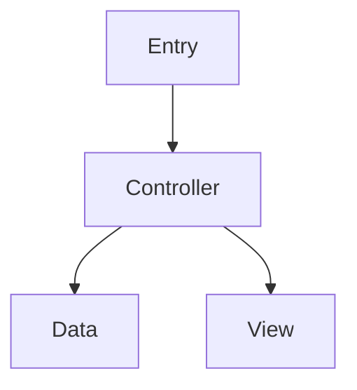
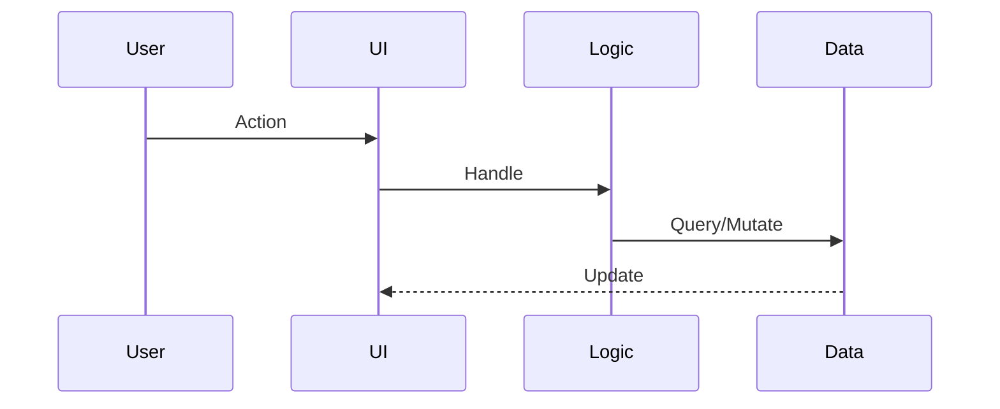

# Investigation Report: [Subject]

**Date**: [YYYY-MM-DD] | **Type**: [Logic Flow | Data | Resource | Animation | VFX | Audio | Physics | UI | Networking | Performance]

## 1. Summary
[1-3 paragraph overview]

## 2. Scope
- **Subject**: [Class/System] | **Entry Points**: [Where execution begins]
- **Boundaries**: [Included/excluded] | **Questions**: [Key questions]

## 3. Architecture

| Class | Responsibility | Layer | Dependencies |
|:---|:---|:---|:---|
| `ClassName.cs` | Brief | Controller | List |

## 4. Execution Flow
1. **Trigger**: [Start] → 2. **Processing**: [Methods] → 3. **Outcome**: [Result]

## 5. Logic Deep-Dive
### [Method]
- **Location**: `File.cs:Line` | **Signature**: `ReturnType Method(params)`
- **Logic**: [Step-by-step] | **Complexity**: [O(n)]

## 6. Data & Serialization

| Class | Purpose | Format | Storage |
|:---|:---|:---|:---|
| `DataClass` | What | JSON/Binary | PlayerPrefs/File/Server |

## 7. Resources

| Type | Path | Loading | Memory |
|:---|:---|:---|:---|
| Prefab | `Assets/...` | Addressables/Resources | Est. |

## 8. System-Specific
> Include ONLY relevant sections:
- **Animation**: Controllers, States, Events, Blend Trees, IK
- **VFX**: Particles, Shaders, VFX Graph
- **Audio**: Sources, Mixer, Triggers, Pooling
- **Physics**: Colliders, Rigidbody, Layers, Raycasting
- **UI**: Canvas, Layout, Navigation, Input
- **Network**: Protocol, Messages, State Sync
- **Performance**: Hot Paths, Allocs, Update Cost, Pooling

## 9. Dependencies & Side Effects
- **Internal**: Systems, Init Order, Coupling
- **External**: Plugins, Platform APIs, Server
- **Side Effects**: State Mutations, Events, Persistent Changes

## 10. Findings

| Risk | Severity | Description | Mitigation |
|:---|:---|:---|:---|
| [Risk] | H/M/L | [Issue] | [Fix] |

### Improvements
1. **[Opportunity]**: [Benefit]

## 11. References

| File | Lines | Key Methods |
|:---|:---|:---|
| `File.cs` | L10-50 | `MethodA()`, `MethodB()` |
