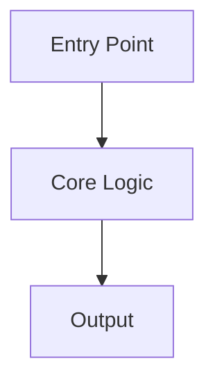

# Investigation Report Template

## {SystemName} — Investigation Report
**Date**: {YYYY-MM-DD}  
**Scope**: {brief system boundary description}  
**Investigator**: AI

---

## Executive Summary

{1 paragraph. What is this system, what does it do, what are the key findings.}

---

## System Map

**Entry points:**
- `{file:line}` — {description}

**Key classes/components:**
- `{ClassName}` (`{file:line}`) — {role}

**Exit points / outputs:**
- `{file:line}` — {description}

---

## Execution Flow

---

## Data Flow

| Data | Source | Destination | Transformation |
|------|--------|-------------|----------------|
| {data} | `{file:line}` | `{file:line}` | {description} |

---

## Risks

| Risk | Severity | Evidence | Mitigation |
|------|----------|----------|------------|
| {risk} | High/Med/Low | `{file:line}` | {action} |

---

## References

- `{file:line}` — {what was found here}
