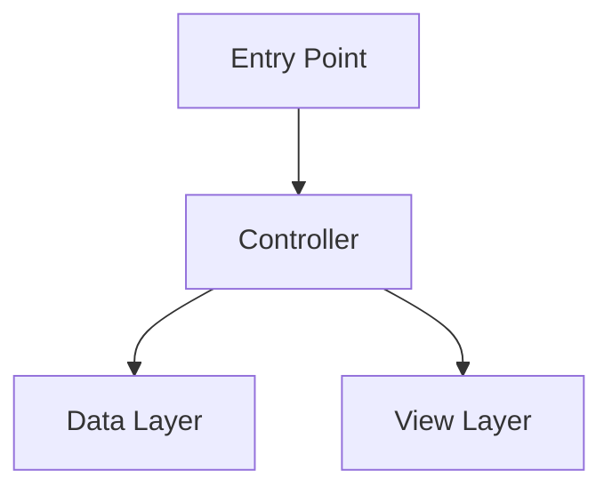
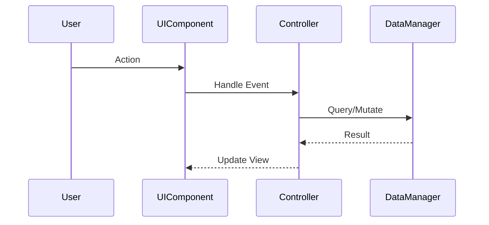
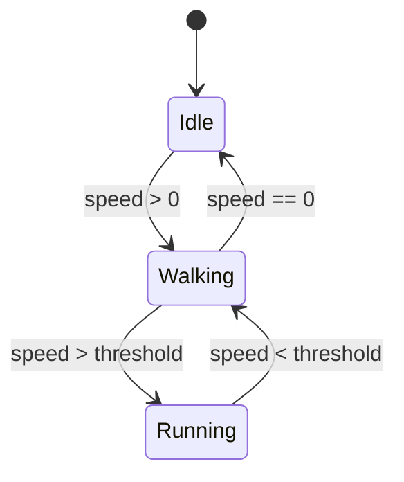

# Investigation Report: [Subject Name]

**Date**: [YYYY-MM-DD]
**Investigator**: AI Agent
**Scope**: [Brief scope description]
**Investigation Type**: [Logic Flow | Data & Serialization | Resource Management | Animation | VFX | Audio | Physics | UI/UX | Networking | Performance | General]

---

## 1. Executive Summary

[1-3 paragraph overview of what was investigated, key findings, and critical insights. Written for someone unfamiliar with the system.]

---

## 2. Investigation Scope

### 2.1 Target
- **Primary Subject**: [Class/System/Feature name]
- **Entry Points**: [Where execution begins]
- **Boundaries**: [What is included/excluded from this investigation]

### 2.2 Questions Answered
1. [Key question this investigation answers]
2. [Additional question]

---

## 3. Architecture Overview

### 3.1 Key Components

| Class / Script | Responsibility | Layer | Dependencies |
|:---|:---|:---|:---|
| `ClassName.cs` | Brief description | e.g., Controller | List of dependencies |

### 3.2 System Diagram

### 3.3 Design Patterns Identified
- **Pattern Name**: Where and how it's applied
- **Pattern Name**: Where and how it's applied

---

## 4. Execution Flow

### 4.1 Primary Flow

1. **Trigger**: [What starts the logic? e.g., User click, event, timer]
2. **Processing**: [Key methods called in order]
3. **Outcome**: [Result of the logic, e.g., state update, scene change]

### 4.2 Alternative Flows
- **[Scenario Name]**: [Description of alternative path]

### 4.3 Error Handling
- **[Error Case]**: [How the system handles it]

---

## 5. Logic Deep-Dive

### 5.1 [Method/Function Name]

- **Location**: `Path/To/File.cs:LineNumber`
- **Signature**: `ReturnType MethodName(params)`
- **Purpose**: [What this method does and why]
- **Inputs**: [Parameters and their constraints]
- **Logic**:
  1. [Step-by-step breakdown]
  2. [Include conditionals and branches]
- **Outputs**: [Return values or state changes]
- **Complexity**: [O(n), nested loops, recursive calls]

### 5.2 [Additional Method]
[Repeat structure as needed]

---

## 6. Data Structures & Serialization

### 6.1 Data Models

| Class | Purpose | Serialization | Storage |
|:---|:---|:---|:---|
| `DataClass` | What it holds | JSON/Binary/FlatBuffers | PlayerPrefs/File/Server |

### 6.2 Data Flow
- **Source**: [Where data originates]
- **Transformations**: [How data is modified in transit]
- **Destination**: [Where data ends up]

### 6.3 Serialization Details
- **Format**: [JSON, FlatBuffers, Binary, ScriptableObject]
- **Schema**: [Key fields and types]
- **Versioning**: [How schema changes are handled]

---

## 7. Resource Management

### 7.1 Assets

| Asset Type | Path | Loading Strategy | Memory Impact |
|:---|:---|:---|:---|
| Prefab | `Assets/Prefabs/...` | Addressables/Resources/AssetBundle | Est. size |

### 7.2 Lifecycle
- **Loading**: [When and how assets are loaded]
- **Caching**: [Caching strategy]
- **Unloading**: [When and how assets are released]

### 7.3 ScriptableObject Usage
- **[SO Name]**: [Purpose and configuration it provides]

---

## 8. System-Specific Analysis

> Include ONLY the sections relevant to this investigation. Delete unused sections.

### 8.1 Animation System
- **Animator Controllers**: [Controllers involved and their states]
- **State Machine**: [Key states, transitions, conditions]
- **Animation Events**: [Callbacks triggered by animations]
- **Blend Trees**: [Blending configurations]
- **IK/Rigging**: [Inverse kinematics setup]

### 8.2 VFX & Particle Systems
- **Particle Systems**: [Systems involved, emission rates, lifetimes]
- **Shader Effects**: [Custom shaders and their parameters]
- **Visual Effect Graph**: [VFX Graph assets if used]
- **Performance**: [Particle counts, overdraw concerns]

### 8.3 Audio System
- **Audio Sources**: [Sources and their configuration]
- **Mixer Groups**: [Audio mixer routing]
- **Sound Triggers**: [When and how sounds are played]
- **Pooling**: [Audio source pooling strategy]

### 8.4 Physics & Collision
- **Colliders**: [Types, layers, and configurations]
- **Rigidbody Setup**: [Mass, drag, constraints]
- **Layer Matrix**: [Which layers interact]
- **Raycasting**: [Raycast usage and optimization]
- **Triggers vs Collisions**: [How each is used]

### 8.5 UI/UX Implementation
- **Canvas Setup**: [Canvas configuration, render mode]
- **Layout System**: [Layout groups, anchoring strategy]
- **Navigation**: [Screen flow and transition system]
- **Input Handling**: [Touch/click/keyboard input processing]
- **Localization**: [Text localization approach]
- **Accessibility**: [Accessibility features]

### 8.6 Networking & Multiplayer
- **Protocol**: [HTTP/WebSocket/Custom]
- **Message Format**: [JSON/Protobuf/FlatBuffers]
- **Request/Response Flow**: [How network calls are made]
- **Error Handling**: [Retry logic, timeout handling]
- **State Synchronization**: [How game state syncs]
- **Security**: [Authentication, data validation]

### 8.7 Performance Characteristics
- **Hot Paths**: [Frequently executed code paths]
- **Memory Allocation**: [GC pressure points, allocations per frame]
- **Update Loop Cost**: [What runs in Update/LateUpdate/FixedUpdate]
- **Batching**: [Draw call batching, mesh combining]
- **Object Pooling**: [Pooling strategies in use]

---

## 9. Dependencies & Side Effects

### 9.1 Internal Dependencies
- **Required Systems**: [Singletons, managers, services]
- **Initialization Order**: [Systems that must initialize first]
- **Coupling Assessment**: [Tight/loose coupling analysis]

### 9.2 External Dependencies
- **Third-Party Plugins**: [SDKs, packages]
- **Platform APIs**: [iOS/Android/WebGL specific calls]
- **Server Dependencies**: [Backend APIs required]

### 9.3 Side Effects
- **State Mutations**: [Global state, singletons modified]
- **Events Dispatched**: [Events fired, observers notified]
- **Persistent Changes**: [PlayerPrefs, file writes, server calls]

---

## 10. Findings & Recommendations

### 10.1 Key Findings
1. **[Finding]**: [Description and evidence]
2. **[Finding]**: [Description and evidence]

### 10.2 Risks & Technical Debt
| Risk | Severity | Description | Mitigation |
|:---|:---|:---|:---|
| [Risk name] | High/Medium/Low | [What could go wrong] | [Suggested fix] |

### 10.3 Improvement Opportunities
1. **[Opportunity]**: [What to improve and expected benefit]
2. **[Opportunity]**: [What to improve and expected benefit]

### 10.4 Edge Cases
- **[Edge Case]**: [Description and current handling]

---

## 11. References

### 11.1 Files Analyzed

| File | Lines | Key Methods |
|:---|:---|:---|
| `Path/To/File.cs` | L10-L50 | `MethodA()`, `MethodB()` |

### 11.2 Related Systems
- **[System Name]**: [How it relates to this investigation]

### 11.3 Related Investigations
- [Link to related investigation reports if any]
