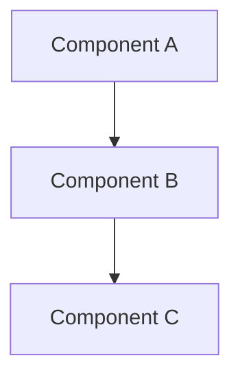
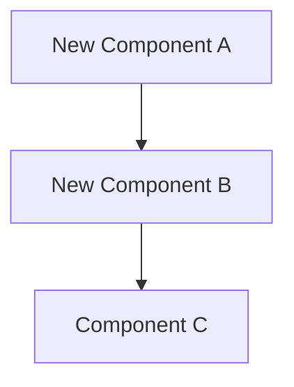

# Refactoring Plan: [Subject Name]

**Date**: [YYYY-MM-DD]
**Author**: AI Agent
**Refactoring Type**: [Extract | Rename | Move | Restructure | Simplify | Performance | Architecture]
**Risk Level**: [Low | Medium | High | Critical]

---

## 1. Executive Summary

[1-2 paragraph overview: what is being refactored, why, and expected outcome.]

---

## 2. Scope

### 2.1 Target
- **Primary Files**: [List of files being refactored]
- **Classes/Methods**: [Specific targets]
- **Estimated Change Size**: [# files, # lines affected]

### 2.2 Motivation
- **Problem**: [What's wrong with the current code]
- **Impact**: [How the problem affects development/runtime]
- **Goal**: [What the refactored code should achieve]

### 2.3 Boundaries
- **In Scope**: [What will change]
- **Out of Scope**: [What will NOT change]
- **Constraints**: [Technical or business constraints]

---

## 3. Investigation Findings

> Populated from `unity-investigate` analysis.

### 3.1 Current Architecture

### 3.2 Dependencies Map

| Class | Depends On | Depended By | Coupling |
|:---|:---|:---|:---|
| `ClassName.cs` | List | List | Tight/Loose |

### 3.3 Code Smells Identified

| Smell | Location | Severity | Description |
|:---|:---|:---|:---|
| [Smell name] | `File.cs:Line` | High/Med/Low | [Brief description] |

### 3.4 Test Coverage (Pre-Refactor)

| Class | Existing Tests | Coverage | Gaps |
|:---|:---|:---|:---|
| `ClassName.cs` | Yes/No | Est. % | [Untested areas] |

---

## 4. Proposed Changes

### 4.1 Target Architecture

### 4.2 Change List

| # | Change | File(s) | Type | Risk |
|:---|:---|:---|:---|:---|
| 1 | [Description] | `File.cs` | Extract/Rename/Move | Low/Med/High |
| 2 | [Description] | `File.cs` | Extract/Rename/Move | Low/Med/High |

### 4.3 Migration Strategy
- **Approach**: [Big-bang | Incremental | Strangler fig]
- **Steps**: [Ordered list of refactoring steps]
- **Rollback Plan**: [How to revert if something goes wrong]

---

## 5. Risk Assessment

| Risk | Likelihood | Impact | Mitigation |
|:---|:---|:---|:---|
| [Risk] | High/Med/Low | High/Med/Low | [How to mitigate] |

### 5.1 Breaking Changes
- [List any API/interface breaking changes]

### 5.2 Runtime Impact
- **Performance**: [Expected impact on FPS/memory/GC]
- **Behavior**: [Any observable behavior changes]

---

## 6. Verification Plan

### 6.1 Pre-Refactor Checks
- [ ] Existing tests pass
- [ ] Compilation clean (zero errors/warnings)
- [ ] Baseline behavior documented

### 6.2 Post-Refactor Verification
- [ ] All existing tests still pass
- [ ] New tests cover refactored code
- [ ] No new compiler warnings
- [ ] No regression in behavior
- [ ] Performance metrics unchanged or improved

### 6.3 Test Cases Required

| Test | Type | What It Verifies |
|:---|:---|:---|
| [Test name] | Edit/Play Mode | [Behavior verified] |

---

## 7. References

### 7.1 Files to Modify

| File | Action | Lines Affected |
|:---|:---|:---|
| `Path/To/File.cs` | Modify/Create/Delete | Est. count |

### 7.2 Related Systems
- [Systems that may be affected by this refactoring]

### 7.3 Related Documentation
- [Links to investigation reports, TDDs, or PRs]
