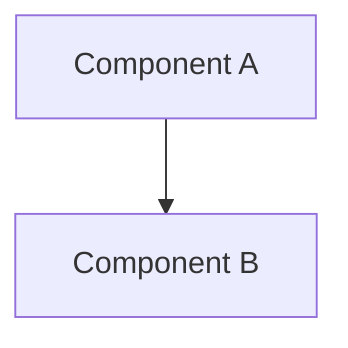
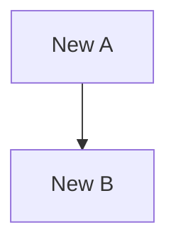

# Refactoring Plan: [Subject Name]

**Date**: [YYYY-MM-DD] | **Type**: [Extract|Rename|Move|Restructure|Simplify|Performance|Architecture] | **Risk**: [Low|Medium|High|Critical]

---

## 1. Executive Summary
[1-2 paragraphs: what, why, expected outcome]

## 2. Scope

**Target**: [Files, classes/methods, estimated change size]
**Motivation**: Problem → Impact → Goal
**Boundaries**: In scope / Out of scope / Constraints

## 3. Investigation Findings

> Populated from `unity-investigate` analysis.

### Current Architecture

### Dependencies
| Class | Depends On | Depended By | Coupling |
|:---|:---|:---|:---|
| `ClassName.cs` | | | Tight/Loose |

### Code Smells
| Smell | Location | Severity | Description |
|:---|:---|:---|:---|
| | `File.cs:Line` | High/Med/Low | |

### Test Coverage (Pre-Refactor)
| Class | Existing Tests | Coverage | Gaps |
|:---|:---|:---|:---|
| | Yes/No | Est. % | |

## 4. Proposed Changes

### Target Architecture

### Change List
| # | Change | File(s) | Type | Risk |
|:---|:---|:---|:---|:---|
| 1 | | | Extract/Rename/Move | Low/Med/High |

### Migration
**Approach**: [Big-bang|Incremental|Strangler fig]
**Rollback**: [How to revert]

## 5. Risk Assessment
| Risk | Likelihood | Impact | Mitigation |
|:---|:---|:---|:---|
| | | | |

**Breaking Changes**: [List]
**Runtime Impact**: Performance / Behavior changes

## 6. Verification Plan

**Pre-refactor**: [ ] Tests pass, [ ] Clean compilation, [ ] Baseline documented
**Post-refactor**: [ ] Existing tests pass, [ ] New tests added, [ ] No warnings, [ ] No regression, [ ] Performance OK

| Test | Type | Verifies |
|:---|:---|:---|
| | Edit/Play Mode | |

## 7. References
| File | Action | Lines Affected |
|:---|:---|:---|
| `Path/To/File.cs` | Modify/Create/Delete | |

Related systems / documentation links
