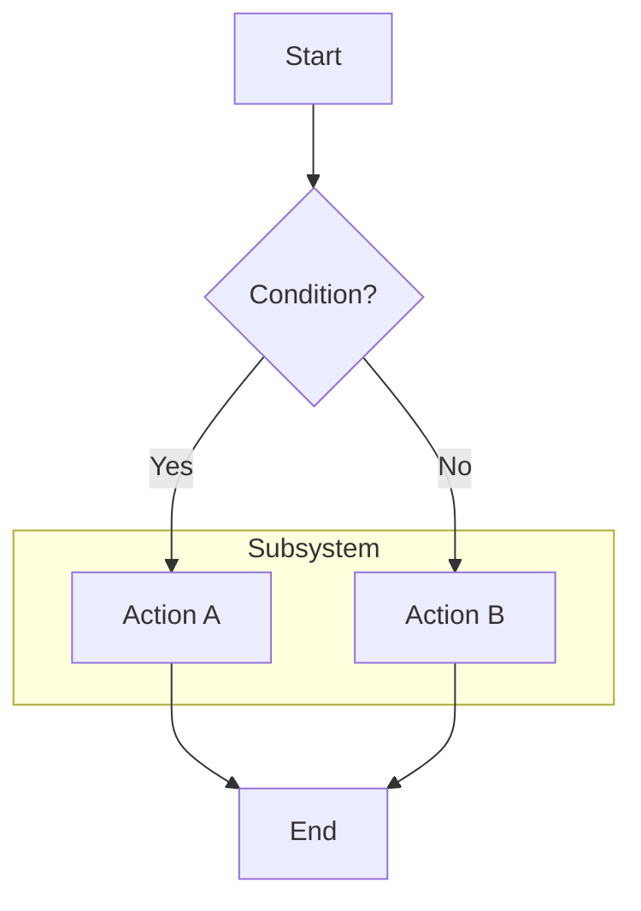
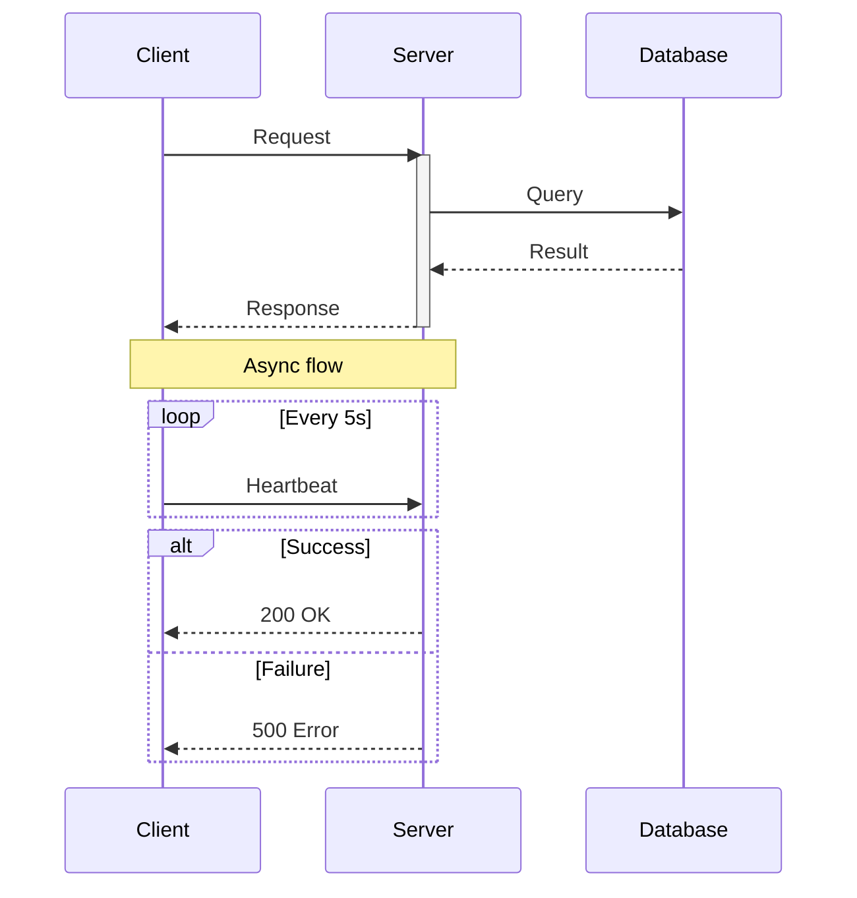
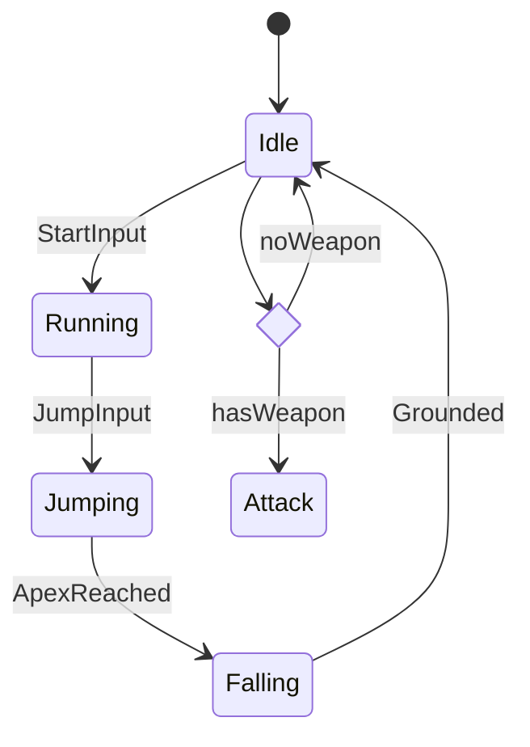
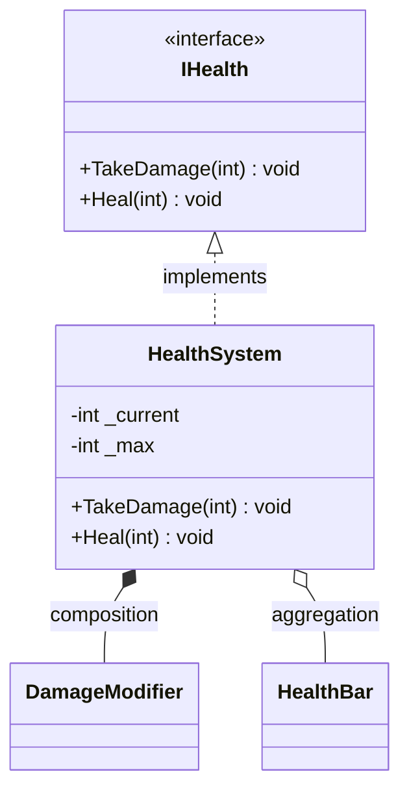
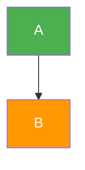

# Mermaid Syntax

## Flowchart

Node shapes: `[rect]` `(round)` `{diamond}` `([stadium])` `[[subroutine]]` `((circle))`
Arrows: `-->` `-.->` `==>` `--text-->`
Direction: `TD` (top-down), `LR` (left-right), `BT`, `RL`

## Sequence Diagram

Arrows: `->>` (solid), `-->>` (dashed), `-x` (lost)
Blocks: `loop`, `alt/else`, `opt`, `par`, `critical`

## State Diagram

## Class Diagram

Relations: `<|--` inherit, `<|..` implement, `*--` composition, `o--` aggregation, `-->` association

## Styling

