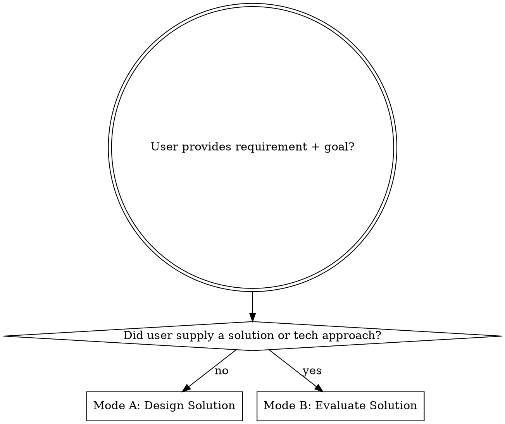

# unity-solution

Turn a Unity requirement into a decision-ready solution document, or evaluate a user-supplied
solution against Unity standards and project context. Detects which mode applies and produces the
matching deliverable.

**Required output:** Read and follow `references/output-template.md`.

## 1. Capture the Goal

- Extract: desired outcome, constraints, success criteria, target platform, quality bar, deadline.
- Read every user-provided document, spec, screenshot, log, or linked local file before asking.
- If the request names existing code, scenes, prefabs, packages, or systems, inspect them first.

## 2. Detect Mode

Detect from the user input which mode applies, then follow the matching branch:

**Signals that user supplied a solution (Mode B):**
- Names a specific API, package, asset, SDK, or pattern ("use Addressables", "use NavMesh", "Shader Graph", "Cinemachine", "URP/HDRP feature", "third-party plugin X").
- Describes architecture ("ECS", "MVC", "event bus", "command pattern", "state machine").
- Lists files/systems to modify ("modify `Player.cs`, add `HealthSystem.cs`").
- Provides pseudocode, diagrams, or step-by-step plan.

**Signals that user only provided a goal (Mode A):**
- Describes a player experience, feature outcome, or problem to fix without naming the technical mechanism.
- Says "I want", "we need", "the issue is", "the goal is" without "I'll use" / "the plan is".

**Mixed signal:** Ask one direct question before branching. Do not guess.

## 3. Mode A — Design Solution (no user-supplied approach)

When the user gave a goal but no solution, design one.

### A.1 Explore Before Asking

- Search the codebase for relevant systems, call paths, assets, tests, settings, conventions.
- Use `explore` subagents when the answer spans multiple files or systems.
- Research Unity best practices, official docs, package guidance, production patterns when the
  solution depends on Unity APIs, tooling, performance, platform behavior, or third-party packages.
- If codebase exploration can answer a question, do that before asking the user.

### A.2 Interview Relentlessly

- Ask precise questions until the requirement is unambiguous enough to design.
- Include suggested answers or tradeoff-based options for each question.
- Ask one decision group at a time: player outcome, content/data model, runtime flow, editor
  workflow, platform constraints, testing, rollout.
- Stop interviewing only when both you and the user can state the same problem, boundaries, and
  acceptance criteria.

### A.3 Generate Multiple Approaches

- Provide at least two viable technical approaches; include a minimal 80/20 option whenever
  possible.
- Explain which approach you prefer, why, and when that preference would change.
- Compare tradeoffs: effort, risk, extensibility, performance, maintainability, testability,
  designer workflow, migration cost.
- Do not hide uncertainty; mark assumptions and unknowns clearly.

### A.4 Write the Solution Document

- Use `references/output-template.md` → **Mode A** section as the structure.
- Ground claims in evidence: cite codebase files, Unity docs, package docs, or observed project
  settings.
- Include implementation steps, affected files/systems, verification plan, open decisions.
- Keep the document practical enough that another engineer can implement from it.

## 4. Mode B — Evaluate Solution (user-supplied approach)

When the user gave a goal **and** a proposed solution, review it.

### B.1 Restate the Solution

- Paraphrase the proposed solution in your own words.
- Identify the components, data flow, integration points, and lifecycle.
- If the solution references code, files, or systems, read them before reviewing.
- If anything in the solution is unclear, ask before evaluating.

### B.2 Evaluate Against Rubric

Use `references/review-checklist.md` as the evaluation rubric. For each dimension:

- State the finding (pass / concern / block).
- Cite evidence: codebase file, Unity doc, package doc, project setting, or pattern.
- For concerns: classify severity (🔴 critical / 🟠 high / 🟡 medium / 🔵 low).
- For blocks: refuse to recommend the solution as-is; explain why.

**Required dimensions:**
1. **Correctness** — does it actually solve the stated problem? Edge cases handled?
2. **Unity fit** — uses Unity APIs, packages, and patterns idiomatically? Avoids reinventing wheels?
3. **Performance** — GC, allocations, draw calls, physics, loading, mobile/WebGL limits considered?
4. **Lifecycle & safety** — Awake/Start/OnEnable/OnDisable/OnDestroy, scene transitions, domain
   reload, hot reload, addressables release, event subscriptions, IDisposable?
5. **Architecture** — separation of concerns, testability, designer workflow, ScriptableObject use,
   assembly definitions, dependency direction?
6. **Risk & migration** — breaking changes, package compatibility, platform-specific behavior,
   rollback plan?
7. **Standards compliance** — read `unity-standards` and check code/prefab/asset/shader/test
   patterns.

### B.3 Surface Unknowns vs Risks

- **Unknown** — needs investigation; not yet a problem.
- **Risk** — could become a problem; mitigation proposed.
- **Block** — must change before implementation; solution as-is will fail.

Do not collapse unknowns into risks or risks into blocks. Each needs different action.

### B.4 Propose Improvements

For every 🟠 high or 🔴 critical finding, propose a concrete alternative. For 🟡 medium and
🔵 low, note as follow-up. Format: `current → proposed → why`.

### B.5 Render Verdict

End the review with one of:

- ✅ **Approve** — solution is sound, proceed.
- 🟡 **Approve with conditions** — proceed after addressing listed 🟠 high findings.
- 🔴 **Reject** — solution has 🔴 critical issues; revise and re-review.

### B.6 Write the Evaluation Document

- Use `references/output-template.md` → **Mode B** section as the structure.
- Lead with the verdict; do not bury it.
- Group findings by dimension, then by severity.
- End with a revised recommendation if the verdict is not Approve.

## 5. Rules

- Do not implement unless the user explicitly asks; this skill designs and evaluates.
- Do not speculate about existing code; inspect it or label the point unknown.
- Prefer simple, shippable designs over abstract architecture.
- If no saved document path is specified, ask whether to save it or provide the document inline.
- In Mode B, never approve without evidence. "Looks fine" is not a verdict.

## 6. Cross-References

- **For design details:** see `unity-technical` (deeper solution-generation workflow).
- **For engineering standards:** see `unity-standards` (apply during Mode B review).
- **For code-level review:** see `unity-review-local` (after implementation, file-level).
- **For spec compliance review:** see `unity-spec` (when solution must match a spec).