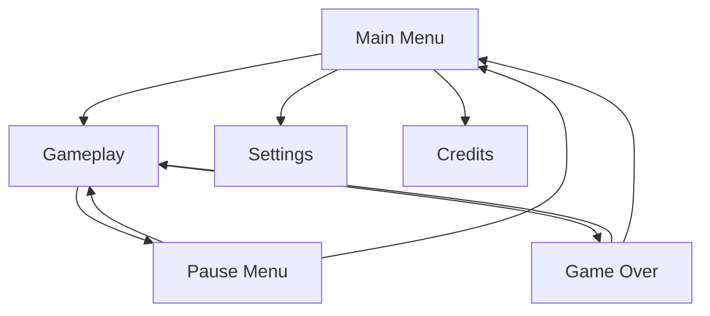

# Game Design Specification: {game_title}

## 1. Metadata

- **Title:** {game_title}
- **Version:** {version}
- **Date:** {date}
- **Status:** {Draft|Review|Approved}
- **Author:** {author}
- **Target Platforms:** {platforms}

---

## 2. Game Overview

**Elevator Pitch:** {2-3 sentence pitch describing the core experience}

- **Genre:** {genre}
- **Target Audience:** {audience_description}
- **Core Fantasy:** {what_the_player_feels}
- **Unique Selling Points:**
  - {usp_1}
  - {usp_2}
  - {usp_3}

---

## 3. Core Mechanics

### Primary Gameplay Loop

```mermaid
flowchart TD
    A[{loop_start}] --> B[{action_1}]
    B --> C[{action_2}]
    C --> D{"{decision_point}"}
    D -->|{outcome_a}| E[{reward}]
    D -->|{outcome_b}| F[{consequence}]
    E --> A
    F --> A
```

### Player Actions

| Action | Input | Description |
|--------|-------|-------------|
| {action_name} | {input_binding} | {what_it_does} |

### Core Verbs

- {verb_1} — {description}
- {verb_2} — {description}
- {verb_3} — {description}

### Input Scheme

| Control | Keyboard/Mouse | Gamepad | Touch |
|---------|---------------|---------|-------|
| {action} | {key} | {button} | {gesture} |

---

## 4. Systems Design

### {system_name_1}

**Purpose:** {what_this_system_does}

**Responsibilities:**
- {responsibility_1}
- {responsibility_2}

**Architecture:**

```mermaid
classDiagram
    class {ClassName1} {
        +{property_1}
        +{method_1}()
    }
    class {ClassName2} {
        +{property_2}
        +{method_2}()
    }
    {ClassName1} --> {ClassName2} : {relationship}
```

**State Diagram:**

```mermaid
stateDiagram-v2
    [*] --> {initial_state}
    {initial_state} --> {state_2} : {trigger}
    {state_2} --> {state_3} : {trigger}
    {state_3} --> [*] : {trigger}
```

**Data Model:**
- {data_field_1}: {type} — {purpose}
- {data_field_2}: {type} — {purpose}

### {system_name_2}

**Purpose:** {what_this_system_does}

**Responsibilities:**
- {responsibility_1}
- {responsibility_2}

---

## 5. Progression

### Player Progression Curve

- **Early game:** {description_of_early_experience}
- **Mid game:** {description_of_mid_experience}
- **Late game:** {description_of_late_experience}

### Unlock Gates

| Gate | Requirement | Unlocks |
|------|------------|---------|
| {gate_name} | {condition} | {content_unlocked} |

### Difficulty Scaling

{description_of_how_difficulty_scales}

### Economy (if applicable)

| Currency | Source | Sink | Balance Notes |
|----------|--------|------|---------------|
| {currency_name} | {how_earned} | {how_spent} | {balance_notes} |

---

## 6. Content

### Levels / Scenes

| Level | Theme | Mechanics Introduced | Estimated Duration |
|-------|-------|---------------------|--------------------|
| {level_name} | {theme} | {new_mechanics} | {duration} |

### Enemies / NPCs

| Name | Role | Behavior | Difficulty |
|------|------|----------|------------|
| {entity_name} | {role} | {behavior_description} | {difficulty_tier} |

### Items / Collectibles

| Item | Category | Effect | Rarity |
|------|----------|--------|--------|
| {item_name} | {category} | {effect_description} | {rarity} |

### Narrative Elements

{description_of_story_structure_and_delivery_method}

---

## 7. UX/UI Flows

### Screen Flow



### Key Screens

| Screen | Purpose | Key Elements |
|--------|---------|--------------|
| {screen_name} | {purpose} | {ui_elements} |

### Input Mapping

{description_of_how_input_is_mapped_across_platforms}

### Accessibility

- {accessibility_feature_1}
- {accessibility_feature_2}
- {accessibility_feature_3}

---

## 8. Art Direction

- **Visual Style:** {style_description}
- **Color Palette:** {primary_colors_and_usage}
- **Reference / Mood:** {reference_games_or_art_styles}
- **Animation Style:** {animation_approach}
- **Camera:** {camera_type_and_behavior}

---

## 9. Audio

- **Music Style:** {genre_and_mood}
- **SFX Categories:**
  - {category_1}: {description}
  - {category_2}: {description}
- **Voice Acting:** {needs_description}
- **Audio Middleware:** {middleware_if_any}
- **Adaptive Audio:** {description_of_dynamic_audio_behavior}

---

## 10. Technical Constraints

| Constraint | Target |
|-----------|--------|
| Target FPS | {fps} |
| Memory Budget | {memory_mb} MB |
| Load Time | {load_seconds}s max |
| Min Spec | {min_hardware} |
| Max Draw Calls | {draw_calls} |
| Max Triangles/Frame | {triangle_count} |

### Networking (if applicable)

- **Architecture:** {client-server|peer-to-peer|none}
- **Tick Rate:** {tick_rate}
- **Max Players:** {max_players}
- **State Sync Strategy:** {description}

---

## 11. Platform Targets

| Platform | Priority | Notes |
|----------|----------|-------|
| {platform_name} | {P0|P1|P2} | {platform_specific_notes} |

### Platform-Specific Considerations

- {consideration_1}
- {consideration_2}

### Input Differences

{description_of_input_variations_across_platforms}

---

## 12. Risks & Mitigations

| Risk | Likelihood | Impact | Mitigation |
|------|-----------|--------|------------|
| {risk_description} | {Low|Medium|High} | {Low|Medium|High} | {mitigation_strategy} |

---

## 13. Milestones (Optional)

| Milestone | Target Date | Deliverables |
|-----------|-------------|--------------|
| {milestone_name} | {date} | {deliverable_list} |

---

## Validation Checklist

Before submitting this spec for review, verify:

- [ ] All 12 mandatory sections (1-12) are filled — no placeholders remain
- [ ] At least 3 Mermaid diagrams present (gameplay loop, architecture, state/screen flow)
- [ ] No TODO/TBD/FIXME text in the document
- [ ] Metadata section has Title, Version, Date, Status filled
- [ ] All `[ASSUMED]` tags reviewed and resolved or accepted
- [ ] Technical constraints are realistic for target platforms
- [ ] Risk table has at least 3 entries with mitigations
- [ ] Input scheme covers all target platforms
- [ ] Progression curve is defined for early/mid/late game
- [ ] All systems in Section 4 have purpose and responsibilities defined
